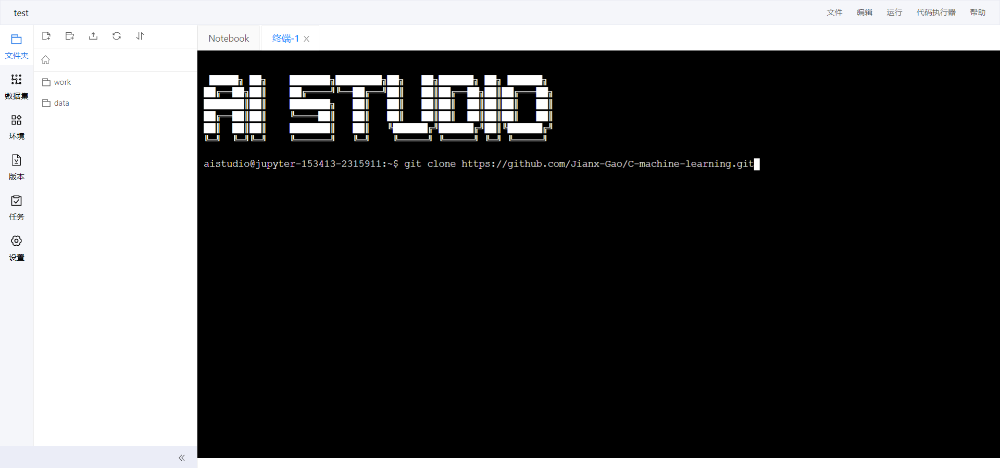
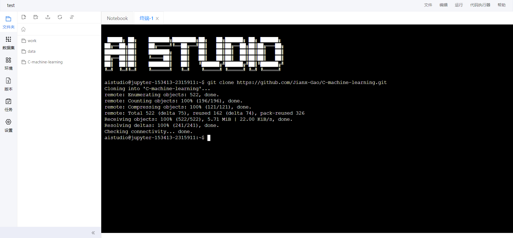
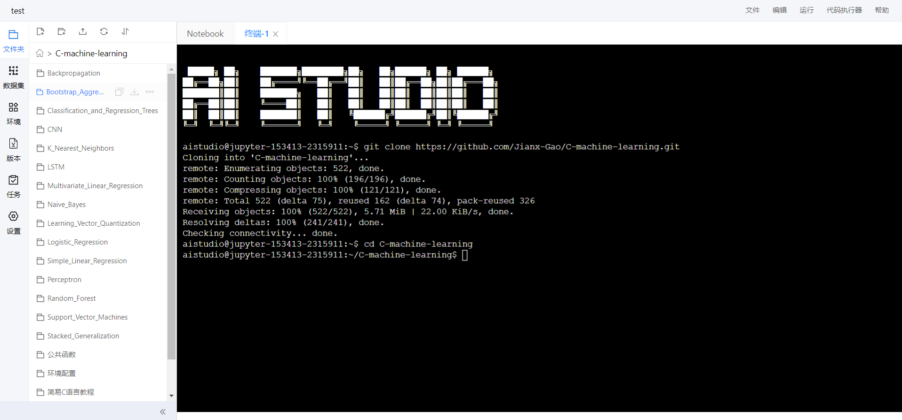

# 一、环境配置

本书中所有代码讲解与运行均以百度AI Studio作为开发平台。因此，下面我们以运行LSTM算法为例，为读者讲解如何使用百度Studio，创建机器学习项目并运行。

## 1.1 百度AI Studio简介

百度AI Studio是针对AI学习者的在线一体化学习与实训社区。平台集合了AI教程，深度学习样例工程，各领域的经典数据集，云端的超强运算及存储资源，以及比赛平台和社区。我们将依托于这一平台讲解与运行机器学习算法。

## 1.2 百度AI Studio配置

### 账号登录

我们在打开浏览器，输入网址：https://aistudio.baidu.com/aistudio/index，进入百度Studio，点击右上角【登录】，读者选择合适的登陆方式即可。


### 创建项目

登陆后，点击右上角的个人头像，点击【个人中心】进入个人主页，点击【项目】右侧的下拉三角，点击【创建和Fork的项目】，点击【创建项目】。


我们选择类型为Notebook，点击【下一步】，


配置环境选择默认的 `PaddlePaddle 2.1.0`和 `python3.7`即可，点击【下一步】，根据实际情况填写项目描述，点击【创建】，完成项目的创建。


项目创建完成后，点击【启动环境】，我们在本例中使用免费的CPU基本版，点击【确定】，


等待片刻后，我们进入如下图所示的界面：


## 1.3 百度AI Studio案例运行

在该部分中，我们从github中将所有代码下载至AI Studio，并安装所有依赖，再通过随机森林算法演示如何在AI Studio运行机器学习代码。

### 下载代码

我们点击【终端】，输入指令：

```bash
git clone https://github.com/Jianx-Gao/C-machine-learning.git
```



如果下载失败，我们可以从github的镜像中下载代码：

```bash
git clone https://github.com.cnpmjs.org/Jianx-Gao/C-machine-learning.git
```

下载完成后，如下图所示：



### 环境配置

我们切换目录，进入`cd C-machine-learning`文件夹，同时点击左侧【C-machine-learning】文件夹

```bash
cd C-machine-learning
```



我们安装`requirements.txt`中写的所有算法的依赖

```bash
pip install -r requirements.txt
```

### 案列运行

下面，我们就可以运行我们的案例来测试代码了，我们分别测试C语言和Python版本的随机森林算法，检验环境是否安装成功

##### C语言版本

```bash
cd Random_Forest/C_version
bash compile.sh
```


##### Python语言版本

```bash
cd ../Python_version
python run.py
```

# 二、公共函数

在本书中，我们把多数机器-深度学习算法需要使用的函数提取出来，作为公共函数，在后续讲解中，直接调用，或简单修改即可。本章节中，我们将详细讲解这些函数的原理与实现，我们将按照如下顺序进行讲解：读取csv文件数据、数据K折交叉验证、数据标准化、计算算法结果、评价验证算法结果。

### 2.1 读取csv文件数据

在训练模型之前，应该先获得要用的数据集，数据集通常需要保存在文本文件中，这就要求我们要对数据集进行读取，以下 `get_row()`、`get_col()`函数可以实现对csv文件的行列数的读取，它们需要字符串类型的文件名作为参数输入，而 `get_two_dimension()`可以对csv文件的内容进行读取，它需要字符串类型的文件名作为输入参数。

- 输入：字符串（文件名）
- 输出：csv文件的行数、列数及数据的二维数组
- 功能——读取cvs文件

```c
int get_row(char *filename) //获取行数
{
	char line[1024];
	int i = 0;
	FILE *stream = fopen(filename, "r");
	while (fgets(line, 1024, stream))
	{
		i++;
	}
	fclose(stream);
	return i;
}

int get_col(char *filename) //获取列数
{
	char line[1024];
	int i = 0;
	FILE *stream = fopen(filename, "r");
	fgets(line, 1024, stream);
	char *token = strtok(line, ",");
	while (token)
	{
		token = strtok(NULL, ",");
		i++;
	}
	fclose(stream);
	return i;
}

void get_two_dimension(char *line, double **data, char *filename)
{
	FILE *stream = fopen(filename, "r");
	int i = 0;
	while (fgets(line, 1024, stream)) //逐行读取
	{
		int j = 0;
		char *tok;
		char *tmp = strdup(line);
		for (tok = strtok(line, ","); tok && *tok; j++, tok = strtok(NULL, ",\n"))
		{
			data[i][j] = atof(tok); //转换成浮点数
		}							//字符串拆分操作
		i++;
		free(tmp);
	}
	fclose(stream); //文件打开后要进行关闭操作
}
```

我们创建 `data.csv`文件，添加如下数据集：

```
1	12.2	12.5	11.1
2.5	555.2	121.4	2.1
```

调用函数：

```c
#include <stdio.h>
#include <string.h>
#include <stdlib.h>
#include <math.h>

int main()
{
	char filename[] = "data.csv";
    char line[1024];
    double **data;
    int row, col;
    row = get_row(filename);
    col = get_col(filename);
    data = (double **)malloc(row * sizeof(double *));
	for (int i = 0; i < row; ++i){
		data[i] = (double *)malloc(col * sizeof(double));
	}
	get_two_dimension(line, data, filename);
	printf("row = %d\n", row);
	printf("col = %d\n", col);

	int i, j;
	for(i=0; i<row; i++){
		for(j=0; j<col; j++){
			printf("%f\t", data[i][j]);
		}
		printf("\n");
    }
}
```

得到结果如下:

```c
row = 2
col = 4
1.000	12.2.000	12.5.000	11.1.000
2.5.000	555.2.000	121.4.000	2.1.000
```

### 2.2 数据K折交叉验证

K折交叉验证,将数据集等比例划分成K份，以其中的一份作为测试数据，其他的K-1份数据作为训练数据。然后，这样算是一次实验，而K折交叉验证只有实验K次才算完成完整的一次，也就是说交叉验证实际是把实验重复做了K次，每次实验都是从K个部分选取一份不同的数据部分作为测试数据（保证K个部分的数据都分别做过测试数据），剩下的K-1个当作训练数据，最后把得到的K个实验结果进行平分。

此函数则用于将原始数据划分为k等份，以用于k折交叉验证。

- 输入：二维数组数据集，数据集行数，交叉验证折数，交叉验证数组长度
- 输出：划分后的三维数组
- 功能——划分数据为k折

```c
double*** cross_validation_split(double **dataset, int row, int n_folds, int fold_size)
{
    srand(10); // 随机种子
    double ***split;
    int i = 0, j = 0, k = 0;
    int index;
    int num;
    num = row / n_folds;
    double **fold;
    split = (double***)malloc(n_folds*sizeof(double**));
    for(i = 0; i < n_folds; i++)
    {
        fold = (double**)malloc(num * sizeof(double *));
        while(j<num)
        {
            fold[j] = (double*)malloc(fold_size * sizeof(double));
            index = rand() % row;
            fold[j] = dataset[index];
            for(k = index; k < row - 1; k++)//for循环删除数组中被rand取到的元素
            {
                dataset[k] = dataset[k + 1];
            }
            row--; //每次随机取出一个后总行数-1，保证不会重复取某一行
            j++;
        }
        j = 0;//清零j
        split[i] = fold;
    }
    return split;
}
```

我们运行如下代码，测试函数：

```c
double data[6][2];
double *data_ptr[6];
double *** split;
for(int i=0;i<6;i++)
{
    for(int j=0;j<2;j++)
    {
        data[i][j]=i+j;
    }
    data_ptr[i] = data[i];
};
split = cross_validation_split(data_ptr,6,3,2);
printf("%f",split[0][0][1]);
```

结果如下：

```c
6.0000
```

### 2.3 数据标准化

数据标准化（归一化）处理是数据挖掘的一项基础工作，**不同评价指标往往具有不同的量纲和量纲单位，这样的情况会影响到数据分析的结果，为了消除指标之间的量纲影响，需要进行数据标准化处理，**以解决数据指标之间的可比性。原始数据经过数据标准化处理后，各指标处于同一数量级，适合进行综合对比评价。

**min-max Normalization**

也称为离差标准化，是对原始数据的线性变换，**使结果值映射到[0 - 1]之间**。转换函数如下：

$$
x^*=\frac{x-min(x)}{max(x)-min(x)}
$$

其中max为样本数据的最大值，min为样本数据的最小值。这种方法有个缺陷就是当有新数据加入时，可能导致max和min的变化，需要重新定义。

- 输入：二维数组数据集，数据集行数，数据集列数
- 输出：标准化过后的二维数组数据集
- 功能——数据集标准化

```c
void normalize_dataset(double **dataset,int row, int col) 
{
    // 先 对列循环
    double maximum, minimum;
    for (int i = 0; i < col; i++) 
    {
        // 第一行为标题，值为0，不能参与计算最大最小值
        maximum = dataset[0][i];
        minimum = dataset[0][i];
        //再 对行循环
        for (int j = 0; j < row; j++) 
        {
            maximum = (dataset[j][i]>maximum)?dataset[j][i]:maximum;
            minimum = (dataset[j][i]<minimum)?dataset[j][i]:minimum;
        }
        // 归一化处理
        for (int j = 0; j < row; j++)
        {
            dataset[j][i] = (dataset[j][i] - minimum) / (maximum - minimum);
        }
    }
}
```

我们使用如下数据调用函数

```c
0.000000     1.000000    2.000000     3.000000     4.000000     5.000000  
10.000000    11.000000   12.000000    13.000000    14.000000    15.000000  
20.000000    21.000000   22.000000    23.000000    24.000000    25.000000  
30.000000    31.000000   32.000000    33.000000    34.000000    35.000000  
40.000000    41.000000   42.000000    43.000000    44.000000    45.000000  
50.000000    51.000000   52.000000    53.000000    54.000000    55.000000  
60.000000    61.000000   62.000000    63.000000    64.000000    65.000000  
70.000000    71.000000   72.000000    73.000000    74.000000    75.000000  
80.000000    81.000000   82.000000    83.000000    84.000000    85.000000  
90.000000    91.000000   92.000000    93.000000    94.000000    95.000000
```

归一化：

```c
0.000000    0.000000    0.000000    0.000000    0.000000    0.000000  
0.111111    0.111111    0.111111    0.111111    0.111111    0.111111  
0.222222    0.222222    0.222222    0.222222    0.222222    0.222222 
0.333333    0.333333    0.333333    0.333333    0.333333    0.333333  
0.444444    0.444444    0.444444    0.444444    0.444444    0.444444  
0.555556    0.555556    0.555556    0.555556    0.555556    0.555556  
0.666667    0.666667    0.666667    0.666667    0.666667    0.666667  
0.777778    0.777778    0.777778    0.777778    0.777778    0.777778  
0.888889    0.888889    0.888889    0.888889    0.888889    0.888889  
1.000000    1.000000    1.000000    1.000000    1.000000    1.000000
```

### 2.4 计算算法结果

我们将训练集、测试集、学习率，epoch数，交叉验证fold的长度输入函数，调用算法，利用函数中的模型框架对测试集进行分类，或者回归，并返回预测结果。

- 输入：训练集、测试集、学习率，epoch数，数组长度
- 输出：预测结果
- 功能——计算算法结果

函数如下：

```c
double get_test_prediction(double **train, double **test, double l_rate, int n_epoch, int fold_size) 
{
    double *weights = (double*)malloc(col * sizeof(double));
    // weights数组的长度就是列数（少一个结果位，多一个bias）
    double *predictions = (double*)malloc(fold_size * sizeof(double));
    // 预测集的行数就是数组prediction的长度
    weights = train_weights(train, l_rate, n_epoch);
    int i;
    for(i = 0; i < fold_size; i++)
    {
    	predictions[i] = predict(test[i], weights);
    }
    return predictions; // 返回对test的预测数组
}
```

### 2.5 评价验证算法结果

#### 2.5.1 计算RMSE

衡量预测值与真实值之间的偏差。常用来作为机器学习模型预测结果衡量的标准。可以由以下公式计算：

$$
RMSE(X,h) = \sqrt{\frac{1}{m}\sum_{i=1}^{m}(h(x_i)-y_i)^2}\tag{1.8}
$$

以下 `rmse_metric()`实现了对测试集RMSE的计算，它需要真实值数组、预测值数组及交叉验证fold的长度作为输入参数。

- 输入：真实值数组，预测值数组，数组长度
- 输出：RMSE值
- 功能——计算算法在测试集的RMSE

```C
double rmse_metric(double *actual, double *predicted, int fold_size)
{
    double sum_err = 0.0;
    int i;
    int len = sizeof(actual)/sizeof(double);
    for (i = 0; i < fold_size; i++)
    {
        double err = predicted[i] - actual[i];
        sum_err += err * err;
    }
    double mean_err = sum_err / len;
    return sqrt(mean_err);
}
```

我们利用如下数据，调用函数：

```c
double act[] = {1, 2, 3, 4};
double pre[] = {4, 3, 2, 1};
printf("%f", rmse_metric(act, pre, 3));
```

计算得到得到RMSE值：

```c
3.316625
```

#### 2.5.2 计算准确率

该函数用于计算预测所得到的结果的准确率，其基本原理为：将预测正确的结果记为1，错误为0，最终求和得到正确结果个数，利用此个数除以总个数，从而得到正确率。

- 输入：真实值数组，预测值数组，数组长度
- 输出：准确率
- 功能——计算准确率

```c
double accuracy_metric(double *actual, double *predicted, int fold_size)
{
	int correct = 0;
	int i;
	int len = sizeof(actual);
	for (i = 0; i < fold_size; i++)
    {
		if (actual[i] == predicted[i])
			correct += 1;
	}
	return (correct / (double)len)*100.0;
}
```

我们利用如下数据，调用函数：

```c
double act[] = {1.0, 2.0, 3.0, 4.0};
double pre[] = {1.0, 2.0, 3.0, 3.0};
printf("%f", (accuracy_metric(act, pre, 4)));
```

计算得到得到准确率:

```c
75.0000
```

#### 2.5.3 整体算法框架

- 输入：训练集、测试集、学习率，epoch数，交叉验证折数，数组长度
- 输出：准确率
- 功能——调用完整算法

```c
#include<stdlib.h>
#include<stdio.h>

extern double* get_test_prediction(double **train, int train_size, double **test, int test_size, int col, int num_neighbors, double l_rate, int n_epoch);
extern double accuracy_metric(double *actual, double *predicted, int fold_size);
extern double***  cross_validation_split(double **dataset, int row, int col, int n_folds, int fold_size);

void evaluate_algorithm(double **dataset, int row, int col, int n_folds, int num_neighbors, double l_rate, int n_epoch) {
	int fold_size = (int)row / n_folds;
	double ***split = cross_validation_split(dataset, row, n_folds, fold_size, col);
	int i, j, k, l;
	int test_size = fold_size;
	int train_size = fold_size * (n_folds - 1);
	double* score = (double*)malloc(n_folds * sizeof(double));

	for (i = 0; i < n_folds; i++) {
		double*** split_copy = (double***)malloc(n_folds * sizeof(double**));
		for (j = 0; j < n_folds; j++) {
			split_copy[j] = (double**)malloc(fold_size * sizeof(double*));
			for (k = 0; k < fold_size; k++) {
				split_copy[j][k] = (double*)malloc(col * sizeof(double));
			}
		}
		for (j = 0; j < n_folds; j++)
		{
			for (k = 0; k < fold_size; k++)
			{
				for (l = 0; l < col; l++)
				{
					split_copy[j][k][l] = split[j][k][l];
				}
			}
		}
		double** test_set = (double**)malloc(test_size * sizeof(double*));
		for (j = 0; j < test_size; j++) {
			test_set[j] = (double*)malloc(col * sizeof(double));
			for (k = 0; k < col; k++) {
				test_set[j][k] = split_copy[i][j][k];
			}
		}
		for (j = i; j < n_folds - 1; j++) {
			split_copy[j] = split_copy[j + 1];
		}
		double** train_set = (double**)malloc(train_size * sizeof(double*));
		for (k = 0; k < n_folds - 1; k++) {
			for (l = 0; l < fold_size; l++) {
				train_set[k*fold_size + l] = (double*)malloc(col * sizeof(double));
				train_set[k*fold_size + l] = split_copy[k][l];
			}
		}
		double* predicted = (double*)malloc(test_size * sizeof(double));
		predicted = get_test_prediction(train_set, train_size, test_set, test_size, col, num_neighbors,l_rate,n_epoch);
		double* actual = (double*)malloc(test_size * sizeof(double));
		for (l = 0; l < test_size; l++) {
			actual[l] = test_set[l][col - 1];
		}
		double acc = accuracy_metric(actual, predicted, test_size);
		score[i] = acc;
		printf("Scores[%d] = %f%%\n", i, score[i]);
		free(split_copy);
	}
	double total = 0;
	for (l = 0; l < n_folds; l++) {
		total += score[l];
	}
	printf("mean_accuracy = %f%%\n", total / n_folds);
}
```

# 三、算法详解

在本章节中，我们将详细展开讲解算法，从最基础的简单线性回归算法讲起，一直到堆栈泛化算法，囊括线性算法，非线性算法，集成算法我们会从原理讲解每一个算法，并用代码实现加深读者的理解。

## 3.1 Simple Linear Regression

> 线性回归是一种已有200多年历史的预测方法。简单线性回归是一种可以由训练集来估计属性的机器学习算法，它相对简单，便于初学者理解。在本节中，您将看到如何用C语言一步步实现这个算法。

### 3.1.1 算法介绍

线性回归可以在输入变量（X）与输出变量（Y）之间建立一种线性关系。具体的说，输出变量（Y）可以由输入变量（X）的线性组合计算出来。当输入变量为单一变量时，这种算法就叫做简单线性回归。

在简单线性回归中，我们可以使用训练数据的统计量来估计模型对新数据预测所需的系数。

一个简单线性回归模型可以写成:

$$
y = b_0 + b_1 × x\tag{1.1}
$$

其中，B0和B1为我们需要从训练集中估计的系数。得到系数后，我们可以利用此方程估计新的输入变量（X对应的输出变量（Y）。估计系数前，我们需要计算训练集的一些统计量，如平均值、方差和协方差等。

当计算出所需的统计量后，我们可以通过如下公式计算B0，B1：

$$
B_1 = \frac{\sum_{i=1}^{n}{((x_i - mean(x))×(y_i - mean(y)))}}{\sum_{i=1}^{n}{(x_i - mean(x))^2}}\tag{1.2}
$$

$$
B_0 = mean(y) - B_1 × mean(x)\tag{1.3}
$$

其中，i表示训练集中的第i个输入变量x或输出变量y。

### 3.1.2 算法讲解

本小节中，我们将通过代码来讲解算法。实现简单线性回归算法的步骤可以分为如下7个部分：

- 读取csv
- 计算均值、方差及协协方差
- 估计回归系数
- 由回归系数计算测试集的预测值
- 按划分的k折交叉验证计算预测所得准确率
- 按划分的训练集和测试集计算预测所得RMSE
- main函数设定以上函数的参数并调用

其中，读取csv、划分数据为k折、按划分的k折交叉验证计算预测所得准确率参考以前章节。

#### 计算均值方差等统计量

##### 计算均值

输入变量（X）与输出变量（Y）的均值可以由以下公式得到：

$$
mean(x) = \frac{\sum_{i=1}{x_i}}{count(x)}\tag{1.4}
$$

其中，`count(x)`表示x的个数。

以下 `mean()`函数可以计算一组数据的均值，它需要一维数组、数组长度作为参数。

```C
double mean(double* values, int length) 
{
    //对一维数组求均值
    int i;
    double sum = 0.0;
    for (i = 0; i < length; i++) {
        sum += values[i];
    }
    double mean = (double)(sum / length);
    return mean;
}
```

##### 计算方差

方差是每个值与均值之差的平方和。一组数字的方差可计算为:

$$
variance = \sum_{i=1}^{n}{(x_i - mean(x))^2}\tag{1.5}
$$

以下 `variance()`函数可以计算一组数据的方差，它需要一维数组变量、数组的均值、以及输出数组的长度作为参数。

```C
double variance(double* values, double mean, int length) {
    //这里求的是平方和，没有除以n
    double sum = 0.0;
    int i;
    for (i = 0; i < length; i++) {
        sum += (values[i] - mean)*(values[i] - mean);
    }
    return sum;
}
```

我们利用以下数据集：

```c
double x[5] = {1, 2, 4, 3, 5};
printf("%f", mean(x, 5));
printf("%f", variance(x, mean(x, 5), 5))
```

得到结果如下:

```c
3.000 
10.000
```

##### 计算协方差

协方差在概率论和统计学中用于衡量两个变量的总体误差。而方差是协方差的一种特殊情况，即当两个变量是相同的情况。

协方差表示的是两个变量的总体的误差，这与只表示一个变量误差的方差不同。 如果两个变量的变化趋势一致，那么两个变量之间的协方差就是正值。 如果两个变量的变化趋势相反，那么两个变量之间的协方差就是负值。

我们可以通过以下公式来计算两个变量的协方差：

$$
covariance = {\sum_{i=1}^{n}{((x_i - mean(x))}}×(y_i - mean(y)))\tag{1.6}
$$

以下 `covariance()`函数可以计算两组数据的协方差，它需要输入数组变量（X）、输入数组的均值、输出数组变量（Y）、输出数组的均值、数组长度作为参数。

```C
double covariance(double* x, double mean_x, double* y, double mean_y, int length) {
    double cov = 0.0;
    int i = 0;
    for (i = 0; i < length; i++) {
        cov += (x[i] - mean_x)*(y[i] - mean_y);
    }
    return cov;
} 
```

我们利用以下数据：

```c
double x[5] = {1, 2, 4, 3, 5};
double y[5] = {1, 3, 3, 2, 5};
printf("%f", covariance(x, mean(x, 5), y, mean(y, 5), 5));
```

得到如下结果：

```c
8.000
```

#### 估计回归系数

在简单线性回归中，我们需要估计两个系数的值。第一个是B1，可以利用公式(1.2)估计。

我们可以简化这个公式：

$$
B_1 = \frac{covariance(x,y)}{variance(x)}\tag{1.7}
$$

我们已经有了计算协方差和方差的函数。接下来，我们需要估计B0的值，也称为截距。可以利用公式(1.3)。

以下 `coefficients()`函数将计算B0、B1并将其存在名为coef的数组。它需要训练集（二维数组），存储B0、B1的数组以及训练集数组长度作为参数。

```C
//由均值方差估计回归系数
void coefficients(double** data, double* coef, int length) {
	double* x = (double*)malloc(length * sizeof(double));
	double* y = (double*)malloc(length * sizeof(double));
	int i;
	for (i = 0; i < length; i++) {
        x[i] = data[i][0];
        y[i] = data[i][1];
	}
	double x_mean = mean(x, length);
	double y_mean = mean(y, length);
	coef[1] = covariance(x, x_mean, y, y_mean, length) / variance(x, x_mean, length);
	coef[0] = y_mean - coef[1] * x_mean;
	for (i = 0; i < 2; i++) {
		printf("coef[%d]=%f\n", i, coef[i]);
	}
}
```

我们利用如下数据：

```c
double data[3][2] = {
    {1,1},
    {2,2},
    {3,3}
};
double coef[2] = {1,1};
double* dataptr[3];
dataptr[0] = data[0];
dataptr[1] = data[1];
dataptr[2] = data[2];
coefficients(dataptr, coef, 3);
```

coef作为输入的数组，经过函数操作后输出得到如下结果:

```c
Ccoef[0] = 0.000000
coef[1] = 1.000000
```

#### 计算测试集的预测值

简单线性回归模型是一条由训练数据估计的系数定义的直线。系数估计出来后，我们就可以用它们来进行预测。用简单的线性回归模型进行预测的方程为公式(1.1)。

以下 `get_test_prediction()`函数实现了对数据集的预测，它需要数据行数、列数、训练集、测试集、K折交叉验证数组大小作为输入参数。

```C
double* get_test_prediction(int col,int row,double** train, double** test, int n_folds) {
	double* coef = (double*)malloc(col * sizeof(double));
	int i;
	for (i = 0; i < col; i++) {
		coef[i] = 0.0;
	}
	int fold_size = (int)row / n_folds;
	int train_size = fold_size * (n_folds - 1);
	coefficients(train, coef, train_size);
	double* predictions = (double*)malloc(fold_size * sizeof(double));
	for (i = 0; i < fold_size; i++) {
		predictions[i] = coef[0] + coef[1] * test[i][0];
	}
	return predictions;
}
```

#### 计算预测准确率

将数据集按划分的k折交叉验证计算预测所得准确率，以下 `evaluate_algorithm()`函数需要训练集、测试集的二维数组，学习率，epoch数，交叉验证折数，交叉验证fold的长度作为参数输入。

```c
double evaluate_algorithm(double **dataset, int n_folds, int fold_size, double l_rate, int n_epoch) 
{
    double*** split =  cross_validation_split(double **dataset, int row, int n_folds, int fold_size);
    int i, j, k, l;
    int test_size = fold_size;
    int train_size = fold_size * (n_folds - 1); //train_size个一维数组
    double* score = (double*)malloc(n_folds * sizeof(float));
    for (i = 0; i < n_folds; i++) 
    {  
        //因为要遍历删除，所以拷贝一份split
        double*** split_copy = (double***)malloc(n_folds * sizeof(double**));
        for (j = 0; j < n_folds; j++) {
            split_copy[j] = (double**)malloc(fold_size * sizeof(double*));
            for (k = 0; k < fold_size; k++) {
                split_copy[j][k] = (double*)malloc(column * sizeof(double));
            }
        }
        for (j = 0; j < n_folds; j++)
        {
            for (k = 0; k < fold_size; k++)
            {
                for (l = 0; l < column; l++)
                {
                    split_copy[j][k][l] = split[j][k][l];
                }
            }
        }
        double** test_set = (double**)malloc(test_size * sizeof(double*));
        for (j = 0; j < test_size; j++) {//对test_size中的每一行
            test_set[j] = (double*)malloc(column * sizeof(double));
            for (k = 0; k < column; k++) {
                test_set[j][k] = split_copy[i][j][k];
            }
        }
        for (j = i; j < n_folds - 1; j++) {
            split_copy[j] = split_copy[j + 1];
        }
        double** train_set = (double**)malloc(train_size * sizeof(double*));
        for (k = 0; k < n_folds - 1; k++) {
            for (l = 0; l < fold_size; l++) {
                train_set[k*fold_size + l] = (double*)malloc(column * sizeof(double));
                train_set[k*fold_size + l] = split_copy[k][l];
            }
        }
        double* predicted = (double*)malloc(test_size * sizeof(double));//predicted有test_size个
        predicted = get_test_prediction(train_set, test_set, l_rate, n_epoch, fold_size);
        double* actual = (double*)malloc(test_size * sizeof(double));
        for (l = 0; l < test_size; l++) {
            actual[l] = test_set[l][column - 1];
        }
        double accuracy = accuracy_metric(actual, predicted, test_size);
        score[i] = accuracy;
        printf("score[%d]=%f\n", i, score[i]);
        free(split_copy);
    }
    double total = 0.0;
    for (l = 0; l < n_folds; l++) {
        total += score[l];
    }
    printf("mean_accuracy=%lf\%\n", total / n_folds);
    return score;
}
```

### 3.1.3 算法代码

我们现在知道了如何实现**简单线性回归算法**，那么我们把它应用到[瑞典保险数据集 insurance.csv](https://aistudio.baidu.com/aistudio/datasetdetail/105756/0)

我们给出链接：https://aistudio.baidu.com/aistudio/datasetdetail/105756/0

#### C语言细节讲解

本节假设您已下载数据集 `insurance.csv`，并且它在当前工作目录中可用。下面我们给出一个完整实例，使用C语言详细讲解每一处细节。我们给出每一个.c文件的所有代码：

##### 1) read_csv.c

```c
#include <stdio.h>
#include <stdlib.h>
#include <string.h>

int get_row(char *filename) //获取行数
{
	char line[1024];
	int i = 0;
	FILE *stream = fopen(filename, "r");
	while (fgets(line, 1024, stream))
	{
		i++;
	}
	fclose(stream);
	return i;
}

int get_col(char *filename) //获取列数
{
	char line[1024];
	int i = 0;
	FILE *stream = fopen(filename, "r");
	fgets(line, 1024, stream);
	char *token = strtok(line, ",");
	while (token)
	{
		token = strtok(NULL, ",");
		i++;
	}
	fclose(stream);
	return i;
}

void get_two_dimension(char *line, double **data, char *filename)
{
	FILE *stream = fopen(filename, "r");
	int i = 0;
	while (fgets(line, 1024, stream)) //逐行读取
	{
		int j = 0;
		char *tok;
		char *tmp = strdup(line);
		for (tok = strtok(line, ","); tok && *tok; j++, tok = strtok(NULL, ",\n"))
		{
			data[i][j] = atof(tok); //转换成浮点数
		}							//字符串拆分操作
		i++;
		free(tmp);
	}
	fclose(stream); //文件打开后要进行关闭操作
}
```

##### 2) k_fold.c

```c
#include <stdlib.h>
#include <stdio.h>

double ***cross_validation_split(double **dataset, int row, int n_folds, int fold_size, int col)
{
	srand(10); //种子
	double ***split;
	int i, j = 0, k = 0;
	int index;
	double **fold;
	split = (double ***)malloc(n_folds * sizeof(double **));
	for (i = 0; i < n_folds; i++)
	{
		fold = (double **)malloc(fold_size * sizeof(double *));
		while (j < fold_size)
		{
			fold[j] = (double *)malloc(col * sizeof(double));
			index = rand() % row;
			fold[j] = dataset[index];
			for (k = index; k < row - 1; k++) //for循环删除这个数组中被rand取到的元素
			{
				dataset[k] = dataset[k + 1];
			}
			row--; //每次随机取出一个后总行数-1，保证不会重复取某一行
			j++;
		}
		j = 0; //清零j
		split[i] = fold;
	}
	return split;
}
```

##### 3) rmse.c

```c
#include <stdlib.h>
#include <stdio.h>
#include <math.h>

double rmse_metric(double *actual, double *predicted, int fold_size)
{
	double sum_err = 0.0;
	int i;
	for (i = 0; i < fold_size; i++)
	{
		double err = predicted[i] - actual[i];
		sum_err += err * err;
	}
	double mean_err = sum_err / fold_size;
	return sqrt(mean_err);
}
```

##### 4) test_prediction.c

```c
#include <stdlib.h>
#include <stdio.h>

extern void coefficients(double **data, double *coef, int length);
double *get_test_prediction(int col, int row, double **train, double **test, int n_folds)
{
	double *coef = (double *)malloc(col * sizeof(double));
	int i;
	for (i = 0; i < col; i++)
	{
		coef[i] = 0.0;
	}
	int fold_size = (int)row / n_folds;
	int train_size = fold_size * (n_folds - 1);
	coefficients(train, coef, train_size);
	double *predictions = (double *)malloc(fold_size * sizeof(double));
	for (i = 0; i < fold_size; i++)
	{
		predictions[i] = coef[0] + coef[1] * test[i][0];
	}
	return predictions;
}
```

##### 5) evaluate.c

```c
#include <stdlib.h>
#include <stdio.h>

extern double *get_test_prediction(int col, int row, double **train, double **test, int n_folds);
extern double rmse_metric(double *actual, double *predicted, int fold_size);
extern double ***cross_validation_split(double **dataset, int row, int col, int n_folds, int fold_size);

double *evaluate_algorithm(double **dataset, int row, int col, int n_folds)
{
	int fold_size = (int)row / n_folds;
	double ***split = cross_validation_split(dataset, row, n_folds, fold_size, col);
	int i, j, k, l;
	int test_size = fold_size;
	int train_size = fold_size * (n_folds - 1);
	double *score = (double *)malloc(n_folds * sizeof(double));
	for (i = 0; i < n_folds; i++)
	{
		//因为要遍历删除，所以拷贝一份split
		double ***split_copy = (double ***)malloc(n_folds * sizeof(double **));
		for (j = 0; j < n_folds; j++)
		{
			split_copy[j] = (double **)malloc(fold_size * sizeof(double *));
			for (k = 0; k < fold_size; k++)
			{
				split_copy[j][k] = (double *)malloc(col * sizeof(double));
			}
		}
		for (j = 0; j < n_folds; j++)
		{
			for (k = 0; k < fold_size; k++)
			{
				for (l = 0; l < col; l++)
				{
					split_copy[j][k][l] = split[j][k][l];
				}
			}
		}

		double **test_set = (double **)malloc(test_size * sizeof(double *));
		for (j = 0; j < test_size; j++)
		{
			test_set[j] = (double *)malloc(col * sizeof(double));
			for (k = 0; k < col; k++)
			{
				test_set[j][k] = split_copy[i][j][k];
			}
		}
		for (j = i; j < n_folds - 1; j++)
		{
			split_copy[j] = split_copy[j + 1];
		} //删除取出来的fold

		double **train_set = (double **)malloc(train_size * sizeof(double *));
		for (k = 0; k < n_folds - 1; k++)
		{
			for (l = 0; l < fold_size; l++)
			{
				train_set[k * fold_size + l] = (double *)malloc(col * sizeof(double));
				train_set[k * fold_size + l] = split_copy[k][l];
				//printf("split_copy[%d][%d]=%f\n", k,l,split_copy[k][l]);
			}
		}

		double *predicted = (double *)malloc(test_size * sizeof(double));
		predicted = get_test_prediction(col, row, train_set, test_set, n_folds);
		double *actual = (double *)malloc(test_size * sizeof(double));
		for (l = 0; l < test_size; l++)
		{
			actual[l] = test_set[l][col - 1];
		}
		double rmse = rmse_metric(actual, predicted, test_size);
		score[i] = rmse;
		printf("score[%d] = %lf\n", i, score[i]);
		free(split_copy);
	}
	double total = 0;
	for (l = 0; l < n_folds; l++)
	{
		total += score[l];
	}
	printf("mean_rmse = %lf\n", total / n_folds);
	return score;
}
```

##### 6) main.c

```c
#include <stdlib.h>
#include <stdio.h>

double **dataset;
int row, col;

extern int get_row(char *filename);
extern int get_col(char *filename);
extern void get_two_dimension(char *line, double **dataset, char *filename);
extern double *evaluate_algorithm(double **dataset, int row, int col, int n_folds);

double mean(double *values, int length);
double covariance(double *x, double mean_x, double *y, double mean_y, int length);
double variance(double *values, double mean, int length);
void coefficients(double **data, double *coef, int length);

//计算均值方差等统计量（多个函数）
double mean(double *values, int length)
{ //对一维数组求均值
	int i;
	double sum = 0.0;
	for (i = 0; i < length; i++)
	{
		sum += values[i];
	}
	double mean = (double)(sum / length);
	return mean;
}

double covariance(double *x, double mean_x, double *y, double mean_y, int length)
{
	double cov = 0.0;
	int i = 0;
	for (i = 0; i < length; i++)
	{
		cov += (x[i] - mean_x) * (y[i] - mean_y);
	}
	return cov;
}

double variance(double *values, double mean, int length)
{ //这里求的是平方和，没有除以n
	double sum = 0.0;
	int i;
	for (i = 0; i < length; i++)
	{
		sum += (values[i] - mean) * (values[i] - mean);
	}
	return sum;
}

//由均值方差估计回归系数
void coefficients(double **data, double *coef, int length)
{
	double *x = (double *)malloc(length * sizeof(double));
	double *y = (double *)malloc(length * sizeof(double));
	int i;
	for (i = 0; i < length; i++)
	{
		x[i] = data[i][0];
		y[i] = data[i][1];
	}
	double x_mean = mean(x, length);
	double y_mean = mean(y, length);
	coef[1] = covariance(x, x_mean, y, y_mean, length) / variance(x, x_mean, length);
	coef[0] = y_mean - coef[1] * x_mean;
}

int main()
{
	char filename[] = "Auto insurance.csv";
	char line[1024];
	row = get_row(filename);
	col = get_col(filename);
	dataset = (double **)malloc(row * sizeof(double *));
	for (int i = 0; i < row; ++i)
	{
		dataset[i] = (double *)malloc(col * sizeof(double));
	} //动态申请二维数组
	get_two_dimension(line, dataset, filename);
	int n_folds = 10;
	int fold_size = (int)row / n_folds;
	evaluate_algorithm(dataset, row, col, n_folds);
	return 0;
}
```

##### 7) compile.sh

```bash
gcc main.c read_csv.c k_fold.c evaluate.c rmse.c test_prediction.c -o run -lm && ./run
```

**编译&运行：**

```bash
bash compile.sh
```

最终输出结果如下：

```c
score[0] = 33.263512
score[1] = 30.319399
score[2] = 22.835829
score[3] = 38.080193
score[4] = 23.662033
score[5] = 25.166845
score[6] = 47.085342
score[7] = 46.614182
score[8] = 40.007351
score[9] = 28.511198
mean_rmse = 33.554588
```

#### Python语言实战

本节同样假设您已经下载数据集，我们使用著名机器学习开源库sklearn高效实现**简单线性回归算法**，以便您在实战中使用该算法：

```python
import pandas as pd
import numpy as np
from sklearn.model_selection import KFold
from sklearn.linear_model import LinearRegression


def rmse_metric(actual, predicted):
    sum_err = 0.0
    for i in range(len(actual)):
        err = predicted[i] - actual[i]
        sum_err += err ** 2
        mean_err = sum_err / (len(actual)-1)
        return np.sqrt(mean_err)


    if __name__ == '__main__':
        dataset = np.array(pd.read_csv("insurance.csv", sep=',', header=None))
        k_Cross = KFold(n_splits=10, random_state=1, shuffle=True)
        index = 0
        score = np.array([])
        for train_index, test_index in k_Cross.split(dataset):
            train_data, train_label = dataset[train_index, :-1], dataset[train_index, -1]
            test_data, test_label = dataset[test_index, :-1], dataset[test_index, -1]
            model = LinearRegression()
            model.fit(train_data, train_label)
            pred = model.predict(test_data)
            rmse = rmse_metric(test_label,pred)
            score = np.append(score,rmse)
            print('score[{}] = {}'.format(index,rmse))
            index+=1
            print('mean_rmse = {}'.format(np.mean(score)))
```

输出结果如下：

```python
score[0] = 31.081476539821356
score[1] = 31.903964258437547
score[2] = 37.76453473731135
score[3] = 52.46285733249147
score[4] = 46.256226601172855
score[5] = 25.094234805956997
score[6] = 27.19738282646511
score[7] = 59.134038915742195
score[8] = 34.08824724550272
score[9] = 39.795062610664274
mean_rmse = 38.477802587356585
```

## 3.2 Multivariate Linear Regression

> 许多机器学习算法的核心是优化。优化算法通常被用来从给定的数据集中寻找一个良好的模型参数。机器学习中最常用的优化算法是随机梯度下降法。在本教程中，您将了解如何使用C语言从头开始实现随机梯度下降，并以此来优化线性回归算法。

### 3.2.1 算法介绍

#### 多元线性回归

线性回归是一种预测真实值的算法。这些需要预测真实值的问题叫做回归问题。线性回归是一种使用直线来建立输入值和输出值之间关系模型的算法。在二维以上的空间中，这条直线被称为一个平面或超平面。

预测就是通过输入值的组合来预测输出值。每个输入属性(x)都使用一个系数(b)对其进行加权，学习算法的目标遍是寻找这组能产生良好预测(y)的系数。

$$
y = b_0+b_1×x_1+b_2×x_1+...\tag{1.1}
$$

这组系数可以用随机梯度下降法求得。

#### 随机梯度下降

梯度下降是沿着函数的斜率或梯度最小化函数的过程。在机器学习中，我们可以使用一种算法来评估和更新每次迭代的效率，以最小化我们的模型在训练数据上的误差，这种算法被称为随机梯度下降法。

这种优化算法的工作原理是每次向模型提供一个训练样本，模型对这个训练样本进行预测，计算误差并更新模型以减少下一次预测的误差。此迭代过程将重复进行固定次数。

当我们得到某个模型的一个系数后，以下方程可以用来由已知系数计算新系数，从而使模型在训练数据上的误差最小。每次迭代，该方程都会使模型中的系数(b)更新。

$$
b = b-learning\space rate × error × x\tag{1.2}
$$

其中，b是被优化的系数或权值，学习率是你需要设定的参数(例如0.01)，error是模型由于权值问题导致在训练集上的预测误差，x是输入变量。

### 3.2.2 算法讲解

#### 训练集梯度下降估计回归系数

我们可以使用随机梯度下降法来估计训练数据的系数。随机梯度下降法需要两个参数：

- **Learning Rate**:用于限制每次更新时每个系数的修正量。
- **Epochs**:更新系数时遍历训练数据的次数。

以上参数及训练数据将作为函数的输入参数。我们需要在函数中执行以下3个循环:

- 循环每个Epoch。
- 对于每个Epoch，循环训练数据中的每一行。
- 对于每个Epoch中的每一行，循环并更新每个系数。

我们可以看到，对于每个Epochs，我们更新了训练数据中每一行的系数。这种更新是根据模型的误差产生的。其中，误差是用候选系数的预测值与预期输出值的差来计算的。

$$
error = prediction-expected\tag{1.3}
$$

每个输入属性都有一个权重系数，并且以相同的方式更新，例如:

$$
b_1(t+1) = b_1(t) - learning\space rate × error(t) × x_1(t)\tag{1.4}
$$

迭代最初的系数，也称为截距或偏置，同样以类似的方式更新。最终结果与系数的初始输入值无关。

$$
b_0(t+1) = b_0(t) - learning\space rate × error(t)\tag{1.5}
$$

下面是一个名为coefficients sgd()的函数，它使用随机梯度下降法计算训练数据集的系数。

- 功能——估计回归系数
- 以训练集数组、数组列数、系数存储数组、学习率、epoch、训练集长度作为输入参数。
- 最终输出系数存储数组。

```c
double* coefficients_sgd(double** dataset,int col,double coef[], double l_rate, int n_epoch, int train_size) {
    int i;
    for (i = 0; i < n_epoch; i++) {
        int j = 0;//遍历每一行
        for (j = 0; j < train_size; j++) {
            double yhat = predict(col,dataset[j], coef);
            double err = yhat - dataset[j][col - 1];
            coef[0] -= l_rate * err;
            int k;
            for (k = 0; k < col - 1; k++) {
                coef[k + 1] -= l_rate * err*dataset[j][k];
            }
        }
    }
    for (i = 0; i < col; i++) {
        printf("coef[i]=%f\n", coef[i]);
    }
    return coef;
}
```

我们利用如下数据集：

```c
int main()
{
    double data[5][5];
    double* ptr[5];
    double weight[5]={1,2,3,4,5};
    for(int i=0;i<5;i++)
    {
        for(int j=0;j<5;j++)
            data[i][j] = i+j;
        ptr[i] = data[i];
    }
    coefficients_sgd(ptr, 5,weight, 0.1,100, 4);
}
```

得到结果如下:

```c
weights[0] = 181.000
weights[1] = 322.000
weights[2] = 503.000
weights[3] = 684.000
weights[4] = 865.000
```

#### 由回归系数计算预测值

在随机梯度下降中评估候选系数值时，在模型完成并且我们想要开始对测试数据或新数据进行预测时，我们都需要一个预测函数。

例如，有一个输入值(x)和两个系数值(b0和b1)。这个问题建模的预测方程为:

$$
y = b_0+b_1×x\tag{1.6}
$$

以下是一个名为predict()的预测函数，给定系数后，它可以预测一组输入值(x)对应的输出值(y)。

- 功能——预测输出值(y)

- 以输入值的属性个数、输入值、系数数组为输入参数

- 最终输出预测值

- ```c
  double predict(int col,double array[], double coefficients[]) {//预测某一行的值
      double yhat = coefficients[0];
      int i;
      for (i = 0; i < col - 1; i++)
          yhat += coefficients[i + 1] * array[i];
      return yhat;
  }
  ```

我们利用如下数据：

```c
int main()
{
	double data[5]={0,1,2,3,4};
    double weights[5]={1,2,3,4,5};
    predict(5,data,weights);
}
```

得到如下结果：

```
1.0000
```

### 3.2.3 算法代码

我们现在知道了如何实现**多元线性回归算法**，那么我们把它应用到[葡萄酒质量数据集 winequize-white.csv](https://aistudio.baidu.com/aistudio/datasetdetail/105756/0)

我们给出链接：https://aistudio.baidu.com/aistudio/datasetdetail/105756/0

#### C语言细节讲解

本节假设您已下载数据集 `winequize-white.csv`，并且它在当前工作目录中可用。下面我们给出一个完整实例，使用C语言详细讲解每一处细节。我们给出每一个.c文件的所有代码：


##### 1) read_csv.c

该文件代码与前面代码一致，不再重复给出。

##### 2) k_fold.c

该文件代码与前面代码一致，不再重复给出。

##### 3) rmse.c

该文件代码与前面代码一致，不再重复给出。

##### 4) normalize.c

```c
void normalize_dataset(double **dataset,int row, int col) 
{
    // 先 对列循环
    double maximum, minimum;
    for (int i = 0; i < col; i++) 
    {
        // 第一行为标题，值为0，不能参与计算最大最小值
        maximum = dataset[0][i];
        minimum = dataset[0][i];
        //再 对行循环
        for (int j = 0; j < row; j++) 
        {
            maximum = (dataset[j][i]>maximum)?dataset[j][i]:maximum;
            minimum = (dataset[j][i]<minimum)?dataset[j][i]:minimum;
        }
        // 归一化处理
        for (int j = 0; j < row; j++)
        {
            dataset[j][i] = (dataset[j][i] - minimum) / (maximum - minimum);
        }
    }
}
```

##### 5) test_prediction.c

```c
#include <stdlib.h>
#include <stdio.h>

extern double *coefficients_sgd(double **dataset, int col, double coef[], double l_rate, int n_epoch, int train_size);
extern double predict(int col, double array[], double coefficients[]);

double *get_test_prediction(double **dataset, int row, int col, double **train, double **test, double l_rate, int n_epoch, int n_folds)
{
	double *coef = (double *)malloc(col * sizeof(double));
	int i;
	for (i = 0; i < col; i++)
	{
		coef[i] = 0.0;
	}
	int fold_size = (int)row / n_folds;
	int train_size = fold_size * (n_folds - 1);
	coefficients_sgd(train, col, coef, l_rate, n_epoch, train_size);
	double *predictions = (double *)malloc(fold_size * sizeof(double)); 
	for (i = 0; i < fold_size; i++)
	{
		predictions[i] = predict(col, test[i], coef);
	}
	return predictions;
}
```

##### 6) evaluate.c

```c
#include <stdlib.h>
#include <stdio.h>

extern double *get_test_prediction(double **dataset, int row, int col, double **train, double **test, double l_rate, int n_epoch, int n_folds);
extern double rmse_metric(double *actual, double *predicted, int fold_size);
extern double ***cross_validation_split(double **dataset, int row, int col, int n_folds, int fold_size);

double *evaluate_algorithm(double **dataset, int row, int col, int n_folds, int n_epoch, double l_rate)
{
	int fold_size = (int)row / n_folds;
	double ***split = cross_validation_split(dataset, row, n_folds, fold_size, col);
	int i, j, k, l;
	int test_size = fold_size;
	int train_size = fold_size * (n_folds - 1);
	double *score = (double *)malloc(n_folds * sizeof(double));

	for (i = 0; i < n_folds; i++)
	{
		//因为要遍历删除，所以拷贝一份split
		double ***split_copy = (double ***)malloc(n_folds * sizeof(double **));
		for (j = 0; j < n_folds; j++)
		{
			split_copy[j] = (double **)malloc(fold_size * sizeof(double *));
			for (k = 0; k < fold_size; k++)
			{
				split_copy[j][k] = (double *)malloc(col * sizeof(double));
			}
		}
		for (j = 0; j < n_folds; j++)
		{
			for (k = 0; k < fold_size; k++)
			{
				for (l = 0; l < col; l++)
				{
					split_copy[j][k][l] = split[j][k][l];
				}
			}
		}
		double **test_set = (double **)malloc(test_size * sizeof(double *));
		for (j = 0; j < test_size; j++)
		{
			test_set[j] = (double *)malloc(col * sizeof(double));
			for (k = 0; k < col; k++)
			{
				test_set[j][k] = split_copy[i][j][k];
			}
		}
		for (j = i; j < n_folds - 1; j++)
		{
			split_copy[j] = split_copy[j + 1];
		} //删除取出来的fold

		double **train_set = (double **)malloc(train_size * sizeof(double *));
		for (k = 0; k < n_folds - 1; k++)
		{
			for (l = 0; l < fold_size; l++)
			{
				train_set[k * fold_size + l] = (double *)malloc(col * sizeof(double));
				train_set[k * fold_size + l] = split_copy[k][l];
			}
		}
		double *predicted = (double *)malloc(test_size * sizeof(double));
		predicted = get_test_prediction(dataset, row, col, train_set, test_set, l_rate, n_epoch, n_folds);
		double *actual = (double *)malloc(test_size * sizeof(double));
		for (l = 0; l < test_size; l++)
		{
			actual[l] = test_set[l][col - 1];
		}
		double rmse = rmse_metric(actual, predicted, test_size);
		score[i] = rmse;
		printf("score[%d] = %f\n", i, score[i]);
		free(split_copy);
	}
	double total = 0;
	for (l = 0; l < n_folds; l++)
	{
		total += score[l];
	}
	printf("mean_rmse = %f\n", total / n_folds);
	return score;
}
```

##### 7) main.c

```c
#include <stdlib.h>
#include <stdio.h>

extern int get_row(char *filename);
extern int get_col(char *filename);
extern void get_two_dimension(char *line, double **dataset, char *filename);
extern double *evaluate_algorithm(double **dataset, int row, int col, int n_folds, int n_epoch, double l_rate);
extern void normalize_dataset(double **dataset, int row, int col);

double *coefficients_sgd(double **dataset, int col, double coef[], double l_rate, int n_epoch, int train_size)
{
	int i;
	for (i = 0; i < n_epoch; i++)
	{
		int j = 0;
		for (j = 0; j < train_size; j++)
		{
			double yhat = predict(col, dataset[j], coef);
			double err = yhat - dataset[j][col - 1];
			coef[0] -= l_rate * err;
			int k;
			for (k = 0; k < col - 1; k++)
			{
				coef[k + 1] -= l_rate * err * dataset[j][k];
			}
		}
	}
	return coef;
}

double predict(int col, double array[], double coefficients[])
{
	double yhat = coefficients[0];
	int i;
	for (i = 0; i < col - 1; i++)
		yhat += coefficients[i + 1] * array[i];
	return yhat;
}

int main()
{
	char filename[] = "winequality-white.csv";
	char line[1024];
	double **dataset;
	int row, col;
	row = get_row(filename);
	col = get_col(filename);
	dataset = (double **)malloc(row * sizeof(double *));
	for (int i = 0; i < row; ++i)
	{
		dataset[i] = (double *)malloc(col * sizeof(double));
	}
	get_two_dimension(line, dataset, filename);
	normalize_dataset(dataset, row, col);

	int n_folds = 10;
	double l_rate = 0.001f;
	int n_epoch = 50;
	evaluate_algorithm(dataset, row, col, n_folds, n_epoch, l_rate);
	return 0;
}
```

##### 8) compile.sh

```bash
gcc main.c read_csv.c normalize.c k_fold.c evaluate.c rmse.c test_prediction.c -o run -lm && ./run
```

**编译&运行：**

```bash
bash compile.sh
```

最终输出结果如下：

```c
score[0] = 0.221540
score[1] = 0.209277
score[2] = 0.221540
score[3] = 0.219608
score[4] = 0.219479
score[5] = 0.216744
score[6] = 0.205718
score[7] = 0.202798
score[8] = 0.214637
score[9] = 0.207231
mean_rmse = 0.213857
```

#### Python语言实战

本节同样假设您已经下载数据集，我们使用著名机器学习开源库sklearn高效实现**多元线性回归算法**，以便您在实战中使用该算法：

```python
import pandas as pd
import numpy as np
from sklearn.model_selection import KFold
from sklearn.linear_model import SGDRegressor
from sklearn.preprocessing import MinMaxScaler


def rmse_metric(actual, predicted):
    sum_err = 0.0
    for i in range(len(actual)):
        err = predicted[i] - actual[i]
        sum_err += err ** 2
    mean_err = sum_err / (len(actual)-1)
    return np.sqrt(mean_err)


if __name__ == '__main__':
    dataset = np.array(pd.read_csv("winequality-white.csv", sep=',', header=None))
    k_Cross = KFold(n_splits=10, random_state=0, shuffle=True)
    index = 0
    score = np.array([])
    Scaler = MinMaxScaler()
    data,label = dataset[:,:-1],dataset[:,-1]
    data = Scaler.fit_transform(data)
    for train_index, test_index in k_Cross.split(dataset):
        train_data, train_label = data[train_index, :], label[train_index]
        test_data, test_label = data[test_index, :], label[test_index]
        model = SGDRegressor()
        model.fit(train_data, train_label)
        pred = model.predict(test_data)
        rmse = rmse_metric(test_label, pred)
        score = np.append(score,rmse)
        print('score[{}] = {}'.format(index,rmse))
        index+=1
    print('mean_rmse = {}'.format(np.mean(score)))
```

输出结果如下，读者可以尝试分析一下为何结果会存在差异？

```python
score[0] = 0.8419014234018158
score[1] = 0.8408919161041173
score[2] = 0.7311825499558641
score[3] = 0.8147707681816518
score[4] = 0.7276314042865725
score[5] = 0.7403970929333936
score[6] = 0.7865008610855795
score[7] = 0.822294388008359
score[8] = 0.7899616477361368
score[9] = 0.7447500726966548
mean_rmse = 0.7840282124390145
```

## 3.3 Logistic Regression

> 逻辑回归是一种针对两类问题的归一化线性分类算法。它易于实现，易于理解，并且在各种各样的问题上都能得到很好的结果。在本教程中，您将了解如何借助C语言，使用随机梯度下降从零开始实现逻辑回归

### 3.3.1 算法介绍

#### 逻辑回归

逻辑回归是根据该方法的核心函数——Logistic函数而命名的。逻辑回归可以使用一个方程来表示，与线性回归非常相似。输入值(X)加以权重值或系数值，然后通过它们的线性组合来预测输出值(y)。逻辑与线性回归的一个关键区别是，建模的输出值是二进制值(0或1)，而不是数值。

$$
yhat = \frac{e^{b0+b1×x1}}{1+e^{b0+b2×x1}}\tag{1.1}
$$

可以简化为：

$$
yhat = \frac{1.0}{1.0+e^{-(b0+b2×x1)}}\tag{1.2}
$$

其中e为自然对数(欧拉数)的底数，yhat为预测输出，b0为偏置或截距项，b1为单个输入值(x1)的系数。预测值ythat是一个0到1之间的实值，需要四舍五入到一个整数值并映射到一个预测的类值。

输入数据中的每一列都有一个相关的b系数(一个常实值)，它必须从训练数据中获得。您存储在内存或文件中的模型实际是方程中的系数(beta值或b)。Logistic回归算法的系数由训练数据估计而来。

#### 随机梯度下降

Logistic回归使用梯度下降更新系数。梯度下降在**8.1.2**节中进行了介绍和描述。每次梯度下降迭代时，机器学习语言中的系数(b)根据以下公式更新:

$$
b = b+learning\space rate × (y-yhat)×yhat×(1-yhat)×x\tag{1.3}
$$

其中，b是将被优化的系数或权重，learning rate一个学习速率,它需要您的配置(例如0.01),(y - yhat)是模型在被分配有权重的训练集上的误差,yhat是由预测系数得到的预测值，x是输入值。

### 3.3.2 算法讲解

#### 训练集梯度下降估计回归系数

我们可以使用随机梯度下降估计训练数据的系数值。随机梯度下降需要两个参数:

- **Learning Rate**:用于限制每次更新时每个系数的修正量。
- **Epochs**:更新系数时，训练数据运行的次数。

以上参数及训练数据将作为函数的参数。我们将在函数中执行3个循环：

- 每个Epoch循环一次
- 对于每一个Epoch，循环遍历训练集中的每一行
- 对于每一个Epoch中的每一行，循环遍历每个权重并更新它

如你所见，每个Ephoch，我们根据模型产生的误差更新了训练数据中每一行的系数。误差计算为期望输出值与用候选系数得到的预测值之间的差。每个输入属性有一个权重系数，并且以一致的方式更新，例如:

$$
b1(t+1)=b1(t)+learning\space rate ×(y(t)-yhat(t)×yhat(t)×(1-yhat(t))×x1(t)\tag{1.4}
$$

列表开始处的特殊系数，也称为截距，以类似的方式更新，只是没有输入，因为它与特定的输入值没有关联:

$$
b0(t+1)=b0(t)+learning\space rate ×(y(t)-yhat(t)×yhat(t)×(1-yhat(t))\tag{1.4}
$$

现在我们可以把这些放在一起。下面是一个名为coefficients_sgd()的函数，它使用随机梯度下降法计算训练数据集的系数值。

```c
void coefficients_sgd(double ** dataset, int col, double *coef, double l_rate, int n_epoch, int train_size) {
    int i;
    for (i = 0; i < n_epoch; i++) {
        int j = 0;//遍历每一行
        for (j = 0; j < train_size; j++) {
            double yhat = predict(col,dataset[j], coef);
            double err = dataset[j][col - 1] - yhat;
            coef[0] += l_rate * err * yhat * (1 - yhat);
            int k;
            for (k = 0; k < col - 1; k++) {
                coef[k + 1] += l_rate * err * yhat * (1 - yhat) * dataset[j][k];
            }
        }
    }
    for (i = 0; i < col; i++) {
        printf("coef[%d]=%f\n",i, coef[i]);
    }
}
```

我们利用如下数据集：

```c
int main()
{
    double data[5][5];
    double* ptr[5];
    double weight[5]={1,2,3,4,5};
    for(int i=0;i<5;i++)
    {
        for(int j=0;j<5;j++)
            data[i][j] = i+j;
        ptr[i] = data[i];
    }
    coefficients_sgd(ptr, 5,weight, 0.1,100, 4);
}
```

得到结果如下:

```c
weights[0] = 181.000
weights[1] = 322.000
weights[2] = 503.000
weights[3] = 684.000
weights[4] = 865.000
```

#### 由回归系数计算预测值

在随机梯度下降中评估候选系数值时，以及在模型完成并且我们希望开始对测试数据或新数据进行预测后，都需要一个可以预测的函数。下面是一个名为predict()的函数，给定一组系数后，它可以输出一行预测值。第一个系数是截距，也称为偏差或b0，因为它是独立的，不对应特定的输入值。

```c
double predict(int col, double array[], double coefficients[]) {//预测某一行的值
    double yhat = coefficients[0];
    int i;
    for (i = 0; i < col - 1; i++)
        yhat += coefficients[i + 1] * array[i];
    printf("%f",1 / (1 + exp(-yhat)));
    return 1 / (1 + exp(-yhat));
}
```

我们使用如下数据：

```c
int main()
{
    double data[5]={0,1,2,3,4};
    double weights[5]={1,2,3,4,5};
    predict(5,data,weights);
}
```

得到如下结果：

```c
1.0000
```

### 3.3.3 算法代码

我们现在知道了如何实现一个**逻辑回归模型**，那么我们把它应用到[糖尿病数据集 Pima.csv](https://aistudio.baidu.com/aistudio/datasetdetail/105756/0)

我们给出链接：https://aistudio.baidu.com/aistudio/datasetdetail/105756/0

#### C语言细节讲解

本节假设您已下载数据集 `Pima.csv`，并且它在当前工作目录中可用。下面我们给出一个完整实例，使用C语言详细讲解每一处细节。我们给出每一个.c文件的所有代码：

##### 1) read_csv.c

该文件代码与前面代码一致，不再重复给出。

##### 2) k_fold.c

该文件代码与前面代码一致，不再重复给出。

##### 3) score.c

```c
#include <stdlib.h>
#include <stdio.h>
#include <math.h>

double accuracy_metric(double *actual, double *predicted, int fold_size)
{
	int correct = 0;
	int i;
	for (i = 0; i < fold_size; i++)
	{
		if (actual[i] == predicted[i])
			correct += 1;
	}
	return (correct / (double)fold_size) * 100.0;
}
```

##### 4) normalize.c

该文件代码与前面代码一致，不再重复给出。

##### 5) test_prediction.c

```c
#include <stdlib.h>
#include <stdio.h>

extern void coefficients_sgd(double **dataset, int col, double *coef, double l_rate, int n_epoch, int train_size);
extern double predict(int col, double array[], double coefficients[]);

double *get_test_prediction(double **dataset, int row, int col, double **train, double **test, double l_rate, int n_epoch, int n_folds)
{
	double *coef = (double *)malloc(col * sizeof(double));
	int i;
	for (i = 0; i < col; i++)
	{
		coef[i] = 0.0;
	}
	int fold_size = (int)row / n_folds;
	int train_size = fold_size * (n_folds - 1);
	coefficients_sgd(train, col, coef, l_rate, n_epoch, train_size);
	double *predictions = (double *)malloc(fold_size * sizeof(double)); 
	for (i = 0; i < fold_size; i++)
	{
		predictions[i] = predict(col, test[i], coef);
		predictions[i] = (float)(int)(predictions[i] + 0.5);
	}
	return predictions;
}
```

##### 6) evaluate.c

```c
#include <stdlib.h>
#include <stdio.h>

extern double *get_test_prediction(double **dataset, int row, int col, double **train, double **test, double l_rate, int n_epoch, int n_folds);
extern double accuracy_metric(double *actual, double *predicted, int fold_size);
extern double ***cross_validation_split(double **dataset, int row, int col, int n_folds, int fold_size);

double *evaluate_algorithm(double **dataset, int row, int col, int n_folds, int n_epoch, double l_rate)
{
	int fold_size = (int)row / n_folds;
	double ***split = cross_validation_split(dataset, row, n_folds, fold_size, col);
	int i, j, k, l;
	int test_size = fold_size;
	int train_size = fold_size * (n_folds - 1);
	double *score = (double *)malloc(n_folds * sizeof(double));

	for (i = 0; i < n_folds; i++)
	{
		// 因为要遍历删除，所以拷贝一份split
		double ***split_copy = (double ***)malloc(n_folds * sizeof(double **));
		for (j = 0; j < n_folds; j++)
		{
			split_copy[j] = (double **)malloc(fold_size * sizeof(double *));
			for (k = 0; k < fold_size; k++)
			{
				split_copy[j][k] = (double *)malloc(col * sizeof(double));
			}
		}
		for (j = 0; j < n_folds; j++)
		{
			for (k = 0; k < fold_size; k++)
			{
				for (l = 0; l < col; l++)
				{
					split_copy[j][k][l] = split[j][k][l];
				}
			}
		}
		double **test_set = (double **)malloc(test_size * sizeof(double *));
		for (j = 0; j < test_size; j++)
		{
			test_set[j] = (double *)malloc(col * sizeof(double));
			for (k = 0; k < col; k++)
			{
				test_set[j][k] = split_copy[i][j][k];
			}
		}
		for (j = i; j < n_folds - 1; j++)
		{
			split_copy[j] = split_copy[j + 1];
		}
		// 删除取出来的fold
		double **train_set = (double **)malloc(train_size * sizeof(double *));
		for (k = 0; k < n_folds - 1; k++)
		{
			for (l = 0; l < fold_size; l++)
			{
				train_set[k * fold_size + l] = (double *)malloc(col * sizeof(double));
				train_set[k * fold_size + l] = split_copy[k][l];
			}
		}
		double *predicted = (double *)malloc(test_size * sizeof(double));
		predicted = get_test_prediction(dataset, row, col, train_set, test_set, l_rate, n_epoch, n_folds);
		double *actual = (double *)malloc(test_size * sizeof(double));
		for (l = 0; l < test_size; l++)
		{
			actual[l] = test_set[l][col - 1];
		}
		double accuracy = accuracy_metric(actual, predicted, test_size);
		score[i] = accuracy;
		printf("score[%d]=%f%%\n", i, score[i]);
		free(split_copy);
	}
	double total = 0;
	for (l = 0; l < n_folds; l++)
	{
		total += score[l];
	}
	printf("mean_accuracy=%f%%\n", total / n_folds);
	return score;
}
```

##### 7) main.c

```c
#include <stdlib.h>
#include <stdio.h>
#include <math.h>

double **dataset;
int row, col;

extern int get_row(char *filename);
extern int get_col(char *filename);
extern void get_two_dimension(char *line, double **dataset, char *filename);
extern double *evaluate_algorithm(double **dataset, int row, int col, int n_folds, int n_epoch, double l_rate);
extern void normalize_dataset(double **dataset, int row, int col);

void coefficients_sgd(double **dataset, int col, double *coef, double l_rate, int n_epoch, int train_size)
{
	int i;
	for (i = 0; i < n_epoch; i++)
	{
		int j = 0;
		for (j = 0; j < train_size; j++)
		{
			double yhat = predict(col, dataset[j], coef);
			double err = dataset[j][col - 1] - yhat;
			coef[0] += l_rate * err * yhat * (1 - yhat);
			int k;
			for (k = 0; k < col - 1; k++)
			{
				coef[k + 1] += l_rate * err * yhat * (1 - yhat) * dataset[j][k];
			}
		}
	}
}

double predict(int col, double array[], double coefficients[])
{
	double yhat = coefficients[0];
	int i;
	for (i = 0; i < col - 1; i++)
		yhat += coefficients[i + 1] * array[i];
	return 1 / (1 + exp(-yhat));
}

int main()
{
	char filename[] = "Pima.csv";
	char line[1024];
	row = get_row(filename);
	col = get_col(filename);
	dataset = (double **)malloc(row * sizeof(double *));
	for (int i = 0; i < row; ++i)
	{
		dataset[i] = (double *)malloc(col * sizeof(double));
	}
	get_two_dimension(line, dataset, filename);
	normalize_dataset(dataset, row, col);
	int n_folds = 5;
	double l_rate = 0.1f;
	int n_epoch = 100;
	evaluate_algorithm(dataset, row, col, n_folds, n_epoch, l_rate);
	return 0;
}
```

##### 8) compile.sh

```bash
gcc main.c read_csv.c normalize.c k_fold.c evaluate.c score.c test_prediction.c -o run -lm && ./run
```

**编译&运行：**

```bash
bash compile.sh
```

最终输出结果如下：

```c
score[0] = 78.431373%
score[1] = 79.738562%
score[2] = 72.549020%
score[3] = 75.163399%
score[4] = 77.124183%
mean_accuracy = 76.601307%
```

#### Python语言实战

本节同样假设您已经下载数据集，我们使用著名机器学习开源库sklearn高效实现**逻辑回归算法**，以便您在实战中使用该算法：

```python
import pandas as pd
import numpy as np
from sklearn.model_selection import KFold
from sklearn.linear_model import LogisticRegression
from sklearn.metrics import accuracy_score
from sklearn.preprocessing import MinMaxScaler


if __name__ == '__main__':
    dataset = np.array(pd.read_csv("Pima.csv", sep=',', header=None))
    k_Cross = KFold(n_splits=5, random_state=0, shuffle=True)
    index = 0
    score = np.array([])
    Scaler = MinMaxScaler()
    data,label = dataset[:,:-1],dataset[:,-1]
    data = Scaler.fit_transform(data)
    for train_index, test_index in k_Cross.split(dataset):
        train_data, train_label = data[train_index, :], label[train_index]
        test_data, test_label = data[test_index, :], label[test_index]
        model = LogisticRegression()
        model.fit(train_data, train_label)
        pred = model.predict(test_data)
        acc = accuracy_score(test_label, pred)
        score = np.append(score,acc)
        print('score[{}] = {}%'.format(index,acc))
        index+=1
    print('mean_accuracy = {}%'.format(np.mean(score)))
```

输出结果如下：

```python
score[0] = 0.8181818181818182%
score[1] = 0.7532467532467533%
score[2] = 0.7467532467532467%
score[3] = 0.7843137254901961%
score[4] = 0.7581699346405228%
mean_accuracy = 0.7721330956625074%
```

## 3.4 Perceptron

> 感知器算法是一种最简单的人工神经网络。它是一个单神经元模型，可用于两类分类问题，并为以后开发更大的网络提供了基础。在本教程中，您将了解如何使用C语言从头开始实现感知器算法。

### 3.4.1 算法介绍

#### 感知算法

感知器的灵感来自于单个神经细胞的信息处理过程，这种神经细胞被称为神经元。神经元通过树突接收输入信号，然后树突将电信号传递到细胞体。以类似的方式，感知器从训练数据的例子中接收输入信号，我们将其加权并组合成一个线性方程，这个方程被称为激活函数。

$$
activation = bias + \sum_{i=1}^{n}weight_i×x_i\tag{1.1}
$$

然后利用传递函数(如阶跃传递函数)将激活函数转化为输出值或预测值。

$$
prediction = 1.0 IF activation ≥ 0.0 ELSE 0.0\tag{1.2}
$$

这样，感知器就是一个解决两类问题（0和1）的分类算法，一个线性方程(如线或超平面)可以用来分离这两个类。它与线性回归和逻辑回归密切相关，后者以类似的方式进行预测(例如输入加权和)。感知器算法的权值必须使用随机梯度下降从训练数据中估计出来。

#### 随机梯度下降

感知器算法使用梯度下降来更新权重。梯度下降在多元线性回归一节中进行了介绍和描述。每次梯度下降迭代，权值w根据公式更新如下:

$$
w = w + learning\space rate × (expected-predicted) × x\tag{1.3}
$$

其中，w是被优化的权重，learning rate是一个需要你配置的学习率（例如0.01），

(如0.01)，(expected - predicted)为模型对训练数据归属权值的预测误差，x为输入值。(expected - predicted)为模型对带有权值的训练数据的预测误差，x为输入值。

### 3.4.2 算法讲解

#### 训练集梯度下降估计回归系数

我们可以使用随机梯度下降来估计训练数据的权值。随机梯度下降需要两个参数:

- **Learning Rate**:用于限制每个重量的数量，每次更新时修正。
- **Epochs**：更新权重时，遍历训练集的次数。

以上参数及训练数据将作为函数的参数。我们将在函数中执行3个循环：

- 每个Epoch循环一次
- 对于每一个Epoch，循环遍历训练集中的每一行
- 对于每一个Epoch中的每一行，循环遍历每个权重并更新它

```
如上，对于每一个Epoch，我们都更新了训练数据中每一行的每个权值。这个权值时根据模型产生的误差进行更新的。误差即期望输出值与由候选权值得到的预测值之间的差。
```


每个输入属性都有一个权重，并且以相同的方式更新这些权重。例如:

$$
w(t + 1) = w(t) + learning\space rate × (expected(t))- predicted(t)) × x(t)\tag{1.4}
$$

除了没有输入外，偏差也以类似的方式进行更新，因为它与特定的输入值没有关联:

$$
bias(t + 1) = bias(t) + learning\space rate × (expected(t))- predicted(t))\tag{1.5}
$$

现在我们可以把这些放在一起。下面是一个名为train weights()的函数，它使用的是随机梯度下降法来计算训练数据集的权值。

```c
void train_weights(double **data, int col,double *weights, double l_rate, int n_epoch, int train_size) {
    int i;
    for (i = 0; i < n_epoch; i++) {
        int j = 0;//遍历每一行
        for (j = 0; j < train_size; j++) {
            double yhat = predict(col,data[j], weights);
            double err = data[j][col - 1] - yhat;
            weights[0] += l_rate * err;
            int k;
            for (k = 0; k < col - 1; k++) {
                weights[k + 1] += l_rate * err * data[j][k];
            }
        }
    }
    for (i = 0; i < col; i++) {
        printf("weights[%d]=%f\n",i, weights[i]);
    }
}
```

我们利用如下数据：

```c
int main()
{
    double data[5][5];
    double* ptr[5];
    double weights[5]={1,2,3,4,5};
    for(int i=0;i<5;i++)
    {
        for(int j=0;j<5;j++)
            data[i][j] = i+j;
        ptr[i] = data[i];
    }
    train_weights(ptr, 5,weights, 0.1,100, 4);
}
```

得到如下结果:

```c
weights[0] = 181.000
weights[1] = 322.000
weights[2] = 503.000
weights[3] = 684.000
weights[4] = 865.000
```

#### 由回归系数计算预测值

开发一个可以进行预测的函数。这在随机梯度下降中评估候选权值时都需要用到，在模型完成后，我们希望对测试数据或新数据进行预测。下面是一个名为predict()的函数，它预测给定一组权重的行的输出值。第一个权重总是偏差，因为它是独立的，不对应任何特定的输入值。

```c
double predict(int col,double *array, double *weights) {
    //预测某一行的值
    double activation = weights[0];
    int i;
    for (i = 0; i < col - 1; i++)
        activation += weights[i + 1] * array[i];
    double output = 0.0;
    if (activation >= 0.0)
        output = 1.0;
    else
        output = 0.0;
    return output;
}
```

我们利用如下数据：

```c
int main()
{
    double data[5]={0,1,2,3,4};
    double weights[5]={1,2,3,4,5};
    predict(5,data,weights);
}
```

得到如下结果：

```c
1.0000
```

### 3.4.3 算法代码

我们现在知道了如何实现**感知器算法**，那么我们把它应用到[声纳数据集 sonar.csv](https://aistudio.baidu.com/aistudio/datasetdetail/105756/0)

我们给出链接：https://aistudio.baidu.com/aistudio/datasetdetail/105756/0

#### C语言细节讲解

本节假设您已下载数据集 `sonar.csv`，并且它在当前工作目录中可用。下面我们给出一个完整实例，使用C语言详细讲解每一处细节。我们给出每一个.c文件的所有代码：

##### 1) read_csv.c

该文件代码与前面代码一致，不再重复给出。

##### 2) k_fold.c

该文件代码与前面代码一致，不再重复给出。

##### 3) score.c

该文件代码与前面代码一致，不再重复给出。

##### 4) normalize.c

该文件代码与前面代码一致，不再重复给出。

##### 5) test_prediction.c

```c
#include <stdlib.h>
#include <stdio.h>

extern void train_weights(double **data, int col, double *weights, double l_rate, int n_epoch, int train_size);
extern double predict(int col, double *array, double *weights);

double *get_test_prediction(double **train, double **test, int row, int col, double l_rate, int n_epoch, int n_folds)
{
	double *weights = (double *)malloc(col * sizeof(double));
	int i;
	for (i = 0; i < col; i++)
	{
		weights[i] = 0.0;
	}
	int fold_size = (int)row / n_folds;
	int train_size = fold_size * (n_folds - 1);
	train_weights(train, col, weights, l_rate, n_epoch, train_size);
	double *predictions = (double *)malloc(fold_size * sizeof(double));
	for (i = 0; i < fold_size; i++)
	{
		predictions[i] = predict(col, test[i], weights);
	}
	return predictions;
}
```

##### 6) evaluate.c

```c
#include <stdlib.h>
#include <stdio.h>

extern double *get_test_prediction(double **train, double **test, int row, int col, double l_rate, int n_epoch, int n_folds);
extern double accuracy_metric(double *actual, double *predicted, int fold_size);
extern double ***cross_validation_split(double **dataset, int row, int col, int n_folds, int fold_size);

double *evaluate_algorithm(double **dataset, int row, int col, int n_folds, int n_epoch, double l_rate)
{
	int fold_size = (int)row / n_folds;
	double ***split = cross_validation_split(dataset, row, n_folds, fold_size, col);
	int i, j, k, l;
	int test_size = fold_size;
	int train_size = fold_size * (n_folds - 1);
	double *score = (double *)malloc(n_folds * sizeof(double));

	for (i = 0; i < n_folds; i++)
	{
		double ***split_copy = (double ***)malloc(n_folds * sizeof(double **));
		for (j = 0; j < n_folds; j++)
		{
			split_copy[j] = (double **)malloc(fold_size * sizeof(double *));
			for (k = 0; k < fold_size; k++)
			{
				split_copy[j][k] = (double *)malloc(col * sizeof(double));
			}
		}
		for (j = 0; j < n_folds; j++)
		{
			for (k = 0; k < fold_size; k++)
			{
				for (l = 0; l < col; l++)
				{
					split_copy[j][k][l] = split[j][k][l];
				}
			}
		}
		double **test_set = (double **)malloc(test_size * sizeof(double *));
		for (j = 0; j < test_size; j++)
		{
			test_set[j] = (double *)malloc(col * sizeof(double));
			for (k = 0; k < col; k++)
			{
				test_set[j][k] = split_copy[i][j][k];
			}
		}
		for (j = i; j < n_folds - 1; j++)
		{
			split_copy[j] = split_copy[j + 1];
		}
		double **train_set = (double **)malloc(train_size * sizeof(double *));
		for (k = 0; k < n_folds - 1; k++)
		{
			for (l = 0; l < fold_size; l++)
			{
				train_set[k * fold_size + l] = (double *)malloc(col * sizeof(double));
				train_set[k * fold_size + l] = split_copy[k][l];
			}
		}
		double *predicted = (double *)malloc(test_size * sizeof(double));
		predicted = get_test_prediction(train_set, test_set, row, col, l_rate, n_epoch, n_folds);
		double *actual = (double *)malloc(test_size * sizeof(double));
		for (l = 0; l < test_size; l++)
		{
			actual[l] = test_set[l][col - 1];
		}
		double accuracy = accuracy_metric(actual, predicted, test_size);
		score[i] = accuracy;
		printf("score[%d] = %f%%\n", i, score[i]);
		free(split_copy);
	}
	double total = 0;
	for (l = 0; l < n_folds; l++)
	{
		total += score[l];
	}
	printf("mean_accuracy = %f%%\n", total / n_folds);
	return score;
}
```

##### 7) main.c

```c
#include <stdlib.h>
#include <stdio.h>

extern int get_row(char *filename);
extern int get_col(char *filename);
extern void get_two_dimension(char *line, double **dataset, char *filename);
extern double *evaluate_algorithm(double **dataset, int row, int col, int n_folds, int n_epoch, double l_rate);
extern void normalize_dataset(double **dataset, int row, int col);

double predict(int col, double *array, double *weights)
{
	double activation = weights[0];
	int i;
	for (i = 0; i < col - 1; i++)
		activation += weights[i + 1] * array[i];
	double output = 0.0;
	if (activation >= 0.0)
		output = 1.0;
	else
		output = 0.0;
	return output;
}

void train_weights(double **data, int col, double *weights, double l_rate, int n_epoch, int train_size)
{
	int i;
	for (i = 0; i < n_epoch; i++)
	{
		int j = 0;
		for (j = 0; j < train_size; j++)
		{
			double yhat = predict(col, data[j], weights);
			double err = data[j][col - 1] - yhat;
			weights[0] += l_rate * err;
			int k;
			for (k = 0; k < col - 1; k++)
			{
				weights[k + 1] += l_rate * err * data[j][k];
			}
		}
	}
}

int main()
{
    double **dataset;
	int row, col;
	char filename[] = "sonar.csv";
	char line[1024];
	row = get_row(filename);
	col = get_col(filename);
	dataset = (double **)malloc(row * sizeof(double *));
	for (int i = 0; i < row; ++i)
	{
		dataset[i] = (double *)malloc(col * sizeof(double));
	}
	get_two_dimension(line, dataset, filename);
	normalize_dataset(dataset, row, col);
	int n_folds = 3;
	double l_rate = 0.01f;
	int n_epoch = 500;
	evaluate_algorithm(dataset, row, col, n_folds, n_epoch, l_rate);
	return 0;
}
```

##### 8) compile.sh

```bash
gcc main.c read_csv.c normalize.c k_fold.c evaluate.c score.c test_prediction.c -o run -lm && ./run
```

**编译&运行：**

```bash
bash compile.sh
```

最终输出结果如下：

```c
score[0] = 82.608696%
score[1] = 79.710145%
score[2] = 73.913043%
mean_accuracy = 78.743961%
```

#### Python语言实战

本节同样假设您已经下载数据集，我们使用著名机器学习开源库sklearn高效实现**感知机算法**，以便您在实战中使用该算法：

```python
import pandas as pd
import numpy as np
from sklearn.model_selection import KFold
from sklearn.linear_model import Perceptron
from sklearn.metrics import accuracy_score
from sklearn.preprocessing import MinMaxScaler


if __name__ == '__main__':
    dataset = np.array(pd.read_csv("sonar.csv", sep=',', header=None))
    k_Cross = KFold(n_splits=3, random_state=8, shuffle=True)
    index = 0
    score = np.array([])
    Scaler = MinMaxScaler()
    data,label = dataset[:,:-1],dataset[:,-1]
    data = Scaler.fit_transform(data)
    for train_index, test_index in k_Cross.split(dataset):
        train_data, train_label = data[train_index, :], label[train_index]
        test_data, test_label = data[test_index, :], label[test_index]
        model = Perceptron(eta0=0.01,max_iter=500)
        model.fit(train_data, train_label)
        pred = model.predict(test_data)
        acc = accuracy_score(test_label, pred)
        score = np.append(score,acc)
        print('score[{}] = {}%'.format(index,acc))
        index+=1
    print('mean_accuracy = {}%'.format(np.mean(score)))
```

输出结果如下：

```python
score[0] = 0.7571428571428571%
score[1] = 0.8405797101449275%
score[2] = 0.6956521739130435%
mean_accuracy = 0.7644582470669427%
```

## 3.5 Classification and Regression Trees

> 决策树是一种广受欢迎的、强大的预测方法。它之所以受到欢迎，是因为其最终的模型对于从业人员来说易于理解，给出的决策树可以确切解释为何做出特定的预测。决策树是最简单的机器学习算法，它易于实现，可解释性强，完全符合人类的直观思维，有着广泛的应用。
>
> 同时，决策树也是更为高级的集成算法（如bagging，random forests和gradient boosting等）的基础。在本节中，您将了解Gini指数的概念、如何创建数据集的拆分、如何构建一棵树、如何利用构建的树作出分类决策以及如何在Banknote数据集上应用这些知识。

### 3.5.1 算法介绍

Classification and Regression Trees（简称CART），指的是可用于分类或回归预测建模问题的决策树算法。在本节中，我们将重点介绍如何使用CART解决分类问题，并以Banknote数据集为例进行演示。

CART模型的表示形式是一棵二叉树。每个节点表示单个输入变量（X）和该变量的分割点（假定变量是数字化的）。树的叶节点（也称作终端节点）包含用于预测的输出变量（y）。

创建二元决策树实际上是划分输入空间的过程。一般采用贪婪方法对变量进行递归的二进制拆分，使用某个成本函数（通常是Gini指数）测试不同的分割点，选择成本最高的拆分（即拆分完之后，剩余成本降到最低，亦代表这种拆分所含的“信息量”最大）。

### 3.5.2 算法讲解

#### 按属性分割数据

* 功能：切分函数，根据切分点将数据分为左右两组
* 输出：从切分点处切分后的数据结果

```c
struct dataset *test_split(int index, double value, int row, int col, double **data)
{
    // 将切分结果作为结构体返回
    struct dataset *split = (struct dataset *)malloc(sizeof(struct dataset));
    int count1=0,count2=0;
    double ***groups = (double ***)malloc(2 * sizeof(double **));
    for (int i = 0; i < 2; i++)
    {
        groups[i]=(double **)malloc(row * sizeof(double *));
        for (int j = 0; j < row; j++)
        {
            groups[i][j] = (double *)malloc(col * sizeof(double ));
        }
    }
    for (int i = 0; i < row; i++)
    {
        if (data[i][index]<value)
        {
            groups[0][count1]=data[i];
            count1 ++;
        }else{
            groups[1][count2] = data[i];
            count2++;
        }
    }
    split->splitdata = groups;
    split->row1 = count1;
    split->row2 = count2;
    return split;
}
```

#### Gini指数

基尼指数是用于评估数据集中的拆分所常用的成本函数。数据集中的拆分涉及一个输入属性和该属性的一个值。它可以用于将训练模式分为两组。最理想的拆分是使基尼指数变为0，而最坏的情况是在二分类问题中分为每一类的概率都是50%（即基尼指数变为0.5）。

基尼系数的具体计算公式如下：

$$
G = 1-\sum^{k}_{i=1}{p_i^2}\tag{5.1}
$$

其中$k$是数据集中样本分类的数量，$p_i$表示第$i$类样本占总样本的比例。如果某一属性取多个值，则按照每一个值所占的比重进行加权平均。

例如，对于下面这些样本：

| day  | deadline? | party? | lazy? | activity |
| ---- | --------- | ------ | ----- | -------- |
| 1    | urgent    | yes    | yes   | party    |
| 2    | urgent    | no     | yes   | study    |
| 3    | near      | yes    | yes   | party    |
| 4    | none      | yes    | no    | party    |
| 5    | none      | no     | yes   | pub      |
| 6    | none      | yes    | no    | party    |
| 7    | near      | no     | no    | study    |
| 8    | near      | no     | yes   | TV       |
| 9    | near      | yes    | yes   | party    |
| 10   | urgent    | no     | no    | study    |

以“deadline?”这个属性为例。首先计算deadline这个属性取每一个值的比例：

$$
P(deadline=urgent)={3\over10}\\
P(deadline=near)={4\over10}\\
P(deadline=none)={3\over10}\tag{5.2}
$$

然后分别计算deadline这个属性取每一个值下的Gini指数：

$$
P(deadline=urgent\&activity=party)={1\over3}\\
P(deadline=urgent\&activity=study)={2\over3}\\
G(urgent)=1-(({1\over3})^2+({2\over3})^2)={4\over9}\tag{5.3}
$$

$$
P(deadline=near\&activity=party)={2\over4}\\
P(deadline=near\&activity=study)={1\over4}\\
P(deadline=near\&activity=TV)={1\over4}\\
G(near)=1-(({2\over4})^2+({1\over4})^2+({1\over4})^2)={5\over8}\tag{5.4}
$$

$$
P(deadline=none\&activity=party)={2\over3}\\
P(deadline=none\&activity=pub)={1\over3}\\
G(none)=1-(({2\over3})^2+({1\over3})^2)={4\over9}\tag{5.5}
$$

最后按照取每一个值所占的比重对以上三个Gini指数做加权平均：

$$
G_1=G(deadline)={3\over10}\times{4\over9}+{4\over10}\times{5\over8}+{3\over10}\times{4\over9}={31\over60}\tag{5.6}
$$

同理可以算出按属性“party?”和“lazy?”切分时的Gini指数：

$$
G_2=G(party)={5\over10}\times[1-({5\over5})^2]+{5\over10}\times[1-(({3\over5})^2+({1\over5})^2+({1\over5})^2)]={7\over25}\tag{5.7}
$$

$$
G_3=G(lazy)={6\over10}\times[1-(({3\over6})^2+({1\over6})^2+({1\over6})^2+({1\over6})^2)]+{4\over10}\times[1-(({2\over4})^2+({2\over4})^2)]={3\over5}\tag{5.8}
$$

由于$G_2<G_1<G_3$

```{c}
double gini_index(int index,double value,int row, int col, double **dataset, double *class, int classnum)
{
    float *numcount1 = (float *)malloc(classnum * sizeof(float));
    float *numcount2 = (float *)malloc(classnum * sizeof(float));
    for (int i = 0; i < classnum; i++)
    {
        numcount1[i]=numcount2[i]=0;
    }
    float count1 = 0, count2 = 0;
    double gini1,gini2,gini;
    gini1=gini2=gini=0;
    // 计算每一类的个数
    for (int i = 0; i < row; i++)
    {
        if (dataset[i][index] < value)
        {
            count1 ++;
            for (int j = 0; j < classnum; j++)
                if (dataset[i][col-1]==class[j])
                    numcount1[j] += 1;
        }
        else
        {
            count2++;
            for (int j = 0; j < classnum; j++)
                if (dataset[i][col - 1] == class[j])
                    numcount2[j]++;
        }
    }
    // 判断分母是否为0，防止运算错误
    if (count1==0)
    {
        gini1=1;
        for (int i = 0; i < classnum; i++)
            gini2 += (numcount2[i] / count2) * (numcount2[i] / count2);
    }else if (count2==0)
    {
        gini2=1;
        for (int i = 0; i < classnum; i++)
            gini1 += (numcount1[i] / count1) * (numcount1[i] / count1);
    }else
    {
        for (int i = 0; i < classnum; i++)
        {
            gini1 += (numcount1[i] / count1) * (numcount1[i] / count1);
            gini2 += (numcount2[i] / count2) * (numcount2[i] / count2);
        }
    }
    // 计算Gini指数
    gini1 = 1 - gini1;
    gini2 = 1 - gini2;
    gini = (count1 / row) * gini1 + (count2 / row) * gini2;
    free(numcount1);free(numcount2);
    numcount1=numcount2=NULL;
    return gini;
}
```

#### 寻找最佳分割点

我们需要根据计算出的Gini指数来决定最佳的分割点。具体做法是计算所有切分点Gini指数，选出Gini指数最小的切分点作为最后的分割点。

* 功能：选取数据的最优切分点
* 输出：数据中最优切分点下的树结构

```c
struct treeBranch *get_split(int row, int col, double **dataset, double *class, int classnum)
{
    struct treeBranch *tree=(struct treeBranch *)malloc(sizeof(struct treeBranch));
    int b_index=999;
    double b_score = 999, b_value = 999,score;
    // 计算所有切分点Gini系数，选出Gini系数最小的切分点
    for (int i = 0; i < col-1; i++)
    {
        for (int j = 0; j < row; j++)
        {
            double value=dataset[j][i];
            score=gini_index(i,value,row,col,dataset,class,classnum);
            if (score<b_score)
            {
                b_score=score;
                b_value=value;
                b_index=i;
            }
        }
    }
    tree->index=b_index;tree->value=b_value;tree->flag=0;
    return tree;
}
```

#### 计算叶子节点结果

我们不能让树一直生长下去，为此我们一般有两种方法来决定何时停止树的生长。

1. 最大树深。这是从树的根节点开始的最大节点数。一旦达到树的最大深度，就必须停止添加新节点。更深的树更复杂，可能更适合训练数据。
2. 最小节点记录。这是给定节点负责的最少训练模式。一旦达到或低于此最小值，我们必须停止拆分和添加新节点。 训练模式很少的节点可能过于具体，可能会过度拟合训练数据。

当我们在某个点停止树的生长时，该节点称为终端节点或叶子节点，用于做出最终预测。这是通过获取分配给该节点的行组并选择该组中最常见的类值来完成的。下面这个函数将为一组行选择一个类值，它返回行列表中最常见的输出值。

* 功能：计算叶子节点结果
* 输出：输出最多的一类

```c
double to_terminal(int row, int col, double **data, double *class, int classnum)
{
    int *num=(int *)malloc(classnum*sizeof(classnum));
    double maxnum=0;
    int flag=0;
    // 计算所有样本中结果最多的一类
    for (int i = 0; i < classnum; i++)
        num[i]=0;
    for (int i = 0; i < row; i++)
        for (int j = 0; j < classnum; j++)
            if (data[i][col-1]==class[j])
                num[j]++;
    for (int j = 0; j < classnum; j++)
    {
        if (num[j] > flag)
        {
            flag = num[j];
            maxnum = class[j];
        }
    }
    free(num);
    num=NULL;
    return maxnum;
}
```

#### 分裂左右迭代

通过上述尝试，我们已经知道如何以及何时创建叶子节点。现在我们可以建立我们的树了。构建决策树需要在为每个节点创建的组上反复调用上面的get_split()函数。添加到现有节点的新节点称为子节点。一个节点可以有零个子节点（叶子节点），一个子节点（在某一侧直接进行预测）或两个子节点。

创建节点后，我们可以通过再次调用相同的函数在拆分后的每一组数据上递归创建子节点。下面是实现此递归过程的函数。

* 功能：创建子树或生成叶子节点
* 输出：生成子树或叶子节点后的树

```c
void split(struct treeBranch *tree, int row, int col, double **data, double *class, int classnum, int depth, int min_size, int max_depth)
{
    // 判断是否已经达到最大层数
    if (depth>=max_depth)
    {
        tree->flag=1;
        tree->output = to_terminal(row, col, data, class, classnum);
        return;
    }
    struct dataset *childdata = test_split(tree->index, tree->value, row, col, data);
    // 判断样本是否已被分为一边
    if (childdata->row1==0 || childdata->row2==0)
    {
        tree->flag = 1;
        tree->output = to_terminal(row, col, data, class, classnum);
        return;
    }
    // 左子树，判断样本是否达到最小样本数，如不是则继续迭代
    if (childdata->row1<=min_size)
    {
        struct treeBranch *leftchild = (struct treeBranch *)malloc(sizeof(struct treeBranch));
        leftchild->flag=1;
        leftchild->output = to_terminal(childdata->row1, col, childdata->splitdata[0], class, classnum);
        tree->leftBranch=leftchild;
    }
    else
    {
        struct treeBranch *leftchild = get_split(childdata->row1, col, childdata->splitdata[0], class, classnum);
        tree->leftBranch=leftchild;
        split(leftchild, childdata->row1, col, childdata->splitdata[0], class, classnum, depth+1, min_size, max_depth);
    }
    // 右子树，判断样本是否达到最小样本数，如不是则继续迭代
    if (childdata->row2 <= min_size)
    {
        struct treeBranch *rightchild = (struct treeBranch *)malloc(sizeof(struct treeBranch));
        rightchild->flag = 1;
        rightchild->output = to_terminal(childdata->row2, col, childdata->splitdata[1], class, classnum);
        tree->rightBranch = rightchild;
    }
    else
    {
        struct treeBranch *rightchild = get_split(childdata->row2, col, childdata->splitdata[1], class, classnum);
        tree->rightBranch = rightchild;
        split(rightchild, childdata->row2, col, childdata->splitdata[1], class, classnum, depth + 1, min_size, max_depth);
    }
    free(childdata->splitdata);childdata->splitdata=NULL;
    free(childdata);childdata=NULL;
    return;
}
```

#### 建立决策树

下面，我们就可以利用上面编写的函数构建根节点并调用split()函数，然后进行递归调用以构建整个树。

* 功能：生成决策树
* 输出：生成后的决策树

```c
struct treeBranch *build_tree(int row, int col, double **data, int min_size, int max_depth)
{
    int count1 = 0, flag1 = 0;
    // 判断结果一共有多少类别，此处classes[20]仅仅是取一个较大的数20，默认类别不可能超过20类
    double classes[20];
    for (int i = 0; i < row; i++)
    {
        if (count1 == 0)
        {
            classes[0] = data[i][col - 1];
            count1++;
        }
        else
        {
            flag1 = 0;
            for (int j = 0; j < count1; j++)
                if (classes[j] == data[i][col - 1])
                    flag1 = 1;
            if (flag1 == 0)
            {
                classes[count1] = data[i][col - 1];
                count1++;
            }
        }
    }
    // 生成切分点
    struct treeBranch *result = get_split(row, col, data, classes, count1);
    // 进入迭代，不断生成子树
    split(result, row, col, data, classes, count1, 1, min_size, max_depth);
    return result;
}
```

### 3.5.3 算法代码

我们现在知道了如何实现**决策树算法**，那么我们把它应用到[钞票数据集 banknote.csv](https://aistudio.baidu.com/aistudio/datasetdetail/105756/0)

我们给出链接：https://aistudio.baidu.com/aistudio/datasetdetail/105756/0

#### C语言细节讲解

本节假设您已下载数据集 `banknote.csv`，并且它在当前工作目录中可用。下面我们给出一个完整实例，使用C语言详细讲解每一处细节。我们给出每一个.c文件的所有代码：

##### 1) read_csv.c

该文件代码对头文件作出调整

```c
#include "DT.h"

//获取行数
int get_row(char *filename) 
{
	char line[1024];
	int i = 0;
	FILE *stream = fopen(filename, "r");
	while (fgets(line, 1024, stream))
	{
		i++;
	}
	fclose(stream);
	return i;
}

//获取列数
int get_col(char *filename) 
{
	char line[1024];
	int i = 0;
	FILE *stream = fopen(filename, "r");
	fgets(line, 1024, stream);
	char *token = strtok(line, ",");
	while (token)
	{
		token = strtok(NULL, ",");
		i++;
	}
	fclose(stream);
	return i;
}

// 获取完整数据集
void get_two_dimension(char *line, double **data, char *filename)
{
	FILE *stream = fopen(filename, "r");
	int i = 0;
	while (fgets(line, 1024, stream)) //逐行读取
	{
		int j = 0;
		char *tok;
		char *tmp = strdup(line);
		for (tok = strtok(line, ","); tok && *tok; j++, tok = strtok(NULL, ",\n"))
		{
			data[i][j] = atof(tok); //转换成浮点数
		}							//字符串拆分操作
		i++;
		free(tmp);
	}
	fclose(stream); //文件打开后要进行关闭操作
}
```

##### 2) k_fold.c

该文件代码对头文件作出调整

```c
#include "DT.h"

double ***cross_validation_split(double **dataset, int row, int n_folds, int fold_size)
{
	srand(10); //种子
	double ***split;
	int i, j = 0, k = 0;
	int index;
	double **fold;
	split = (double ***)malloc(n_folds * sizeof(double **));
	for (i = 0; i < n_folds; i++)
	{
		fold = (double **)malloc(fold_size * sizeof(double *));
		while (j < fold_size)
		{
			fold[j] = (double *)malloc(col * sizeof(double));
			index = rand() % row;
			fold[j] = dataset[index];
			for (k = index; k < row - 1; k++) //for循环删除这个数组中被rand取到的元素
			{
				dataset[k] = dataset[k + 1];
			}
			row--; //每次随机取出一个后总行数-1，保证不会重复取某一行
			j++;
		}
		j = 0; //清零j
		split[i] = fold;
	}
	return split;
}
```

##### 3) DT.c

核心函数部分，用以构建整棵决策树，并给出决策树的预测结果。

```{c}
#include "DT.h"

// 切分函数，根据切分点将数据分为左右两组
struct dataset *test_split(int index, double value, int row, int col, double **data)
{
    // 将切分结果作为结构体返回
    struct dataset *split = (struct dataset *)malloc(sizeof(struct dataset));
    int count1 = 0, count2 = 0;
    double ***groups = (double ***)malloc(2 * sizeof(double **));
    for (int i = 0; i < 2; i++)
    {
        groups[i] = (double **)malloc(row * sizeof(double *));
        for (int j = 0; j < row; j++)
        {
            groups[i][j] = (double *)malloc(col * sizeof(double));
        }
    }
    for (int i = 0; i < row; i++)
    {
        if (data[i][index] < value)
        {
            groups[0][count1] = data[i];
            count1++;
        }
        else
        {
            groups[1][count2] = data[i];
            count2++;
        }
    }
    split->splitdata = groups;
    split->row1 = count1;
    split->row2 = count2;
    return split;
}

// 计算Gini系数
double gini_index(int index, double value, int row, int col, double **dataset, double *class, int classnum)
{
    float *numcount1 = (float *)malloc(classnum * sizeof(float));
    float *numcount2 = (float *)malloc(classnum * sizeof(float));
    for (int i = 0; i < classnum; i++)
        numcount1[i] = numcount2[i] = 0;

    float count1 = 0, count2 = 0;
    double gini1, gini2, gini;
    gini1 = gini2 = gini = 0;
    // 计算每一类的个数
    for (int i = 0; i < row; i++)
    {
        if (dataset[i][index] < value)
        {
            count1++;
            for (int j = 0; j < classnum; j++)
                if (dataset[i][col - 1] == class[j])
                    numcount1[j] += 1;
        }
        else
        {
            count2++;
            for (int j = 0; j < classnum; j++)
                if (dataset[i][col - 1] == class[j])
                    numcount2[j]++;
        }
    }
    // 判断分母是否为0，防止运算错误
    if (count1 == 0)
    {
        gini1 = 1;
        for (int i = 0; i < classnum; i++)
            gini2 += (numcount2[i] / count2) * (numcount2[i] / count2);
    }
    else if (count2 == 0)
    {
        gini2 = 1;
        for (int i = 0; i < classnum; i++)
            gini1 += (numcount1[i] / count1) * (numcount1[i] / count1);
    }
    else
    {
        for (int i = 0; i < classnum; i++)
        {
            gini1 += (numcount1[i] / count1) * (numcount1[i] / count1);
            gini2 += (numcount2[i] / count2) * (numcount2[i] / count2);
        }
    }
    // 计算Gini系数
    gini1 = 1 - gini1;
    gini2 = 1 - gini2;
    gini = (count1 / row) * gini1 + (count2 / row) * gini2;
    free(numcount1);
    free(numcount2);
    numcount1 = numcount2 = NULL;
    return gini;
}

// 选取数据的最优切分点
struct treeBranch *get_split(int row, int col, double **dataset, double *class, int classnum)
{
    struct treeBranch *tree = (struct treeBranch *)malloc(sizeof(struct treeBranch));
    int b_index = 999;
    double b_score = 999, b_value = 999, score;
    // 计算所有切分点Gini系数，选出Gini系数最小的切分点
    for (int i = 0; i < col - 1; i++)
    {
        for (int j = 0; j < row; j++)
        {
            double value = dataset[j][i];
            score = gini_index(i, value, row, col, dataset, class, classnum);
            if (score < b_score)
            {
                b_score = score;
                b_value = value;
                b_index = i;
            }
        }
    }
    tree->index = b_index;
    tree->value = b_value;
    tree->flag = 0;
    return tree;
}

// 计算叶节点结果
double to_terminal(int row, int col, double **data, double *class, int classnum)
{
    int *num = (int *)malloc(classnum * sizeof(classnum));
    double maxnum = 0;
    int flag = 0;
    // 计算所有样本中结果最多的一类
    for (int i = 0; i < classnum; i++)
        num[i] = 0;
    for (int i = 0; i < row; i++)
        for (int j = 0; j < classnum; j++)
            if (data[i][col - 1] == class[j])
                num[j]++;
    for (int j = 0; j < classnum; j++)
    {
        if (num[j] > flag)
        {
            flag = num[j];
            maxnum = class[j];
        }
    }
    free(num);
    num = NULL;
    return maxnum;
}

// 创建子树或生成叶节点
void split(struct treeBranch *tree, int row, int col, double **data, double *class, int classnum, int depth, int min_size, int max_depth)
{
    // 判断是否已经达到最大层数
    if (depth >= max_depth)
    {
        tree->flag = 1;
        tree->output = to_terminal(row, col, data, class, classnum);
        return;
    }
    struct dataset *childdata = test_split(tree->index, tree->value, row, col, data);
    // 判断样本是否已被分为一边
    if (childdata->row1 == 0 || childdata->row2 == 0)
    {
        tree->flag = 1;
        tree->output = to_terminal(row, col, data, class, classnum);
        return;
    }
    // 左子树，判断样本是否达到最小样本数，如不是则继续迭代
    if (childdata->row1 <= min_size)
    {
        struct treeBranch *leftchild = (struct treeBranch *)malloc(sizeof(struct treeBranch));
        leftchild->flag = 1;
        leftchild->output = to_terminal(childdata->row1, col, childdata->splitdata[0], class, classnum);
        tree->leftBranch = leftchild;
    }
    else
    {
        struct treeBranch *leftchild = get_split(childdata->row1, col, childdata->splitdata[0], class, classnum);
        tree->leftBranch = leftchild;
        split(leftchild, childdata->row1, col, childdata->splitdata[0], class, classnum, depth + 1, min_size, max_depth);
    }
    // 右子树，判断样本是否达到最小样本数，如不是则继续迭代
    if (childdata->row2 <= min_size)
    {
        struct treeBranch *rightchild = (struct treeBranch *)malloc(sizeof(struct treeBranch));
        rightchild->flag = 1;
        rightchild->output = to_terminal(childdata->row2, col, childdata->splitdata[1], class, classnum);
        tree->rightBranch = rightchild;
    }
    else
    {
        struct treeBranch *rightchild = get_split(childdata->row2, col, childdata->splitdata[1], class, classnum);
        tree->rightBranch = rightchild;
        split(rightchild, childdata->row2, col, childdata->splitdata[1], class, classnum, depth + 1, min_size, max_depth);
    }
    free(childdata->splitdata);
    childdata->splitdata = NULL;
    free(childdata);
    childdata = NULL;
    return;
}

// 生成决策树
struct treeBranch *build_tree(int row, int col, double **data, int min_size, int max_depth)
{
    int count1 = 0, flag1 = 0;
    // 判断结果一共有多少类别，此处classes[20]仅仅是取一个较大的数20，默认类别不可能超过20类
    double classes[20];
    for (int i = 0; i < row; i++)
    {
        if (count1 == 0)
        {
            classes[0] = data[i][col - 1];
            count1++;
        }
        else
        {
            flag1 = 0;
            for (int j = 0; j < count1; j++)
                if (classes[j] == data[i][col - 1])
                    flag1 = 1;
            if (flag1 == 0)
            {
                classes[count1] = data[i][col - 1];
                count1++;
            }
        }
    }
    // 生成切分点
    struct treeBranch *result = get_split(row, col, data, classes, count1);
    // 进入迭代，不断生成子树
    split(result, row, col, data, classes, count1, 1, min_size, max_depth);
    return result;
}

// 决策树预测
double predict(double *test, struct treeBranch *tree)
{
    double output;
    // 判断是否达到叶节点，flag=1时为叶节点，flag=0时则继续判断
    if (tree->flag == 1)
    {
        output = tree->output;
        return output;
    }
    else
    {
        if (test[tree->index] < tree->value)
        {
            output = predict(test, tree->leftBranch);
            return output;
        }
        else
        {
            output = predict(test, tree->rightBranch);
            return output;
        }
    }
}
```

##### 4) DT.h

构建决策树所需要包含的头文件。

```{c}
#ifndef DT
#define DT

#include <stdio.h>
#include <string.h>
#include <stdlib.h>

double **dataset;
int row, col;

struct treeBranch
{
    int flag;
    int index;
    double value;
    double output;
    struct treeBranch *leftBranch;
    struct treeBranch *rightBranch;
};

struct dataset
{
    int row1;
    int row2;
    double ***splitdata;
};

int get_row(char *filename);
int get_col(char *filename);
void get_two_dimension(char *line, double **dataset, char *filename);
double ***cross_validation_split(double **dataset, int row, int n_folds, int fold_size);
struct dataset *test_split(int index, double value, int row, int col, double **data);
double gini_index(int index, double value, int row, int col, double **dataset, double *class, int classnum);
struct treeBranch *get_split(int row, int col, double **dataset, double *class, int classnum);
double to_terminal(int row, int col, double **data, double *class, int classnum);
void split(struct treeBranch *tree, int row, int col, double **data, double *class, int classnum, int depth, int min_size, int max_depth);
struct treeBranch *build_tree(int row, int col, double **data, int min_size, int max_depth);
double predict(double *test, struct treeBranch *tree);
float *evaluate_algorithm(double **dataset, int column, int n_folds, int fold_size, int min_size, int max_depth);
float accuracy_metric(double *actual, double *predicted, int fold_size);
double *get_test_prediction(double **train, double **test, int column, int min_size, int max_depth, int fold_size, int train_size);

#endif
```

##### 5) score.c

该文件代码对头文件作出调整

```c
#include "DT.h"

float accuracy_metric(double *actual, double *predicted, int fold_size)
{
	int correct = 0;
	for (int i = 0; i < fold_size; i++)
	{
		if (actual[i] == predicted[i])
			correct += 1;
	}
	return (correct / (float)fold_size) * 100.0;
}
```

##### 6) test_prediction.c

我们将上述的预测在测试集上也进行一遍，由此判断模型对于没有见过的数据会做出怎样的预测，方便进一步对模型的好坏作出评估。

```{c}
#include "DT.h"

double *get_test_prediction(double **train, double **test, int column, int min_size, int max_depth, int fold_size, int train_size)
{
	double *predictions = (double *)malloc(fold_size * sizeof(double)); //预测集的行数就是数组prediction的长度
	struct treeBranch *tree = build_tree(train_size, column, train, min_size, max_depth);
	for (int i = 0; i < fold_size; i++)
	{
		predictions[i] = predict(test[i], tree);
	}
	return predictions; //返回对test的预测数组
}
```

##### 7) evaluate.c

```{c}
#include "DT.h"

float *evaluate_algorithm(double **dataset, int column, int n_folds, int fold_size, int min_size, int max_depth)
{
	double ***split = cross_validation_split(dataset, row, n_folds, fold_size);
	int i, j, k, l;
	int test_size = fold_size;
	int train_size = fold_size * (n_folds - 1); //train_size个一维数组
	float *score = (float *)malloc(n_folds * sizeof(float));
	for (i = 0; i < n_folds; i++)
	{ //因为要遍历删除，所以拷贝一份split
		double ***split_copy = (double ***)malloc(n_folds * sizeof(double **));
		for (j = 0; j < n_folds; j++)
		{
			split_copy[j] = (double **)malloc(fold_size * sizeof(double *));
			for (k = 0; k < fold_size; k++)
			{
				split_copy[j][k] = (double *)malloc(column * sizeof(double));
			}
		}
		for (j = 0; j < n_folds; j++)
		{
			for (k = 0; k < fold_size; k++)
			{
				for (l = 0; l < column; l++)
				{
					split_copy[j][k][l] = split[j][k][l];
				}
			}
		}
		double **test_set = (double **)malloc(test_size * sizeof(double *));
		for (j = 0; j < test_size; j++)
		{ //对test_size中的每一行
			test_set[j] = (double *)malloc(column * sizeof(double));
			for (k = 0; k < column; k++)
			{
				test_set[j][k] = split_copy[i][j][k];
			}
		}
		for (j = i; j < n_folds - 1; j++)
		{
			split_copy[j] = split_copy[j + 1];
		}
		double **train_set = (double **)malloc(train_size * sizeof(double *));
		for (k = 0; k < n_folds - 1; k++)
		{
			for (l = 0; l < fold_size; l++)
			{
				train_set[k * fold_size + l] = (double *)malloc(column * sizeof(double));
				train_set[k * fold_size + l] = split_copy[k][l];
			}
		}
		double *predicted = (double *)malloc(test_size * sizeof(double)); //predicted有test_size个
		predicted = get_test_prediction(train_set, test_set, column, min_size, max_depth, fold_size, train_size);
		double *actual = (double *)malloc(test_size * sizeof(double));
		for (l = 0; l < test_size; l++)
		{
			actual[l] = test_set[l][column - 1];
		}
		float accuracy = accuracy_metric(actual, predicted, test_size);
		score[i] = accuracy;
		printf("score[%d] = %f%%\n", i, score[i]);
		free(split_copy);
	}
	float total = 0.0;
	for (l = 0; l < n_folds; l++)
	{
		total += score[l];
	}
	printf("mean_accuracy = %f%%\n", total / n_folds);
	return score;
}
```

##### 8) main.c

```{c}
#include "DT.h"

int main()
{
    char filename[] = "banknote.csv";
    char line[1024];
    row = get_row(filename);
    col = get_col(filename);
    dataset = (double **)malloc(row * sizeof(int *));
    for (int i = 0; i < row; ++i)
    {
        dataset[i] = (double *)malloc(col * sizeof(double));
    } //动态申请二维数组
    get_two_dimension(line, dataset, filename);

    // CART参数，分别为叶节点最小样本数和树最大层数
    int min_size = 5, max_depth = 10;
    int n_folds = 5;
    int fold_size = (int)(row / n_folds);

    // CART决策树，返回交叉验证正确率
    float* score = evaluate_algorithm(dataset, col, n_folds, fold_size, min_size, max_depth);
}
```

##### 9) compile.sh

```bash
gcc main.c read_csv.c normalize.c k_fold.c evaluate.c score.c test_prediction.c -o run -lm && ./run
```

**编译&运行：**

```bash
bash compile.sh
```

最终输出结果如下：

```c
score[0] = 97.080292%
score[1] = 97.810219%
score[2] = 96.715332%
score[3] = 98.905113%
score[4] = 98.175179%
mean_accuracy = 97.737228%
```

#### Python语言实战

本节同样假设您已经下载数据集，我们使用著名机器学习开源库sklearn高效实现**决策树算法**，以便您在实战中使用该算法：

```python
import pandas as pd
import numpy as np
from sklearn.model_selection import KFold
from sklearn.tree import DecisionTreeClassifier
from sklearn.metrics import accuracy_score


if __name__ == '__main__':
    dataset = np.array(pd.read_csv("banknote.csv", sep=',', header=None))
    k_Cross = KFold(n_splits=5, random_state=0, shuffle=True)
    index = 0
    score = np.array([])
    data,label = dataset[:,:-1],dataset[:,-1]
    for train_index, test_index in k_Cross.split(dataset):
        train_data, train_label = data[train_index, :], label[train_index]
        test_data, test_label = data[test_index, :], label[test_index]
        model = DecisionTreeClassifier()
        model.fit(train_data, train_label)
        pred = model.predict(test_data)
        acc = accuracy_score(test_label, pred)
        score = np.append(score,acc)
        print('score[{}] = {}%'.format(index,acc))
        index+=1
    print('mean_accuracy = {}%'.format(np.mean(score)))
```

输出结果如下：

```python
score[0] = 0.9927272727272727%
score[1] = 0.9854545454545455%
score[2] = 0.9671532846715328%
score[3] = 0.9963503649635036%
score[4] = 0.9635036496350365%
mean_accuracy = 0.9810378234903782%
```

## 3.6 Naive Bayes

> 朴素贝叶斯算法，是应用最为广泛的分类算法之一。该算法利用贝叶斯定理与特征条件独立假设做预测，直接且易于理解。该算法在实际运用中，往往能得到意想不到的好结果。

### 3.6.1 算法介绍

朴素贝叶斯算法的其本质就是计算$P(class|data)$，即数据$data$属于某一类别$class$的概率。

朴素贝叶斯算法的核心就是贝叶斯公式，贝叶斯公式为我们提供了一个适用于计算一些数据属于某一类别的概率的计算方法。贝叶斯公式如下：

$$
P(class|data) = \dfrac{P(data|class)\times P(class)}{P(data)}
$$

其中，$P(class|data)$表示$data$属于某个$class$的概率。同时，上式假设各个特征条件是独立的。

我们认为，使得$P(class|data)$最大的$class$就是该$data$所属的$class$，从而我们可以预测出该数据所属类别。

下面，我们将结合代码讲解，朴素贝叶斯算法是如何计算$P(class|data)$，进而对$data$做预测的。

### 3.6.2 算法讲解

#### 数据分类

我们需把所有的数据按照各自的类别进行分类，组成一个新的数组。下面先给出将数据的分类函数：

```c
double*** separate_by_class(double **dataset,int class_num, int *class_num_list, int row, int col) {
    double ***separated;
    separated = (double***)malloc(class_num * sizeof(double**));
    int i, j;
    for (i = 0; i < class_num; i++) {
        separated[i] = (double**)malloc(class_num_list[i] * sizeof(double *));
        for (j = 0; j < class_num_list[i]; j++) {
            separated[i][j] = (double*)malloc(col * sizeof(double));
        }
    }
    int* index = (int *)malloc(class_num * sizeof(int));
    for (i = 0; i < class_num; i++) {
        index[i] = 0;
    }
    for (i = 0; i < row; i++) {
        for (j = 0; j < class_num; j++) {
            if (dataset[i][col - 1] == j) {
                separated[j][index[j]] = dataset[i];
                index[j]++;
            }
        }
    }
    return separated;
}
```

以下面的10条数据为例，利用上述函数对数据进行分类

```c
X1				X2				Lable
2.000000        2.000000        0.000000
2.005000        1.995000        0.000000
2.010000        1.990000        0.000000
2.015000        1.985000        0.000000
2.020000        1.980000        0.000000

5.000000        5.000000        1.000000
5.005000        4.995000        1.000000
5.010000        4.990000        1.000000
5.015000        4.985000        1.000000
5.020000        4.980000        1.000000
```

代码如下：

```c
double*** separate_by_class(double **dataset,int class_num, int *class_num_list, int row, int col) {
    double ***separated;
    separated = (double***)malloc(class_num * sizeof(double**));
    int i, j;
    for (i = 0; i < class_num; i++) {
        separated[i] = (double**)malloc(class_num_list[i] * sizeof(double *));
        for (j = 0; j < class_num_list[i]; j++) {
            separated[i][j] = (double*)malloc(col * sizeof(double));
        }
    }
    int* index = (int *)malloc(class_num * sizeof(int));
    for (i = 0; i < class_num; i++) {
        index[i] = 0;
    }
    for (i = 0; i < row; i++) {
        for (j = 0; j < class_num; j++) {
            if (dataset[i][col - 1] == j) {
                separated[j][index[j]] = dataset[i];
                index[j]++;
            }
        }
    }
    return separated;
}

void main() {
    double **dataset;
    dataset = (double **)malloc(row * sizeof(double *));
    for (int i = 0; i < row; ++i) {
        dataset[i] = (double *)malloc(col * sizeof(double));
    }
    for (int i = 0; i < 5; i++) {
        dataset[i][0] = 2 + i * 0.005;
        dataset[i][1] = 2 - i * 0.005;
        dataset[i][2] = 0;
    }
    for (int i = 0; i < 5; i++) {
        dataset[i+5][0] = 5 + i * 0.005;
        dataset[i+5][1] = 5 - i * 0.005;
        dataset[i + 5][2] = 1;
    }
    int class_num_list[2] = {5,5};
    double ***separated = separate_by_class(dataset, 2, class_num_list, 10, 3);
    // 输出结果
    for (int i = 0; i < 2; i++) {
        //先按照类别输出
        for (int j = 0; j < 5; j++) {
            for (int k = 0; k < 3; k++) {
                printf("%f\t", separated[i][j][k]);
            }
            printf("\n");
        }
        printf("\n");
    }
}
```

输出结果如下：

```c
2.000000        2.000000        0.000000
2.005000        1.995000        0.000000
2.010000        1.990000        0.000000
2.015000        1.985000        0.000000
2.020000        1.980000        0.000000

5.000000        5.000000        1.000000
5.005000        4.995000        1.000000
5.010000        4.990000        1.000000
5.015000        4.985000        1.000000
5.020000        4.980000        1.000000
```

#### 计算统计量

我们需要计算数据的均值与标准差，其公式与前文中提到的一致，如下所示：

$mean = \dfrac{\sum_{i=1}^nx_i}{count(x)}$

$standard\;\;deviation = \sqrt{\dfrac{\sum_{i-1}^n{(x_i-mean(x))^2}}{count(x)-1}}$

其代码如下：

```c
double get_mean(double**dataset, int row, int col) {
    int i;
    double mean = 0;
    for (i = 0; i < row; i++) {
        mean += dataset[i][col];
    }
    return mean / row;
}

double get_std(double**dataset, int row, int col) {
    int i;
    double mean = 0;
    double std = 0;
    for (i = 0; i < row; i++) {
        mean += dataset[i][col];
    }
    mean /= row;
    for (i = 0; i < row; i++) {
        std += pow((dataset[i][col]-mean),2);
    }
    return sqrt(std / (row - 1));
}
```

仍然以下面的10条数据为例，利用上述函数按照类别计算数据的统计量

```c
X1				X2				Lable
2.000000        2.000000        0.000000
2.005000        1.995000        0.000000
2.010000        1.990000        0.000000
2.015000        1.985000        0.000000
2.020000        1.980000        0.000000

5.000000        5.000000        1.000000
5.005000        4.995000        1.000000
5.010000        4.990000        1.000000
5.015000        4.985000        1.000000
5.020000        4.980000        1.000000
```

代码如下：

```c
double get_mean(double**dataset, int row, int col) {
    int i;
    double mean = 0;
    for (i = 0; i < row; i++) {
        mean += dataset[i][col];
    }
    return mean / row;
}

double get_std(double**dataset, int row, int col) {
    int i;
    double mean = 0;
    double std = 0;
    for (i = 0; i < row; i++) {
        mean += dataset[i][col];
    }
    mean /= row;
    for (i = 0; i < row; i++) {
        std += pow((dataset[i][col]-mean),2);
    }
    return sqrt(std / (row - 1));
}

double*** separate_by_class(double **dataset,int class_num, int *class_num_list, int row, int col) {
    double ***separated;
    separated = (double***)malloc(class_num * sizeof(double**));
    int i, j;
    for (i = 0; i < class_num; i++) {
        separated[i] = (double**)malloc(class_num_list[i] * sizeof(double *));
        for (j = 0; j < class_num_list[i]; j++) {
            separated[i][j] = (double*)malloc(col * sizeof(double));
        }
    }
    int* index = (int *)malloc(class_num * sizeof(int));
    for (i = 0; i < class_num; i++) {
        index[i] = 0;
    }
    for (i = 0; i < row; i++) {
        for (j = 0; j < class_num; j++) {
            if (dataset[i][col - 1] == j) {
                separated[j][index[j]] = dataset[i];
                index[j]++;
            }
        }
    }
    return separated;
}

double** summarize_dataset(double **dataset,int row, int col) {
    int i;
    double **summary = (double**)malloc((col - 1) * sizeof(double *));
    for (i = 0; i < (col - 1); i++) {
        summary[i] = (double*)malloc(2 * sizeof(double));
        summary[i][0] = get_mean(dataset, row, i);
        summary[i][1] = get_std(dataset, row, i);
    }
    return summary;
}

double*** summarize_by_class(double **train, int class_num, int *class_num_list, int row, int col) {
    int i;
    double ***summarize;
    summarize = (double***)malloc(class_num * sizeof(double**));
    double ***separate = separate_by_class(train, class_num, class_num_list, row, col);
    for (i = 0; i < class_num; i++) {
        summarize[i] = summarize_dataset(separate[i], class_num_list[i], col);
    }
    return summarize;
}

void main() {
    int row = 10;
    int col = 3;
    int class_num = 2;
    int class_num_list[2] = { 5,5 };
    double** dataset;
    dataset = (double**)malloc(row * sizeof(double*));
    for (int i = 0; i < row; ++i) {
        dataset[i] = (double*)malloc(col * sizeof(double));
    }
    for (int i = 0; i < 5; i++) {
        dataset[i][0] = 2 + i * 0.005;
        dataset[i][1] = 2 - i * 0.005;
        dataset[i][2] = 0;
    }
    for (int i = 0; i < 5; i++) {
        dataset[i + 5][0] = 5 + i * 0.005;
        dataset[i + 5][1] = 5 - i * 0.005;
        dataset[i + 5][2] = 1;
    }
    double*** summarize = summarize_by_class(dataset, class_num, class_num_list, row, col);
    for (int i = 0; i < 2; i++) {
        //先按照类别输出
        for (int j = 0; j < 2; j++) {
            for (int k = 0; k < 2; k++) {
                printf("%f\t", summarize[i][j][k]);
            }
            printf("\n");
        }
        printf("\n");
    }
}
```

按照类别依次得到每列数据的均值与方差：

```c
2.010000        0.007906
1.990000        0.007906

5.010000        0.007906
4.990000        0.007906
```

#### 高斯概率分布函数

高斯概率密度函数表达式为：

$$
probability(x) = \dfrac{e^{-\dfrac{(x-mean(x))^2}{2\times standard\_{} deviation^2}}}{\sqrt{2\times PI}\times standard\_{} deviation}
$$

计算代码如下：

```c
double calculate_probability(double x, double mean, double std)
{
    double pi = acos(-1.0);
    double p = 1 / (pow(2 * pi, 0.5) * std) * exp(-(pow((x - mean), 2) / (2 * pow(std, 2))));
    return p;
}
```

#### 类别概率

下面就是朴素贝叶斯的关键——计算数据属于某一类别的概率。

代码如下：

```c
double* calculate_class_probabilities(double ***summaries,double *test_row, int class_num, int *class_num_list, int row, int col) {
    int i, j;
    double *probabilities = (double *)malloc(class_num * sizeof(double));
    for (i = 0; i < class_num; i++) {
        probabilities[i] = (double)class_num_list[i] / row;
    }
    for (i = 0; i < class_num; i++) {
        for (j = 0; j < col-1; j++) {
            probabilities[i] *= calculate_probability(test_row[j], summaries[i][j][0], summaries[i][j][1]);
        }
    }
    return probabilities;
}
```

### 3.6.3 算法代码

我们现在知道了如何实现**朴素贝叶斯算法**，那么我们把它应用到[鸢尾花数据集 iris.csv](https://aistudio.baidu.com/aistudio/datasetdetail/105756/0)

我们给出链接：https://aistudio.baidu.com/aistudio/datasetdetail/105756/0

#### C语言细节讲解

本节假设您已下载数据集 `iris.csv`，并且它在当前工作目录中可用。下面我们给出一个完整实例，使用C语言详细讲解每一处细节。我们给出每一个.c文件的所有代码：

##### 1) read_csv.c

该文件代码与前面代码一致，不再重复给出。

##### 2) normalize.c

该文件代码与前面代码一致，不再重复给出。

##### 3) k_fold.c

该文件代码与前面代码一致，不再重复给出。

##### 4) score.c

该文件代码与前面代码一致，不再重复给出。

##### 5) test_prediction.c

```c
#include <stdlib.h>
#include <stdio.h>

extern double predict(double ***summaries, double *test_row, int class_num, int *class_num_list, int row, int col);
extern int get_class_num(double **dataset, int row, int col);
extern int *get_class_num_list(double **dataset, int class_num, int row, int col);
extern double ***summarize_by_class(double **train, int class_num, int *class_num_list, int row, int col);

double *get_test_prediction(double **train, int train_size, double **test, int test_size, int col)
{
	int class_num = get_class_num(train, train_size, col);
	int *class_num_list = get_class_num_list(train, class_num, train_size, col);
	double *predictions = (double *)malloc(test_size * sizeof(double)); //因为test_size和fold_size一样大
	double ***summaries = summarize_by_class(train, class_num, class_num_list, train_size, col);
	for (int i = 0; i < test_size; i++)
	{
		predictions[i] = predict(summaries, test[i], class_num, class_num_list, train_size, col);
	}
	return predictions; //返回对test的预测数组
}
```

##### 6) evaluate.c

```c
#include <stdlib.h>
#include <stdio.h>

extern double *get_test_prediction(double **train, int train_size, double **test, int test_size, int col);
extern double accuracy_metric(double *actual, double *predicted, int fold_size);
extern double ***cross_validation_split(double **dataset, int row, int col, int n_folds, int fold_size);

void evaluate_algorithm(double **dataset, int row, int col, int n_folds)
{
	int fold_size = (int)row / n_folds;
	double ***split = cross_validation_split(dataset, row, n_folds, fold_size, col);
	int i, j, k, l;
	int test_size = fold_size;
	int train_size = fold_size * (n_folds - 1);
	double *score = (double *)malloc(n_folds * sizeof(double));

	for (i = 0; i < n_folds; i++)
	{
		double ***split_copy = (double ***)malloc(n_folds * sizeof(double **));
		for (j = 0; j < n_folds; j++)
		{
			split_copy[j] = (double **)malloc(fold_size * sizeof(double *));
			for (k = 0; k < fold_size; k++)
			{
				split_copy[j][k] = (double *)malloc(col * sizeof(double));
			}
		}
		for (j = 0; j < n_folds; j++)
		{
			for (k = 0; k < fold_size; k++)
			{
				for (l = 0; l < col; l++)
				{
					split_copy[j][k][l] = split[j][k][l];
				}
			}
		}
		double **test_set = (double **)malloc(test_size * sizeof(double *));
		for (j = 0; j < test_size; j++)
		{
			test_set[j] = (double *)malloc(col * sizeof(double));
			for (k = 0; k < col; k++)
			{
				test_set[j][k] = split_copy[i][j][k];
			}
		}
		for (j = i; j < n_folds - 1; j++)
		{
			split_copy[j] = split_copy[j + 1];
		}
		double **train_set = (double **)malloc(train_size * sizeof(double *));
		for (k = 0; k < n_folds - 1; k++)
		{
			for (l = 0; l < fold_size; l++)
			{
				train_set[k * fold_size + l] = (double *)malloc(col * sizeof(double));
				train_set[k * fold_size + l] = split_copy[k][l];
			}
		}
		double *predicted = (double *)malloc(test_size * sizeof(double));
		predicted = get_test_prediction(train_set, train_size, test_set, test_size, col);
		double *actual = (double *)malloc(test_size * sizeof(double));
		for (l = 0; l < test_size; l++)
		{
			actual[l] = test_set[l][col - 1];
		}

		double acc = accuracy_metric(actual, predicted, test_size);
		score[i] = acc;
		printf("Scores[%d] = %f%%\n", i, score[i]);
		free(split_copy);
	}
	double total = 0;
	for (l = 0; l < n_folds; l++)
	{
		total += score[l];
	}
	printf("mean_accuracy = %f%%\n", total / n_folds);
}
```

##### 7) main.c

```c
#include <stdlib.h>
#include <string.h>
#include <stdio.h>
#include <math.h>

extern int get_row(char *filename);
extern int get_col(char *filename);
extern void get_two_dimension(char *line, double **dataset, char *filename);
extern void evaluate_algorithm(double **dataset, int row, int col, int n_folds);

void quicksort(double *arr, int L, int R)
{
	int i = L;
	int j = R;
	//支点
	int kk = (L + R) / 2;
	double pivot = arr[kk];
	//左右两端进行扫描，只要两端还没有交替，就一直扫描
	while (i <= j)
	{ //寻找直到比支点大的数
		while (pivot > arr[i])
		{
			i++;
		} //寻找直到比支点小的数
		while (pivot < arr[j])
		{
			j--;
		} //此时已经分别找到了比支点小的数(右边)、比支点大的数(左边)，它们进行交换
		if (i <= j)
		{
			double temp = arr[i];
			arr[i] = arr[j];
			arr[j] = temp;
			i++;
			j--;
		}
	} //上面一个while保证了第一趟排序支点的左边比支点小，支点的右边比支点大了。
	//“左边”再做排序，直到左边剩下一个数(递归出口)
	if (L < j)
	{
		quicksort(arr, L, j);
	}
	//“右边”再做排序，直到右边剩下一个数(递归出口)
	if (i < R)
	{
		quicksort(arr, i, R);
	}
}
double get_mean(double **dataset, int row, int col)
{
	int i;
	double mean = 0;
	for (i = 0; i < row; i++)
	{
		mean += dataset[i][col];
	}
	return mean / row;
}
double get_std(double **dataset, int row, int col)
{
	int i;
	double mean = 0;
	double std = 0;
	for (i = 0; i < row; i++)
	{
		mean += dataset[i][col];
	}
	mean /= row;
	for (i = 0; i < row; i++)
	{
		std += pow((dataset[i][col] - mean), 2);
	}
	return sqrt(std / (row - 1));
}

int get_class_num(double **dataset, int row, int col)
{
	int i;
	int num = 1;
	double *class_data = (double *)malloc(row * sizeof(double));
	for (i = 0; i < row; i++)
	{
		class_data[i] = dataset[i][col - 1];
	}
	quicksort(class_data, 0, row - 1);
	for (i = 0; i < row - 1; i++)
	{
		if (class_data[i] != class_data[i + 1])
		{
			num += 1;
		}
	}
	return num;
}
int *get_class_num_list(double **dataset, int class_num, int row, int col)
{
	int i, j;
	int *class_num_list = (int *)malloc(class_num * sizeof(int));
	for (j = 0; j < class_num; j++)
	{
		class_num_list[j] = 0;
	}
	for (j = 0; j < class_num; j++)
	{
		for (i = 0; i < row; i++)
		{
			if (dataset[i][col - 1] == j)
			{
				class_num_list[j] += 1;
			}
		}
	}
	return class_num_list;
}

double ***separate_by_class(double **dataset, int class_num, int *class_num_list, int row, int col)
{
	double ***separated;
	separated = (double ***)malloc(class_num * sizeof(double **));
	int i, j;
	for (i = 0; i < class_num; i++)
	{
		separated[i] = (double **)malloc(class_num_list[i] * sizeof(double *));
		for (j = 0; j < class_num_list[i]; j++)
		{
			separated[i][j] = (double *)malloc(col * sizeof(double));
		}
	}
	int *index = (int *)malloc(class_num * sizeof(int));
	for (i = 0; i < class_num; i++)
	{
		index[i] = 0;
	}
	for (i = 0; i < row; i++)
	{
		for (j = 0; j < class_num; j++)
		{
			if (dataset[i][col - 1] == j)
			{
				separated[j][index[j]] = dataset[i];
				index[j]++;
			}
		}
	}
	return separated;
}
double **summarize_dataset(double **dataset, int row, int col)
{
	int i;
	double **summary = (double **)malloc((col - 1) * sizeof(double *));
	for (i = 0; i < (col - 1); i++)
	{
		summary[i] = (double *)malloc(2 * sizeof(double));
		summary[i][0] = get_mean(dataset, row, i);
		summary[i][1] = get_std(dataset, row, i);
	}
	return summary;
}
double ***summarize_by_class(double **train, int class_num, int *class_num_list, int row, int col)
{
	int i;
	double ***summarize;
	summarize = (double ***)malloc(class_num * sizeof(double **));
	double ***separate = separate_by_class(train, class_num, class_num_list, row, col);
	for (i = 0; i < class_num; i++)
	{
		summarize[i] = summarize_dataset(separate[i], class_num_list[i], col);
	}
	return summarize;
}

double calculate_probability(double x, double mean, double std)
{
	double pi = acos(-1.0);
	double p = 1 / (pow(2 * pi, 0.5) * std) *
			   exp(-(pow((x - mean), 2) / (2 * pow(std, 2))));
	return p;
}
double *calculate_class_probabilities(double ***summaries, double *test_row, int class_num, int *class_num_list, int row, int col)
{
	int i, j;
	double *probabilities = (double *)malloc(class_num * sizeof(double));
	for (i = 0; i < class_num; i++)
	{
		probabilities[i] = (double)class_num_list[i] / row;
	}
	for (i = 0; i < class_num; i++)
	{
		for (j = 0; j < col - 1; j++)
		{
			probabilities[i] *= calculate_probability(test_row[j], summaries[i][j][0], summaries[i][j][1]);
		}
	}
	return probabilities;
}
double predict(double ***summaries, double *test_row, int class_num, int *class_num_list, int row, int col)
{
	int i;
	double *probabilities = calculate_class_probabilities(summaries, test_row, class_num, class_num_list, row, col);
	double label = 0;
	double best_prob = probabilities[0];
	for (i = 1; i < class_num; i++)
	{
		if (probabilities[i] > best_prob)
		{
			label = i;
			best_prob = probabilities[i];
		}
	}
	return label;
}

void main()
{
	char filename[] = "iris.csv";
	char line[1024];
	int row = get_row(filename);
	int col = get_col(filename);
	//printf("row = %d, col = %d\n", row, col);
	double **dataset;
	dataset = (double **)malloc(row * sizeof(double *));
	for (int i = 0; i < row; ++i)
	{
		dataset[i] = (double *)malloc(col * sizeof(double));
	}
	get_two_dimension(line, dataset, filename);
	int n_folds = 5;
	evaluate_algorithm(dataset, row, col, n_folds);
}
```

##### 8) compile.sh

```bash
gcc main.c read_csv.c normalize.c k_fold.c evaluate.c score.c test_prediction.c -o run -lm && ./run
```

**编译&运行：**

```bash
bash compile.sh
```

最终输出结果如下：

```c
Scores[0] = 96.666667%
Scores[1] = 93.333333%
Scores[2] = 96.666667%
Scores[3] = 100.000000%
Scores[4] = 93.333333%
mean_accuracy = 96.000000%
```

#### Python语言实战

本节同样假设您已经下载数据集，我们使用著名机器学习开源库sklearn高效实现**朴素贝叶斯算法**，以便您在实战中使用该算法：

```python
import pandas as pd
import numpy as np
from sklearn.model_selection import KFold
from sklearn.naive_bayes import GaussianNB
from sklearn.metrics import accuracy_score
from sklearn.preprocessing import MinMaxScaler


if __name__ == '__main__':
    dataset = np.array(pd.read_csv("iris.csv", sep=',', header=None))
    k_Cross = KFold(n_splits=5, random_state=0, shuffle=True)
    index = 0
    score = np.array([])
    Scaler = MinMaxScaler()
    data,label = dataset[:,:-1],dataset[:,-1]
    data = Scaler.fit_transform(data)
    for train_index, test_index in k_Cross.split(dataset):
        train_data, train_label = data[train_index, :], label[train_index]
        test_data, test_label = data[test_index, :], label[test_index]
        model = GaussianNB()
        model.fit(train_data, train_label)
        pred = model.predict(test_data)
        acc = accuracy_score(test_label, pred)
        score = np.append(score,acc)
        print('score[{}] = {}%'.format(index,acc))
        index+=1
    print('mean_accuracy = {}%'.format(np.mean(score)))
```

输出结果如下：

```python
score[0] = 0.9666666666666667%
score[1] = 0.9%
score[2] = 0.9666666666666667%
score[3] = 1.0%
score[4] = 0.9333333333333333%
mean_accuracy = 0.9533333333333334%
```

## 3.7 $k$-Nearest Neighbors

> $k$-近邻（$k$-Nearest Neighbour），简称KNN。KNN算法最初由Cover和Hart于1968年提出，是一个理论上比较成熟的方法，也是最简单的机器学习算法之一。

### 3.7.1 算法介绍

KNN算法是一种有监督学习。KNN算法的核心就是从训练集中选取 $k$ 个与新样本**相似度最高**的样本（ $k$ 个近邻），通过这 $k$ 个近邻的类别来确定待新样本的类别。其中，$k$ 的大小是可以自由选取的。

如何衡量样本之间的相似度呢？下面，引入欧式距离公式：

我们知道，两点 $(x_0,y_0),(x_1,y_1)$ 之间的欧几里得距离公式如下：

$$
d = \sqrt{(x_0-x_1)^2+(y_0-y_1)^2}
$$

然而，多数用于机器学习的样本可能是高维的。因此，我们将其推广至 $n$ 维，设两点分别是$(x_1^{(1)},x_2^{(1)},\dots,x_n^{(1)})$与$(x_1^{(2)},x_2^{(2)},\dots,x_n^{(2)})$，则两点之间的欧几里得距离公式为：

$$
d = \sqrt{\sum_{i=1}^n(x_{i}^{(1)}-x_{i}^{(2)})^2}
$$

若训练集共m个样本，我们得到每一个训练样本与新样本的距离序列 $\{d_i\}(i=1,2,\dots,m)$。

**我们认为两个样本的距离最小时，它们最相似。**因此我们从序列 $\{d_i\}$ 中选取最小的 $k$ 个样本，设它们的类别分别是  $y_1,y_2,\dots,y_k$ ，我们求出这 $k$ 个数的众数 $l$ ，$l$ 即为KNN算法对新样本的分类。

**当然，KNN算法不仅可用于分类任务，也可以用于回归任务。当KNN算法用于归回任务时，我们可以求出新样本的 $k$ 个近邻类别的均值 $m$，$m$ 即为KNN算法对新样本的预测。**

### 3.7.2 算法讲解

#### 欧几里得距离

实现KNN算法的第一步是计算同一份数据集中的任意两行数据的距离。

下面给出一个C语言自定义函数 `euclidean_distance()`，完成欧几里得距离的计算。

```c
#include<stdio.h>
#include<math.h>

double euclidean_distance(double *row1, double *row2, int col) {
    double distance = 0;
    for (int i = 0; i < col - 1; i++) {
        distance += pow((row1[i] - row2[i]), 2);
    }
    return sqrt(distance);
}

void main(){
    double test_data[10][3] = {
        {2.56373457, 2.63727045, 0},
        {1.62548536, 2.26342507, 0},
        {3.69634668, 4.34629352, 0},
        {1.45607019, 1.84562031, 0},
        {3.06407232, 3.00530597, 0},
        {7.54753121, 2.98926223, 1},
        {5.12422124, 2.08862677, 1},
        {6.86549671, 1.77106367, 1},
        {8.67541865, -0.24206865, 1},
        {7.67375646, 3.76356301, 1}
    };
    double** dataset;
    dataset = (double**)malloc(10 * sizeof(double*));
    for (int i = 0; i < 10; ++i) {
        dataset[i] = test_data[i];
    }
    double result;
    for (int i = 0; i < 10; i++) {
        result = euclidean_distance(test_data[0], test_data[i], 3);
        printf("%f\n", result);
    }
}
```

运行代码，得到每一行数据与第一行数据的距离：

```c
0.000000
1.009986
2.050261
1.361481
0.621118
4.996211
2.618607
4.388106
6.755981
5.232672
```

#### 获取近邻

通过计算某一条数据$x_i$与其他所有数据之间的距离，得到一个距离集合。将该距离集合中的元素由小到大排序，找到与$x_i$最近的k个数据，即k个近邻，返回他们的标签。

下面以3个近邻为例，沿用上面的数据，求出与$x_0$距离最近的3条数据的标签。

```c
void QuickSort(double **arr, int L, int R) {
    int i = L;
    int j = R;
    int kk = (L + R) / 2; //支点
    double pivot = arr[kk][0];
    //左右两端进行扫描，直到两端交替
    while (i <= j) {
        //寻找比支点大的数
        while (pivot > arr[i][0])
        {
            i++;
        }//寻找比支点小的数
        while (pivot < arr[j][0])
        {
            j--;
        }//此时已经分别找到了比支点小的数(右边)、比支点大的数(左边)，交换他们
        if (i <= j) {
            double *temp = arr[i];
            arr[i] = arr[j];
            arr[j] = temp;
            i++; j--;
        }
    }//上面的while保证了第一次排序支点的左边比支点小，支点的右边比支点大了。
    //左边再做排序，直到左边剩下一个数(递归出口)
    if (L < j)
    {
        QuickSort(arr, L, j);
    }
    //“右边”再做排序，直到右边剩下一个数(递归出口)
    if (i < R)
    {
        QuickSort(arr, i, R);
    }
}

double* get_neighbors(double **train_data, int train_row, int col, double *test_row, int num_neighbors) {
    double *neighbors = (double *)malloc(num_neighbors * sizeof(double));
    double **distances = (double **)malloc(train_row * sizeof(double *));
    for (int i = 0; i < train_row; i++) {
        distances[i] = (double *)malloc(2 * sizeof(double));
        distances[i][0] = euclidean_distance(train_data[i], test_row, col);
        distances[i][1] = train_data[i][col - 1];
    }
    QuickSort(distances, 0, train_row - 1);
    for (int i = 0; i < num_neighbors; i++) {
        neighbors[i] = distances[i][1];
    }
    return neighbors;
}

void main(){
    double result;
    for (int i = 0; i < 10; i++) {
        result = euclidean_distance(dataset[0], dataset[i], 3);
        printf("%f\n", result);
    }
    int num_neighbors = 3;
    double* neighbors = get_neighbors(dataset, 10, 3, dataset[0], num_neighbors);
    for (int i = 0; i < num_neighbors; i++) {
        printf("%f\n", neighbors[i]);
    }
}
```

得到近邻的标签为：

```c
0.000000
0.000000
0.000000
```

#### 预测结果

```c
double predict(double **train_data, int train_row, int col, double *test_row, int num_neighbors) {
    double* neighbors = get_neighbors(train_data, train_row, col, test_row, num_neighbors);
    double result = 0;
    for (int i = 0; i < num_neighbors; i++) {
        result += neighbors[i];
    }
    return result / num_neighbors;
}

void main() {
    double test_data[10][3] = {
        {2.56373457, 2.63727045, 0},
        {1.62548536, 2.26342507, 0},
        {3.69634668, 4.34629352, 0},
        {1.45607019, 1.84562031, 0},
        {3.06407232, 3.00530597, 0},
        {7.54753121, 2.98926223, 1},
        {5.12422124, 2.08862677, 1},
        {6.86549671, 1.77106367, 1},
        {8.67541865, -0.24206865, 1},
        {7.67375646, 3.76356301, 1}
    };
    double** dataset;
    dataset = (double**)malloc(10 * sizeof(double*));
    for (int i = 0; i < 10; ++i) {
        dataset[i] = test_data[i];
    }
    int num_neighbors = 3;
    double result;
    result = predict(dataset, 10, 3, dataset[0], num_neighbors);
    printf("%f\n", result);
}
```

该数据的标签为0，而结果为：

```c
0
```

### 3.7.3 算法代码

我们现在知道了如何实现**KNN算法**，那么我们把它应用到[鲍鱼数据集 abalone.csv](https://aistudio.baidu.com/aistudio/datasetdetail/105756/0)

我们给出链接：https://aistudio.baidu.com/aistudio/datasetdetail/105756/0

#### C语言细节讲解

本节假设您已下载数据集 `abalone.csv`，并且它在当前工作目录中可用。下面我们给出一个完整实例，使用C语言详细讲解每一处细节。我们给出每一个.c文件的所有代码：

##### 1) read_csv.c

该文件代码与前面代码一致，不再重复给出。

##### 1) normalize.c

该文件代码与前面代码一致，不再重复给出。

##### 2) k_fold.c

该文件代码与前面代码一致，不再重复给出。

##### 3) rmse.c

该文件代码与前面代码一致，不再重复给出。

##### 4) test_prediction.c

```c
#include<stdlib.h>
#include<stdio.h>
#include<math.h>

extern void QuickSort(double **arr, int L, int R);
extern double euclidean_distance(double *row1, double *row2, int col);
extern double* get_neighbors(double **train_data, int train_row, int col, double *test_row, int num_neighbors);
extern double predict(double **train_data, int train_row, int col, double *test_row, int num_neighbors);

double* get_test_prediction(double **train, int train_size,  double **test, int test_size, int col, int num_neighbors)
{
	double* predictions = (double*)malloc(test_size * sizeof(double));
	for (int i = 0; i < test_size; i++)
	{
predictions[i] = predict(train, train_size,col,test[i],num_neighbors);
	}
	return predictions;//返回对test的预测数组
}
```

##### 5) evaluate.c

```c
#include <stdlib.h>
#include <stdio.h>

extern double *get_test_prediction(double **train, int train_size, double **test, int test_size, int col, int num_neighbors);
extern double rmse_metric(double *actual, double *predicted, int fold_size);
extern double ***cross_validation_split(double **dataset, int row, int col, int n_folds, int fold_size);

void evaluate_algorithm(double **dataset, int row, int col, int n_folds, int num_neighbors)
{
	int fold_size = (int)row / n_folds;
	double ***split = cross_validation_split(dataset, row, n_folds, fold_size, col);
	int i, j, k, l;
	int test_size = fold_size;
	int train_size = fold_size * (n_folds - 1);
	double *score = (double *)malloc(n_folds * sizeof(double));

	for (i = 0; i < n_folds; i++)
	{
		double ***split_copy = (double ***)malloc(n_folds * sizeof(double **));
		for (j = 0; j < n_folds; j++)
		{
			split_copy[j] = (double **)malloc(fold_size * sizeof(double *));
			for (k = 0; k < fold_size; k++)
			{
				split_copy[j][k] = (double *)malloc(col * sizeof(double));
			}
		}
		for (j = 0; j < n_folds; j++)
		{
			for (k = 0; k < fold_size; k++)
			{
				for (l = 0; l < col; l++)
				{
					split_copy[j][k][l] = split[j][k][l];
				}
			}
		}
		double **test_set = (double **)malloc(test_size * sizeof(double *));
		for (j = 0; j < test_size; j++)
		{
			test_set[j] = (double *)malloc(col * sizeof(double));
			for (k = 0; k < col; k++)
			{
				test_set[j][k] = split_copy[i][j][k];
			}
		}
		for (j = i; j < n_folds - 1; j++)
		{
			split_copy[j] = split_copy[j + 1];
		}
		double **train_set = (double **)malloc(train_size * sizeof(double *));
		for (k = 0; k < n_folds - 1; k++)
		{
			for (l = 0; l < fold_size; l++)
			{
				train_set[k * fold_size + l] = (double *)malloc(col * sizeof(double));
				train_set[k * fold_size + l] = split_copy[k][l];
			}
		}
		double *predicted = (double *)malloc(test_size * sizeof(double));
		predicted = get_test_prediction(train_set, train_size, test_set, test_size, col, num_neighbors);
		double *actual = (double *)malloc(test_size * sizeof(double));
		for (l = 0; l < test_size; l++)
		{
			actual[l] = test_set[l][col - 1];
		}
		double rmse = rmse_metric(actual, predicted, test_size);
		score[i] = rmse;
		printf("rmse[%d]=%f\n", i, score[i]);
		free(split_copy);
	}
	double total = 0;
	for (l = 0; l < n_folds; l++)
	{
		total += score[l];
	}
	printf("mean_rmse=%f\n", total / n_folds);
}
```

##### 6) main.c

```c
#define _CRT_SECURE_NO_WARNINGS
#include <stdlib.h>
#include <string.h>
#include <stdio.h>
#include <math.h>

extern int get_row(char *filename);
extern int get_col(char *filename);
extern void get_two_dimension(char *line, double **dataset, char *filename);
extern void normalize_dataset(double **dataset, int row, int col);
extern void evaluate_algorithm(double **dataset, int row, int col, int n_folds, int num_neighbors);

void QuickSort(double **arr, int L, int R)
{
	int i = L;
	int j = R;
	//支点
	int kk = (L + R) / 2;
	double pivot = arr[kk][0];
	//左右两端进行扫描，只要两端还没有交替，就一直扫描
	while (i <= j)
	{ //寻找直到比支点大的数
		while (pivot > arr[i][0])
		{
			i++;
		} //寻找直到比支点小的数
		while (pivot < arr[j][0])
		{
			j--;
		} //此时已经分别找到了比支点小的数(右边)、比支点大的数(左边)，它们进行交换
		if (i <= j)
		{
			double *temp = arr[i];
			arr[i] = arr[j];
			arr[j] = temp;
			i++;
			j--;
		}
	} //上面一个while保证了第一趟排序支点的左边比支点小，支点的右边比支点大了。
	//“左边”再做排序，直到左边剩下一个数(递归出口)
	if (L < j)
	{
		QuickSort(arr, L, j);
	}
	//“右边”再做排序，直到右边剩下一个数(递归出口)
	if (i < R)
	{
		QuickSort(arr, i, R);
	}
}
// Calculate the Euclidean distance between two vectors
double euclidean_distance(double *row1, double *row2, int col)
{
	double distance = 0;
	for (int i = 0; i < col - 1; i++)
	{
		distance += pow((row1[i] - row2[i]), 2);
	}
	return sqrt(distance);
}
// Locate the most similar neighbors
double *get_neighbors(double **train_data, int train_row, int col, double *test_row, int num_neighbors)
{
	double *neighbors = (double *)malloc(num_neighbors * sizeof(double));
	double **distances = (double **)malloc(train_row * sizeof(double *));
	for (int i = 0; i < train_row; i++)
	{
		distances[i] = (double *)malloc(2 * sizeof(double));
		distances[i][0] = euclidean_distance(train_data[i], test_row, col);
		distances[i][1] = train_data[i][col - 1];
	}
	QuickSort(distances, 0, train_row - 1);
	for (int i = 0; i < num_neighbors; i++)
	{
		neighbors[i] = distances[i][1];
	}
	return neighbors;
}
double predict(double **train_data, int train_row, int col, double *test_row, int num_neighbors)
{
	double *neighbors = get_neighbors(train_data, train_row, col, test_row, num_neighbors);
	double result = 0;
	for (int i = 0; i < num_neighbors; i++)
	{
		result += neighbors[i];
	}
	return result / num_neighbors;
}

void main()
{
	char filename[] = "abalone.csv";
	char line[1024];
	int row = get_row(filename);
	int col = get_col(filename);
	//printf("row = %d, col = %d\n", row, col);
	double **dataset;
	dataset = (double **)malloc(row * sizeof(double *));
	for (int i = 0; i < row; ++i)
	{
		dataset[i] = (double *)malloc(col * sizeof(double));
	}
	get_two_dimension(line, dataset, filename);
	normalize_dataset(dataset, row, col);
	int k_fold = 5;
	int num_neighbors = 5;
	evaluate_algorithm(dataset, row, col, k_fold, num_neighbors);
}
```

##### 7) compile.sh

```bash
gcc main.c read_csv.c normalize.c k_fold.c evaluate.c rmse.c test_prediction.c -o run -lm && ./run
```

**编译&运行：**

```bash
bash compile.sh
```

最终输出结果如下：

```c
rmse[0] = 0.081334
rmse[1] = 0.083535
rmse[2] = 0.080164
rmse[3] = 0.081941
rmse[4] = 0.079612
mean_rmse = 0.081317
```

#### Python语言实战

本节同样假设您已经下载数据集，我们使用著名机器学习开源库sklearn高效实现**KNN算法**，以便您在实战中使用该算法：

```python
import pandas as pd
import numpy as np
from sklearn.model_selection import KFold
from sklearn.neighbors import KNeighborsClassifier
from sklearn.preprocessing import MinMaxScaler


def rmse_metric(actual, predicted):
    sum_err = 0.0
    for i in range(len(actual)):
        err = predicted[i] - actual[i]
        sum_err += err ** 2
    mean_err = sum_err / (len(actual)-1)
    return np.sqrt(mean_err)


if __name__ == '__main__':
    dataset = np.array(pd.read_csv("abalone.csv", sep=',', header=None))
    k_Cross = KFold(n_splits=5, random_state=0, shuffle=True)
    index = 0
    scores = np.array([])
    Scaler = MinMaxScaler()
    data,label = dataset[:,:-1],dataset[:,-1]
    data = Scaler.fit_transform(data)
    for train_index, test_index in k_Cross.split(dataset):
        train_data, train_label = data[train_index, :], label[train_index]
        test_data, test_label = data[test_index, :], label[test_index]
        model = KNeighborsClassifier(n_neighbors=5)
        model.fit(train_data, train_label)
        pred = model.predict(test_data)
        score = rmse_metric(test_label, pred)
        scores = np.append(scores,score)
        print('score[{}] = {}'.format(index,score))
        index+=1
    print('mean_rmse = {}'.format(np.mean(scores)))
```

输出结果如下，读者可以尝试分析一下为何结果会存在差异？

```python
score[0] = 2.852249873576536
score[1] = 2.764618196506543
score[2] = 2.6721316902024443
score[3] = 2.6719073204392374
score[4] = 2.9138304126803454
mean_rmse = 2.7749474986810214
```

## 3.8 Learning Vector Quantization

### 3.8.1 算法简介

学习向量量化（Learning Vector Quantization）与K-Mean算法类似，其为试图找到一组原型向量来刻画聚类结构，但与一般的聚类算法不同的是，LVQ假设数据样本带有类别标记，学习过程利用样本的这些监督信息来辅助聚类，从而克服自组织网络采用无监督学习算法带来的缺乏分类信息的弱点。

向量量化的思路是，将高维输入空间分成若干个不同的区域，对每个区域确定一个中心向量作为聚类中心，与其处于同一个区域的输入向量可用作该中心向量来代表，从而形成了以各中心向量为聚类中心的点集。

#### LVQ网络结构与工作原理

其结构分为输入层、竞争层、输出层，竞争层和输出层之间完全连接。输出层每个神经元只与竞争层中的一组神经元连接，连接权重固定为1，训练过程中输入层和竞争层之间的权值逐渐被调整为聚类中心。当一个样本输入LVQ网络时，竞争层的神经元通过胜者为王学习规则产生获胜神经元，容许其输出为1，其它神经元输出为0。与获胜神经元所在组相连的输出神经元输出为1，而其它输出神经元为0，从而给出当前输入样本的模式类。将竞争层学习得到的类成为子类，而将输出层学习得到的类成为目标类。

#### LVQ网络学习算法

LVQ网络的学习规则结合了竞争学习规则和有导师学习规则，所以样本集应当为{(xi，di)}。其中di为l维，对应输出层的l个神经元，它只有一个分量为1，其他分量均为0。通常把竞争层的每个神经元指定给一个输出神经元，相应的权值为1，从而得到输出层的权值。比如某LVQ网络竞争层6个神经元，输出层3个神经元，代表3类。若将竞争层的1，3指定为第一个输出神经元，2，5指定为第二个输出神经元，3，6指定为第三个输出神经元。

训练前预先定义好竞争层到输出层权重，从而指定了输出神经元类别，训练中不再改变。网络的学习通过改变输入层到竞争层的权重来进行。根据输入样本类别和获胜神经元所属类别，可判断当前分类是否正确。若分类正确，则将获胜神经元的权向量向输入向量方向调整，分类错误则向相反方向调整。

### 3.8.2 算法讲解

#### 算法流程

输入：样本集$D=(x_1,y_1),(x_2,y_2)...(x_m,y_m)$;原型向量个数为q，各原型向量预设的类别标记$t_1,t_2...t_q$,学习率$\delta\in(0,1)$

1.初始化一些原型向量$p_1,p_2...p_q$

2.repeat

3.从样本集D随机选取样本$(x_j,y_j)$

4.计算样本$x_j$与$p_i(1<i<q)$

5.找出与$x_j$距离最近的原型向量$p_i$,$i^*=argmin_{i\in(1,2,...,q)}d_{ji}$

6.if $y_i=t_{i^*}$ ,then

7.$p'=p_{i^*}+\delta(x_j-p_{i^*})$

8、else

9.$p'=p_{i^*}-\delta(x_j-p_{i^*})$

10.end if

11.将原型向量$p_{i^*}$更新为$p'$

12.until满足停止条件

输出：原型向量$p_1, p_2,...,p_q$

#### 核心思想


1.对原型向量进行迭代优化，每一轮随机选择一个有标记的训练样本，找出与其距离最近的原型向量，根据两者的类别标记是否一致来对原型向量进行相应的更新。

2.LVQ的关键在于第6-10行如何更新原型向量，对于样本


$x_j$，若最近的原型向量$p_{i^*}$与$x_j$的类别标记相同，则令$p_{i^*}$向$x_j$方向靠近，否则远离其方向，学习率为$\delta$


#### 计算欧式距离

```c
double euclidean_distance(double*row1, double*row2){
    int i;
    double distance = 0.0;
    for (i=0;i<col-1;i++){
        distance =distance+ (row1[i] - row2[i])*(row1[i] - row2[i]);
    }
    return sqrt(distance);
    //其返回的是两个标志的欧氏距离的绝对值
}
```

```c
input:
row1:	2	4
row2:	1	3
output:	1
```

#### 2.4  确定最佳匹配位置

```c
int get_best_matching_unit(double**codebooks, double*test_row,int n_codebooks){
    double dist_min,dist;
    int i,min=0;
    dist_min = euclidean_distance(codebooks[0], test_row);
    for (i=0;i< n_codebooks;i++){
        dist = euclidean_distance(codebooks[i], test_row);
        if(dist < dist_min){
            dist_min=dist;
            min=i;
        }
    }
    //bmu=codebooks[min];
    return min;
}//其返回欧氏距离最小的标志的index
```

```c
input:
3	6	7	2
output:
3
```

#### 2.5  初始化原型向量

```c
double** random_codebook(double**train,int n_codebooks,int fold_size){
    int i,j,r;
    int n_folds=(int)(row/fold_size);
    double **codebooks=(double **)malloc(n_codebooks * sizeof(int*));
    for ( i=0;i < n_codebooks; ++i){
        codebooks[i] = (double *)malloc(col * sizeof(double));
    };
    srand((unsigned)time(NULL));
    for(i=0;i<n_codebooks;i++){
        for(j=0;j<col;j++){
            //srand((unsigned int)time(0));
            r=rand()%((n_folds-1)*fold_size);
            //printf(" r%d",r);
            codebooks[i][j]=train[r][j];
        }
    }
    return codebooks;
}//产生初始化原型向量
```

```c
output:
0.001251
0.563585
0.193304
0.808741
0.585009
0.479873
0.350291
0.895962
0.822840
0.746605
0.174108
0.858943
0.710501
0.513535
0.303995
0.014985
0.091403
0.364452
0.147313
0.165899
0.988525
0.445692
0.119083
0.004669
......
```

#### 预测神经网络

```c
float* get_test_prediction(double **train, double **test, float l_rate, int n_epoch, int fold_size)
{
    int i;
    double **codebooks=(double **)malloc(n_codebooks * sizeof(int*));
    for ( i=0;i < n_codebooks; ++i){
codebooks[i] = (double *)malloc(col * sizeof(double));
	};
    float *predictions=(float*)malloc(fold_size*sizeof(float));//预测集的行数就是数组prediction的长度

    codebooks=train_codebooks(train,l_rate,n_epoch,n_codebooks,fold_size);
    for(i=0;i<fold_size;i++)
    {
        predictions[i]=predict(codebooks,test[i]);
    }
	return predictions;
}//返回聚类预测分类结果
```

```c
output:
2
2
1
1
2
1
0
0
1
2
2
2
0
2
......
```

### 3.8.3 算法代码

我们现在知道了如何实现**学习向量量化算法**，那么我们把它应用到[电离数据集 ionosphere-full.csv](https://aistudio.baidu.com/aistudio/datasetdetail/105756/0)

我们给出链接：https://aistudio.baidu.com/aistudio/datasetdetail/105756/0

#### C语言细节讲解

本节假设您已下载数据集 `ionosphere-full.csv`，并且它在当前工作目录中可用。下面我们给出一个完整实例，使用C语言详细讲解每一处细节。我们给出每一个.c文件的所有代码：

##### 1) read_csv.c

该文件代码与前面代码一致，不再重复给出。

##### 2) k_fold.c

该文件代码与前面代码一致，不再重复给出。

##### 3) score.c

该文件代码与前面代码一致，不再重复给出。

##### 4) test_prediction.c

```c
#include <stdlib.h>
#include <stdio.h>
#include <math.h>

extern double predict(int col, double **codebooks, double *test_row, int n_codebooks);
extern double **train_codebooks(double **train, int row, int col, double l_rate, int n_epoch, int n_codebooks, int fold_size);

double *get_test_prediction(double **train, double **test, int row, int col, double l_rate, int n_epoch, int fold_size, int n_codebooks)
{
    int i;
    double **codebooks = (double **)malloc(n_codebooks * sizeof(int *));
    for (i = 0; i < n_codebooks; ++i)
    {
        codebooks[i] = (double *)malloc(col * sizeof(double));
    };
    double *predictions = (double *)malloc(fold_size * sizeof(double)); //预测集的行数就是数组prediction的长度
    codebooks = train_codebooks(train, row, col, l_rate, n_epoch, n_codebooks, fold_size);
    for (i = 0; i < fold_size; i++)
    {
        predictions[i] = predict(col, codebooks, test[i], n_codebooks);
    }
    return predictions;
}
```

##### 5) evaluate.c

```c
#include <stdlib.h>
#include <stdio.h>

extern double accuracy_metric(double *actual, double *predicted, int fold_size);
extern double ***cross_validation_split(double **dataset, int row, int n_folds, int fold_size, int col);
extern double *get_test_prediction(double **train, double **test, int row, int col, double l_rate, int n_epoch, int fold_size, int n_codebooks);

void evaluate_algorithm(double **dataset, int row, int col, int n_folds, int fold_size, double l_rate, int n_epoch, int n_codebooks)
{
    double ***split;
    split = cross_validation_split(dataset, row, n_folds, fold_size, col);
    int i, j, k, l;
    int test_size = fold_size;
    int train_size = fold_size * (n_folds - 1);
    double *score = (double *)malloc(n_folds * sizeof(double));
    for (i = 0; i < n_folds; i++)
    {
        double ***split_copy = (double ***)malloc(n_folds * sizeof(int **));
        for (j = 0; j < n_folds; j++)
        {
            split_copy[j] = (double **)malloc(fold_size * sizeof(int *));
            for (k = 0; k < fold_size; k++)
            {
                split_copy[j][k] = (double *)malloc(col * sizeof(double));
            }
        }
        for (j = 0; j < n_folds; j++)
        {
            for (k = 0; k < fold_size; k++)
            {
                for (l = 0; l < col; l++)
                {
                    split_copy[j][k][l] = split[j][k][l];
                }
            }
        }
        double **test_set = (double **)malloc(test_size * sizeof(int *));
        for (j = 0; j < test_size; j++)
        {
            test_set[j] = (double *)malloc(col * sizeof(double));
            for (k = 0; k < col; k++)
            {
                test_set[j][k] = split_copy[i][j][k];
            }
        }
        for (j = i; j < n_folds - 1; j++)
        {
            split_copy[j] = split_copy[j + 1];
        }
        double **train_set = (double **)malloc(train_size * sizeof(int *));
        for (k = 0; k < n_folds - 1; k++)
        {
            for (l = 0; l < fold_size; l++)
            {
                train_set[k * fold_size + l] = (double *)malloc(col * sizeof(double));
                train_set[k * fold_size + l] = split_copy[k][l];
            }
        }
        double *predicted = (double *)malloc(test_size * sizeof(double));
        predicted = get_test_prediction(train_set, test_set, row, col, l_rate, n_epoch, fold_size, n_codebooks);
        double *actual = (double *)malloc(test_size * sizeof(double));
        for (l = 0; l < test_size; l++)
        {
            actual[l] = (double)test_set[l][col - 1];
        }
        double accuracy = accuracy_metric(actual, predicted, test_size);
        score[i] = accuracy;
        printf("score[%d]=%.2f%%\n", i, score[i]);
        free(split_copy);
    }
    double total = 0.0;
    for (l = 0; l < n_folds; l++)
    {
        total += score[l];
    }
    printf("mean_accuracy=%.2f%%\n", total / n_folds);
}
```

##### 6) main.c

```c
#include <stdio.h>
#include <stdlib.h>
#include <string.h>
#include <malloc.h>
#include <time.h>
#include <math.h>

extern int get_row(char *filename);
extern int get_col(char *filename);
extern void get_two_dimension(char *line, double **dataset, char *filename);
extern void evaluate_algorithm(double **dataset, int row, int col, int n_folds, int fold_size, double l_rate, int n_epoch, int n_codebooks);

double euclidean_distance(int col, double *row1, double *row2)
{
    int i;
    double distance = 0.0;
    for (i = 0; i < col - 1; i++)
    {
        distance = distance + (row1[i] - row2[i]) * (row1[i] - row2[i]);
    }
    return sqrt(distance);
}

//Locate the best matching unit
int get_best_matching_unit(int col, double **codebooks, double *test_row, int n_codebooks)
{
    double dist_min, dist;
    int i, min = 0;
    dist_min = euclidean_distance(col, codebooks[0], test_row);
    for (i = 0; i < n_codebooks; i++)
    {
        dist = euclidean_distance(col, codebooks[i], test_row);
        if (dist < dist_min)
        {
            dist_min = dist;
            min = i;
        }
    }
    return min;
}

// Make a prediction with codebook vectors
double predict(int col, double **codebooks, double *test_row, int n_codebooks)
{
    int min;
    min = get_best_matching_unit(col, codebooks, test_row, n_codebooks);
    return (double)codebooks[min][col - 1];
}

// Create random codebook vectors
double **random_codebook(double **train, int row, int col, int n_codebooks, int fold_size)
{
    int i, j, r;
    int n_folds = (int)(row / fold_size);
    double **codebooks = (double **)malloc(n_codebooks * sizeof(int *));
    for (i = 0; i < n_codebooks; ++i)
    {
        codebooks[i] = (double *)malloc(col * sizeof(double));
    };
    srand((unsigned)time(NULL));
    for (i = 0; i < n_codebooks; i++)
    {
        for (j = 0; j < col; j++)
        {
            r = rand() % ((n_folds - 1) * fold_size);
            codebooks[i][j] = train[r][j];
        }
    }
    return codebooks;
}

double **train_codebooks(double **train, int row, int col, double l_rate, int n_epoch, int n_codebooks, int fold_size)
{
    int i, j, k, min = 0;
    double error, rate = 0.0;
    int n_folds = (int)(row / fold_size);
    double **codebooks = (double **)malloc(n_codebooks * sizeof(int *));
    for (i = 0; i < n_codebooks; ++i)
    {
        codebooks[i] = (double *)malloc(col * sizeof(double));
    };
    codebooks = random_codebook(train, row, col, n_codebooks, fold_size);
    for (i = 0; i < n_epoch; i++)
    {
        rate = l_rate * (1.0 - (i / (double)n_epoch));
        for (j = 0; j < fold_size * (n_folds - 1); j++)
        {
            min = get_best_matching_unit(col, codebooks, train[j], n_codebooks);
            for (k = 0; k < col - 1; k++)
            {
                error = train[j][k] - codebooks[min][k];
                if (fabs(codebooks[min][col - 1] - train[j][col - 1]) < 1e-13)
                {
                    codebooks[min][k] = codebooks[min][k] + rate * error;
                }
                else
                {
                    codebooks[min][k] = codebooks[min][k] - rate * error;
                }
            }
        }
    }
    return codebooks;
}

int main()
{
    char filename[] = "ionosphere-full.csv";
    char line[1024];
    int row = get_row(filename);
    int col = get_col(filename);
    int i;
    double **dataset = (double **)malloc(row * sizeof(int *));
    for (i = 0; i < row; ++i)
    {
        dataset[i] = (double *)malloc(col * sizeof(double));
    }
    get_two_dimension(line, dataset, filename);
    int n_folds = 5;
    double l_rate = 0.3;
    int n_epoch = 50;
    int fold_size = (int)(row / n_folds);
    int n_codebooks = 20;
    evaluate_algorithm(dataset, row, col, n_folds, fold_size, l_rate, n_epoch, n_codebooks);
    return 0;
}
```

##### 7) compile.sh

```bash
gcc main.c read_csv.c normalize.c k_fold.c evaluate.c score.c test_prediction.c -o run -lm && ./run
```

**编译&运行：**

```bash
bash compile.sh
```

最终输出结果如下：

```c
score[0] = 91.4286%
score[1] = 90.0000%
score[2] = 87.1429%
score[3] = 81.4286%
score[4] = 87.1429%
mean_accuracy = 87.4286%
```

#### Python语言实战

本节同样假设您已经下载数据集，我们使用著名机器学习开源库sklearn与sklearn_lvq高效实现**学习向量量化算法**，以便您在实战中使用该算法：

```python
import pandas as pd
import numpy as np
from sklearn.model_selection import KFold
from sklearn.metrics import accuracy_score
from sklearn_lvq import LgmlvqModel


if __name__ == '__main__':
    dataset = np.array(pd.read_csv("ionosphere-full.csv", sep=',', header=None))
    k_Cross = KFold(n_splits=5, random_state=8, shuffle=True)
    index = 0
    score = np.array([])
    data,label = dataset[:,:-1],dataset[:,-1]
    for train_index, test_index in k_Cross.split(dataset):
        train_data, train_label = data[train_index, :], label[train_index]
        test_data, test_label = data[test_index, :], label[test_index]
        model = LgmlvqModel()
        model.fit(train_data,train_label)
        pred = model.predict(test_data)
        acc = accuracy_score(test_label, pred)
        score = np.append(score,acc)
        print('score[{}] = {}%'.format(index,acc))
        index+=1
    print('mean_accuracy = {}%'.format(np.mean(score)))
```

输出结果如下：

```python
score[0] = 0.9014084507042254%
score[1] = 0.8714285714285714%
score[2] = 0.8428571428571429%
score[3] = 0.9%
score[4] = 0.9285714285714286%
mean_accuracy = 0.8888531187122737%
```

## 3.9 Support Vector Machine

> 支持向量机（Support Vector Machine, SVM）是一类按监督学习方式对数据进行二元分类的广义线性分类器，其决策边界是对学习样本求解的最大边距超平面。SVM算法最早是由 Vladimir N. Vapnik 和 Alexey Ya. Chervonenkis 在1963年提出；目前的版本(soft margin)是由Corinna Cortes 和 Vapnik在1993年提出，并在1995年发表；深度学习（2012）出现之前，SVM被认为机器学习中近十几年来最成功，表现最好的算法。

### 3.9.1 算法简介

支持向量机（SVM）是用于分类与回归分析中分析数据的监督式学习模型与相关的学习算法。给定一组数据集，每个训练数据被标记为属于两个类别中的一个或另一个，SVM训练算法创建一个根据训练集的模型，使该模型成为非概率二元线性分类器。除了进行线性分类之外，SVM还可以使用所谓的核技巧有效地进行非线性分类，将其输入隐式映射到高维特征空间中。

本书中，我们将主要介绍数据集**线性可分**情况下的SVM算法。

### 3.9.2 算法讲解

#### 超平面

SVM算法的目标是找到一个**超平面** $\omega X+b=0$，以此超平面为边界，可以将数据集分为两类，如下图所示：


因此，我们需要先找到各个分类的样本点离这个超平面最近的点，使得这个点到超平面的距离最大化，最近的点就是在虚线上的点，这个点也被称之为**支持向量**。于是，我们认为$\omega  X-b>1$为蓝色点，$\omega  X-b>-1$为绿色点，于是完成二分类。

#### 线性可分

在数据集式线性可分的情况下，数据集应分布于超平面的两侧。那么，使得支持向量到超平面的距离最大化，可以使用如下等价的两个优化式表示：
$$
\begin{array}{llrl}
\max _{\boldsymbol{w}, b} & \frac{2}{\|\boldsymbol{w}\|} & \Longleftrightarrow \min _{\boldsymbol{w}, b} & \frac{1}{2}\|\boldsymbol{w}\|^{2} \\
\text { s.t. } & y_{i}\left(\boldsymbol{w}^{\top} \boldsymbol{X}_{i}+b\right) \geq 1 & \text { s.t. } & y_{i}\left(\boldsymbol{w}^{\top} \boldsymbol{X}_{i}+b\right) \geq 1
\end{array}
$$

其中，$\omega=\sum_{i=1}^{n} \alpha_{i}t_{i} x_{i}$，$x_i$表示数据集特正，$t_i$表示label。

我们可以通过复杂的数学推导（此处省略），求解出$\omega$和$b$的值，进而确定我们的算法参数。为此，我们介绍简化版的SMO算法，该算法可以求解参数$\alpha$和$b$，进而我们可以确定$\omega$。

#### SMO求解

我们首先给出算法的输入输出：


进而，我们给出算法的伪代码：


其中，上述为代码中使用的公式如下所示：
$$
\begin{gathered}
f(x)=\omega x^{T}+b=\sum_{i=1}^{n} \alpha_{i}^{o l d} t_{i} x_{i} x^{T}+b &(45)\\
t_{i} \neq t_{j} \Longrightarrow L=\max \left(0, \alpha_{j}^{o l d}-\alpha_{i}^{\text {old }}\right), \quad H=\min \left(C, C+\alpha_{j}^{\text {old }}-\alpha_{i}^{\text {old }}\right) & (46)\\
t_{i}=t_{j} \Longrightarrow L=\max \left(0, \alpha_{j} v+\alpha_{i}^{\text {old }}-C\right), \quad H=\min \left(C, \alpha_{j}^{\text {old }}+\alpha_{i}^{\text {old }}\right) & (47)\\
E_{k}=f\left(x_{k}\right)-t_{k}, \quad \eta=2 x_{i} x_{j}^{T}-x_{i} x_{i}^{T}-x_{j} x_{j}^{T} & (48)\\
\alpha_{j}^{\text {raw }}=\alpha_{j}^{\text {old }}-\frac{t_{j}\left(E_{i}-E_{j}\right)}{\eta}&(49)\\
\alpha_{j}^{\text {new }}= \begin{cases}H & \text { if } \alpha_{j}^{\text {raw }}>H  \\
\alpha_{j}^{\text {raw }} & \text { if } L \leq \alpha_{j}^{\text {raw }} \leq H  \\
L & \text { if } \alpha_{j}^{\text {raw }}<L .\end{cases} &(50)\\
\qquad \alpha_{i}^{\text {new }}=\alpha_{i}^{\text {old }}+t_{i} t_{j}\left(\alpha_{j}^{\text {old }}-\alpha_{j}^{\text {new }}\right) &(51) \\
b_{1}=b-E_{i}-t_{i}\left(\alpha_{i}^{\text {new }}-\alpha_{i}^{\text {old }}\right) x_{i} x_{i}^{T}-t_{j}\left(\alpha_{j}^{\text {new }}-\alpha_{j}^{\text {old }}\right) x_{i} x_{j}^{T} &(52) \\
b_{2}=b-E_{j}-t_{i}\left(\alpha_{i}^{\text {new }}-\alpha_{i}^{\text {old }}\right) x_{i} x_{j}^{T}-t_{j}\left(\alpha_{j}^{\text {new }}-\alpha_{j}^{\text {old }}\right) x_{j} x_{j}^{T} &(53) \\
b^{\text {new }}= \begin{cases}b_{1} & \text { if } 0<\alpha_{i}^{\text {new }}<C \\
b_{2} & \text { if } 0<\alpha_{j}^{\text {new }}<C \\
\left(b_{1}+b_{2}\right) / 2 & \text { otherwise. }\end{cases}&(54)
\end{gathered}
$$
我们给出该函数`Svm_Smo`的代码：

```c
void Svm_Smo(double *b, double *alpha, int m_passes, double **train_data, double *label, double tol, double C, double change_limit, int row, int col)
{
    srand((unsigned)time(NULL));
    int p_num = 0;
    while (p_num < m_passes)
    {
        int num_chaged_alpha = 0;
        for (int i = 0; i < row; i++)
        {
            double error_i = calculate_error(*b, label, train_data, alpha, row, col, i);
            if (((label[i] * error_i < (-tol)) && (alpha[i] < C)) || ((label[i] * error_i > tol) && (alpha[i] > 0)))
            {
                int j = rand() % row;
                while (j == i)
                {
                    j = rand() % row;
                }
                double error_j = calculate_error(*b, label, train_data, alpha, row, col, j);
                // save old alpha i, j
                double alpha_old_i = alpha[i];
                double alpha_old_j = alpha[j];
                // compute Land H
                double L = 0, H = C;
                if (label[i] != label[j])
                {
                    double L = 0 > (alpha[j] - alpha[i]) ? 0 : (alpha[j] - alpha[i]);
                    double H = C < (C + alpha[j] - alpha[i]) ? C : (C + alpha[j] - alpha[i]);
                }
                else
                {
                    double L = 0 > (alpha[j] + alpha[i] - C) ? 0 : (alpha[j] + alpha[i] - C);
                    double H = C < (alpha[j] + alpha[i]) ? C : (alpha[j] + alpha[i]);
                }
                if (L == H)
                {
                    continue;
                }
                // compute eta, in order to be convenient to judge
                double eta = 2 * array_dot(train_data[i], train_data[j], col - 1) -
                    array_dot(train_data[i], train_data[i], col - 1) -
                    array_dot(train_data[j], train_data[j], col - 1);
                if (eta >= 0)
                {
                    continue;
                }
                // computeand clip new value for alpha_raw_j
                alpha[j] -= (label[j] * (error_i - error_j) / eta);
                // compute alpha_new_j
                if (alpha[j] > H)
                {
                    alpha[j] = H;
                }
                else if (alpha[j] < L)
                {
                    alpha[j] = L;
                }
                // Check
                if (fabs(alpha[j] - alpha_old_j) < change_limit)
                {
                    continue;
                }
                // compute alpha_new_i
                alpha[i] += label[i] * label[j] * (alpha_old_j - alpha[j]);
                // compute b1, b2
                double b1 = *b - error_i - label[i] * (alpha[i] - alpha_old_i) * array_dot(train_data[i], train_data[i], col - 1) -
                    label[j] * (alpha[j] - alpha_old_j) * array_dot(train_data[i], train_data[j], col - 1);
                double b2 = *b - error_j - label[i] * (alpha[i] - alpha_old_i) * array_dot(train_data[i], train_data[j], col - 1) -
                    label[j] * (alpha[j] - alpha_old_j) * array_dot(train_data[j], train_data[j], col - 1);
                if ((0 < alpha[i]) && (alpha[i] < C))
                {
                    *b = b1;
                }
                else if ((0 < alpha[j]) && (alpha[j] < C))
                {
                    *b = b2;
                }
                else
                {
                    *b = (b1 + b2) / 2;
                    num_chaged_alpha += 1;
                }
            }
            else
            {
                continue;
            }
        }
        if (num_chaged_alpha == 0)
        {
            p_num += 1;
        }
        else
        {
            p_num = 0;
        }
    }
}
```

如此我们求得参数$\alpha$和$b$，再通过函数`get_weight`，即可求得$\omega$的值：

```c
double *get_weight(double *alpha, double *label, double **train_data, int row, int col)
{
    double *weight;
    weight = (double *)malloc((col - 1) * sizeof(double));
    for (int j = 0; j < col - 1; j++)
    {
        weight[j] = 0;
        for (int i = 0; i < row; i++)
        {
            weight[j] += alpha[i] * label[i] * train_data[i][j];
        }
    }
    return weight;
}
```

### 3.9.3 算法代码

我们现在知道了如何实现**支持向量机算法**，那么我们把它应用到[声纳数据集 sonar.csv](https://aistudio.baidu.com/aistudio/datasetdetail/105756/0)

我们给出链接：https://aistudio.baidu.com/aistudio/datasetdetail/105756/0

#### C语言细节讲解

本节假设您已下载数据集 `sonar.csv`，并且它在当前工作目录中可用。下面我们给出一个完整实例，使用C语言详细讲解每一处细节。我们给出每一个.c文件的所有代码：

##### 1) read_csv.c

该文件代码与前面代码一致，不再重复给出。

##### 2) normalize.c

该文件代码与前面代码一致，不再重复给出。

##### 3) k_fold.c

该文件代码与前面代码一致，不再重复给出。

##### 4) score.c

该文件代码与前面代码一致，不再重复给出。

##### 5) test_prediction.c

```c
#include <stdio.h>
#include <stdlib.h>
#include <time.h>
#include <math.h>

double *get_label(double **dataset, int row, int col)
{
    double *label = (double *)malloc(row * sizeof(double));
    for (int i = 0; i < row; i++)
    {
        label[i] = dataset[i][col - 1];
    }
    return label;
}

double array_dot(double *row1, double *row2, int col)
{
    double res = 0;
    for (int i = 0; i < col; i++)
    {
        res += row1[i] * row2[i];
    }
    return res;
}

double calculate_error(double b, double *label, double **data, double *alpha, int row, int column, int index)
{
    double error = 0;
    double *dot_res;
    dot_res = (double *)malloc(row * sizeof(double));
    for (int i = 0; i < row; i++)
    {
        dot_res[i] = array_dot(data[i], data[index], column - 1);

        dot_res[i] = dot_res[i] * alpha[i] * label[i];
        error += dot_res[i];
    }

    error += b - label[index];

    return error;
}

void Svm_Smo(double *b, double *alpha, int m_passes, double **train_data, double *label, double tol, double C, double change_limit, int row, int col)
{
    srand((unsigned)time(NULL));
    int p_num = 0;
    while (p_num < m_passes)
    {
        int num_chaged_alpha = 0;
        for (int i = 0; i < row; i++)
        {
            double error_i = calculate_error(*b, label, train_data, alpha, row, col, i);
            if (((label[i] * error_i < (-tol)) && (alpha[i] < C)) || ((label[i] * error_i > tol) && (alpha[i] > 0)))
            {
                int j = rand() % row;
                while (j == i)
                {
                    j = rand() % row;
                }
                double error_j = calculate_error(*b, label, train_data, alpha, row, col, j);
                // save old alpha i, j
                double alpha_old_i = alpha[i];
                double alpha_old_j = alpha[j];
                // compute Land H
                double L = 0, H = C;
                if (label[i] != label[j])
                {
                    double L = 0 > (alpha[j] - alpha[i]) ? 0 : (alpha[j] - alpha[i]);
                    double H = C < (C + alpha[j] - alpha[i]) ? C : (C + alpha[j] - alpha[i]);
                }
                else
                {
                    double L = 0 > (alpha[j] + alpha[i] - C) ? 0 : (alpha[j] + alpha[i] - C);
                    double H = C < (alpha[j] + alpha[i]) ? C : (alpha[j] + alpha[i]);
                }
                if (L == H)
                {
                    continue;
                }
                // compute eta, in order to be convenient to judge
                double eta = 2 * array_dot(train_data[i], train_data[j], col - 1) -
                    array_dot(train_data[i], train_data[i], col - 1) -
                    array_dot(train_data[j], train_data[j], col - 1);
                if (eta >= 0)
                {
                    continue;
                }
                // computeand clip new value for alpha_raw_j
                alpha[j] -= (label[j] * (error_i - error_j) / eta);
                // compute alpha_new_j
                if (alpha[j] > H)
                {
                    alpha[j] = H;
                }
                else if (alpha[j] < L)
                {
                    alpha[j] = L;
                }
                // Check
                if (fabs(alpha[j] - alpha_old_j) < change_limit)
                {
                    continue;
                }
                // compute alpha_new_i
                alpha[i] += label[i] * label[j] * (alpha_old_j - alpha[j]);
                // compute b1, b2
                double b1 = *b - error_i - label[i] * (alpha[i] - alpha_old_i) * array_dot(train_data[i], train_data[i], col - 1) -
                    label[j] * (alpha[j] - alpha_old_j) * array_dot(train_data[i], train_data[j], col - 1);
                double b2 = *b - error_j - label[i] * (alpha[i] - alpha_old_i) * array_dot(train_data[i], train_data[j], col - 1) -
                    label[j] * (alpha[j] - alpha_old_j) * array_dot(train_data[j], train_data[j], col - 1);
                if ((0 < alpha[i]) && (alpha[i] < C))
                {
                    *b = b1;
                }
                else if ((0 < alpha[j]) && (alpha[j] < C))
                {
                    *b = b2;
                }
                else
                {
                    *b = (b1 + b2) / 2;
                    num_chaged_alpha += 1;
                }
            }
            else
            {
                continue;
            }
        }
        if (num_chaged_alpha == 0)
        {
            p_num += 1;
        }
        else
        {
            p_num = 0;
        }
    }
}

double *get_weight(double *alpha, double *label, double **train_data, int row, int col)
{
    double *weight;
    weight = (double *)malloc((col - 1) * sizeof(double));
    for (int j = 0; j < col - 1; j++)
    {
        weight[j] = 0;
        for (int i = 0; i < row; i++)
        {
            weight[j] += alpha[i] * label[i] * train_data[i][j];
        }
    }
    return weight;
}

double predict(double *w, double *test_data, double b, int col)
{
    return array_dot(test_data, w, col - 1) + b;
}

double *get_test_prediction(double **train, int train_size, double **test_data, int test_size, int m_passes, double tol, double C, double change_limit, int col)
{
    double b = 0;
    double *alpha = (double *)malloc(train_size * sizeof(double));
    for (int i = 0; i < train_size; i++)
    {
        alpha[i] = 0;
    }
    double *label = get_label(train, train_size, col);
    Svm_Smo(&b, alpha, m_passes, train, label, tol, C, change_limit, train_size, col);
    double *w = get_weight(alpha, label, train, train_size, col);
    double *predictions = (double *)malloc(test_size * sizeof(double));
    for (int i = 0; i < test_size; i++)
    {
        predictions[i] = predict(w, test_data[i], b, col);
        if (predictions[i] >= 0)
        {
            predictions[i] = 1;
        }
        else
        {
            predictions[i] = -1;
        }
    }
    return predictions;
}
```

##### 6) evaluate.c

```c
#include <stdlib.h>
#include <stdio.h>

extern double *get_test_prediction(double **train, int train_size, double **test_data, int test_size, int m_passes, double tol, double C, double change_limit, int col);
extern double accuracy_metric(double *actual, double *predicted, int fold_size);
extern double ***cross_validation_split(double **dataset, int row, int col, int n_folds, int fold_size);

void evaluate_algorithm(double **dataset, int row, int col, int n_folds, int m_passes, double tol, double C, double change_limit)
{
	int fold_size = (int)row / n_folds;
	double ***split = cross_validation_split(dataset, row, n_folds, fold_size, col);
	int i, j, k, l;
	int test_size = fold_size;
	int train_size = fold_size * (n_folds - 1);
	double *score = (double *)malloc(n_folds * sizeof(double));

	for (i = 0; i < n_folds; i++)
	{
		double ***split_copy = (double ***)malloc(n_folds * sizeof(double **));
		for (j = 0; j < n_folds; j++)
		{
			split_copy[j] = (double **)malloc(fold_size * sizeof(double *));
			for (k = 0; k < fold_size; k++)
			{
				split_copy[j][k] = (double *)malloc(col * sizeof(double));
			}
		}
		for (j = 0; j < n_folds; j++)
		{
			for (k = 0; k < fold_size; k++)
			{
				for (l = 0; l < col; l++)
				{
					split_copy[j][k][l] = split[j][k][l];
				}
			}
		}
		double **test_set = (double **)malloc(test_size * sizeof(double *));
		for (j = 0; j < test_size; j++)
		{
			test_set[j] = (double *)malloc(col * sizeof(double));
			for (k = 0; k < col; k++)
			{
				test_set[j][k] = split_copy[i][j][k];
			}
		}
		for (j = i; j < n_folds - 1; j++)
		{
			split_copy[j] = split_copy[j + 1];
		}
		double **train_set = (double **)malloc(train_size * sizeof(double *));
		for (k = 0; k < n_folds - 1; k++)
		{
			for (l = 0; l < fold_size; l++)
			{
				train_set[k * fold_size + l] = (double *)malloc(col * sizeof(double));
				train_set[k * fold_size + l] = split_copy[k][l];
			}
		}
		double *predicted = (double *)malloc(test_size * sizeof(double));
		predicted = get_test_prediction(train_set, train_size, test_set, test_size, m_passes, tol, C, change_limit, col);
		double *actual = (double *)malloc(test_size * sizeof(double));
		for (l = 0; l < test_size; l++)
		{
			actual[l] = test_set[l][col - 1];
		}

		double acc = accuracy_metric(actual, predicted, test_size);
		score[i] = acc;
		printf("Scores[%d] = %f%%\n", i, score[i]);
		free(split_copy);
	}
	double total = 0;
	for (l = 0; l < n_folds; l++)
	{
		total += score[l];
	}
	printf("mean_accuracy = %f%%\n", total / n_folds);
}
```

##### 7) main.c

```c
#include <stdio.h>
#include <stdlib.h>

extern int get_row(char *filename);
extern int get_col(char *filename);
extern void get_two_dimension(char *line, double **dataset, char *filename);
extern void normalize_dataset(double **dataset, int row, int col);
extern void evaluate_algorithm(double **dataset, int row, int col, int n_folds, int m_passes, double tol, double c, double change_limit);

void main()
{
	char filename[] = "sonar.csv";
	char line[1024];
	int row = get_row(filename);
	int col = get_col(filename);
	double **dataset;
	dataset = (double **)malloc(row * sizeof(double *));
	for (int i = 0; i < row; ++i)
	{
		dataset[i] = (double *)malloc(col * sizeof(double));
	}
	get_two_dimension(line, dataset, filename);
	normalize_dataset(dataset, row, col);
	int n_folds = 5;
	int max_passes = 1;
	double C = 0.05;
	double tolerance = 0.001;
	double change_limit = 0.001;
	evaluate_algorithm(dataset, row, col, n_folds, max_passes, tolerance, C, change_limit);
}
```

##### 8) compile.sh

```bash
gcc main.c read_csv.c normalize.c k_fold.c evaluate.c score.c test_prediction.c -o run -lm && ./run
```

**编译&运行：**

```bash
bash compile.sh
```

最终输出结果如下：

```c
Scores[0] = 56.097561%
Scores[1] = 53.658537%
Scores[2] = 56.097561%
Scores[3] = 51.219512%
Scores[4] = 53.658537%
mean_accuracy = 54.146341%
```

#### Python语言实战

本节同样假设您已经下载数据集，我们使用著名机器学习开源库sklearn高效实现**支持向量机算法**，以便您在实战中使用该算法：

```python
import pandas as pd
import numpy as np
from sklearn.model_selection import KFold
from sklearn.svm import SVC
from sklearn.metrics import accuracy_score


if __name__ == '__main__':
    dataset = np.array(pd.read_csv("sonar.csv", sep=',', header=None))
    k_Cross = KFold(n_splits=5, random_state=0, shuffle=True)
    index = 0
    score = np.array([])
    data,label = dataset[:,:-1],dataset[:,-1]
    for train_index, test_index in k_Cross.split(dataset):
        train_data, train_label = data[train_index, :], label[train_index]
        test_data, test_label = data[test_index, :], label[test_index]
        model = SVC()
        model.fit(train_data, train_label)
        pred = model.predict(test_data)
        acc = accuracy_score(test_label, pred)
        score = np.append(score,acc)
        print('score[{}] = {}%'.format(index,acc))
        index+=1
    print('mean_accuracy = {}%'.format(np.mean(score)))
```

输出结果如下：

```python
score[0] = 0.7857142857142857%
score[1] = 0.6904761904761905%
score[2] = 0.7804878048780488%
score[3] = 0.8536585365853658%
score[4] = 0.8292682926829268%
mean_accuracy = 0.7879210220673635%
```

## 3.10 Backpropagation

### 3.10.1 算法介绍

反向传播算法（Backpropagation）是一种适合于多层神经元网络的学习算法，通常用于训练大规模的深度学习网络。反向传播算法主要基于梯度下降法，其过程由前向传播、反向传播、权重更新这三步构成。

下面将结合代码，详细阐述反向传播算法在MLP（多层感知机算法）中的应用过程。

### 3.10.2 算法讲解

#### 初始化网络参数

首先我们需要确定网络的层数与节点数，以本文为例，MLP的层数为两层，隐藏层（第一层）节点数为12，输出层（第二层）节点数为3：

```c
#define node1 12 //第一层节点数 
#define node2 3 //第二层节点数
```

之后定义sigmoid函数及其导数：

```c
//激活函数
double sigmoid(double x) 
{
    return 1.0 / (1.0 + exp(-x));
}

//激活函数的导数，y为激活函数值
double dsigmoid(double y)
{
    return y * (1.0 - y);  
}  
```

之后，根据层数和节点数初始化权重矩阵：

```c
double W_1[node1][col]; //第一层权重
double W_2[node2][node1+1]; //第二层权重 

// 初始化权重 
for(j=0;j<node1;j++){
    for(k=0;k<col;k++){
        W_1[j][k] = 0.1;
    }
}
for(j=0;j<node2;j++){
    for(k=0;k<node1+1;k++){
        W_2[j][k] = 0.1;
    }
}
```

将权重打印出来如下：

```
W_1[0][0] = 0.100000
W_1[0][1] = 0.100000
W_1[0][2] = 0.100000
W_1[0][3] = 0.100000
W_1[0][4] = 0.100000
W_1[0][5] = 0.100000
W_1[0][6] = 0.100000
W_1[0][7] = 0.100000
W_1[1][0] = 0.100000
W_1[1][1] = 0.100000
W_1[1][2] = 0.100000
W_1[1][3] = 0.100000
W_1[1][4] = 0.100000
W_1[1][5] = 0.100000
W_1[1][6] = 0.100000
W_1[1][7] = 0.100000
W_1[2][0] = 0.100000
W_1[2][1] = 0.100000
W_1[2][2] = 0.100000
W_1[2][3] = 0.100000
W_1[2][4] = 0.100000
W_1[2][5] = 0.100000
W_1[2][6] = 0.100000
W_1[2][7] = 0.100000
W_1[3][0] = 0.100000
W_1[3][1] = 0.100000
W_1[3][2] = 0.100000
W_1[3][3] = 0.100000
W_1[3][4] = 0.100000
W_1[3][5] = 0.100000
W_1[3][6] = 0.100000
W_1[3][7] = 0.100000
W_1[4][0] = 0.100000
W_1[4][1] = 0.100000
W_1[4][2] = 0.100000
W_1[4][3] = 0.100000
W_1[4][4] = 0.100000
W_1[4][5] = 0.100000
W_1[4][6] = 0.100000
W_1[4][7] = 0.100000
W_1[5][0] = 0.100000
W_1[5][1] = 0.100000
W_1[5][2] = 0.100000
W_1[5][3] = 0.100000
W_1[5][4] = 0.100000
W_1[5][5] = 0.100000
W_1[5][6] = 0.100000
W_1[5][7] = 0.100000
W_1[6][0] = 0.100000
W_1[6][1] = 0.100000
W_1[6][2] = 0.100000
W_1[6][3] = 0.100000
W_1[6][4] = 0.100000
W_1[6][5] = 0.100000
W_1[6][6] = 0.100000
W_1[6][7] = 0.100000
W_1[7][0] = 0.100000
W_1[7][1] = 0.100000
W_1[7][2] = 0.100000
W_1[7][3] = 0.100000
W_1[7][4] = 0.100000
W_1[7][5] = 0.100000
W_1[7][6] = 0.100000
W_1[7][7] = 0.100000
W_1[8][0] = 0.100000
W_1[8][1] = 0.100000
W_1[8][2] = 0.100000
W_1[8][3] = 0.100000
W_1[8][4] = 0.100000
W_1[8][5] = 0.100000
W_1[8][6] = 0.100000
W_1[8][7] = 0.100000
W_1[9][0] = 0.100000
W_1[9][1] = 0.100000
W_1[9][2] = 0.100000
W_1[9][3] = 0.100000
W_1[9][4] = 0.100000
W_1[9][5] = 0.100000
W_1[9][6] = 0.100000
W_1[9][7] = 0.100000
W_1[10][0] = 0.100000
W_1[10][1] = 0.100000
W_1[10][2] = 0.100000
W_1[10][3] = 0.100000
W_1[10][4] = 0.100000
W_1[10][5] = 0.100000
W_1[10][6] = 0.100000
W_1[10][7] = 0.100000
W_1[11][0] = 0.100000
W_1[11][1] = 0.100000
W_1[11][2] = 0.100000
W_1[11][3] = 0.100000
W_1[11][4] = 0.100000
W_1[11][5] = 0.100000
W_1[11][6] = 0.100000
W_1[11][7] = 0.100000
W_2[0][0] = 0.100000
W_2[0][1] = 0.100000
W_2[0][2] = 0.100000
W_2[0][3] = 0.100000
W_2[0][4] = 0.100000
W_2[0][5] = 0.100000
W_2[0][6] = 0.100000
W_2[0][7] = 0.100000
W_2[0][8] = 0.100000
W_2[0][9] = 0.100000
W_2[0][10] = 0.100000
W_2[0][11] = 0.100000
W_2[0][12] = 0.100000
W_2[1][0] = 0.100000
W_2[1][1] = 0.100000
W_2[1][2] = 0.100000
W_2[1][3] = 0.100000
W_2[1][4] = 0.100000
W_2[1][5] = 0.100000
W_2[1][6] = 0.100000
W_2[1][7] = 0.100000
W_2[1][8] = 0.100000
W_2[1][9] = 0.100000
W_2[1][10] = 0.100000
W_2[1][11] = 0.100000
W_2[1][12] = 0.100000
W_2[2][0] = 0.100000
W_2[2][1] = 0.100000
W_2[2][2] = 0.100000
W_2[2][3] = 0.100000
W_2[2][4] = 0.100000
W_2[2][5] = 0.100000
W_2[2][6] = 0.100000
W_2[2][7] = 0.100000
W_2[2][8] = 0.100000
W_2[2][9] = 0.100000
W_2[2][10] = 0.100000
W_2[2][11] = 0.100000
W_2[2][12] = 0.100000
```

#### 前向传播

权重初始化完成后，就可以开始进行训练。首先第一步是前向传播，设$a^{i}_j$为第$i$层第$j$个神经元的输出，$x_k$为输入向量的第$k$个元素，$w^{ij}_t$为第$i$层第$j$个神经元第$t$个权重值，计算出各个神经元的输出值：

$$
a^{1}_j = w^{1j}_0+\sum_{t}w^{1j}_{t}x_{t} \\
a^{i}_j = w^{ij}_0+\sum_{t}w^{ij}_{t}a^{i-1}_t \quad(i>1)
$$

代码片段如下：

```c
double layer1_out[node1]; //第一层节点输出值
double layer2_out[node2]; //第二层节点输出值
double train[7] = {15.26,14.84,0.871,5.763,3.312,2.221,5.22};

for(j=0;j<node1;j++){
    double sum = W_1[j][col-1];
    for(k=0;k<col-1;k++){
        sum += W_1[j][k]*train[k];
    }
    layer1_out[j] = sigmoid(sum);
    printf("layer1[%d] = %f\n",j,layer1_out[j]);
}

for(j=0;j<node2;j++){
    double sum = W_2[j][node1];
    for(k=0;k<node1;k++){
        sum += W_2[j][k]*layer1_out[k];
    }
    layer2_out[j] = sigmoid(sum);
    printf("layer2[%d] = %f\n",j,layer2_out[j]);
}
```

经计算后，我们可以得到如下结果：

```
layer1[0] = 0.992222
layer1[1] = 0.992222
layer1[2] = 0.992222
layer1[3] = 0.992222
layer1[4] = 0.992222
layer1[5] = 0.992222
layer1[6] = 0.992222
layer1[7] = 0.992222
layer1[8] = 0.992222
layer1[9] = 0.992222
layer1[10] = 0.992222
layer1[11] = 0.992222
layer2[0] = 0.784260
layer2[1] = 0.784260
layer2[2] = 0.784260
```

#### 反向传播

前向传播完成后，就可以计算预测值和真实值的误差，然后进行反向传播，为之后的权值更新做准备。设$\Delta a^{i}_j$为第$i$层第$j$个神经元的误差，$I$为总层数，实际值的第$j$个元素为$y_j$，$\delta$为激活函数的导数，则其公式为：

$$
\Delta a^{I}_j = (y_j-a^{I}_j)\delta(a^{I}_j) \\
\Delta a^{i}_t = \sum_{j}w^{(i+1)j}_{t}\delta(a^{i+1}_{j}) \quad (i<I)
$$

本文选取的例子为多分类问题，需要把真实值（1,2,3）转换成one-hot形式（[1,0,0],[0,1,0],[0,0,1]）。定义转换函数如下：

```c
#define class_num 3 //种类数量 

double *transfer_to_one_hot(int y){
    double *one_hot = (double *)malloc(class_num*sizeof(double));
    int i;
    for(i=0;i<class_num;i++){
        one_hot[i] = 0;
    }
    one_hot[y-1] = 1;
    return one_hot;
}
```

于是利用转换函数把原数据转换为one-hot形式，再计算误差进行反向传播，代码片段如下：

```c
// 误差反向传播
int y = 1;
double *target = transfer_to_one_hot(y);
double layer2_delta[node2];
double layer1_delta[node1];
for(j=0;j<node2;j++){
    double expected= (double) *(target + j);
    layer2_delta[j] = (expected - layer2_out[j])*dsigmoid(layer2_out[j]);
}
for(j=0;j<node1;j++){
    double error = 0.0;
    for(k=0;k<node2;k++){
        error += W_2[k][j]*layer2_delta[k];
    }
    layer1_delta[j] = error*dsigmoid(layer1_out[j]);
}
```

经过计算后，我们可以得到各个层的delta值，结果如下：

```
layer2_delta[0] = 0.036502
layer2_delta[1] = -0.132694
layer2_delta[2] = -0.132694
layer1_delta[0] = -0.000177
layer1_delta[1] = -0.000177
layer1_delta[2] = -0.000177
layer1_delta[3] = -0.000177
layer1_delta[4] = -0.000177
layer1_delta[5] = -0.000177
layer1_delta[6] = -0.000177
layer1_delta[7] = -0.000177
layer1_delta[8] = -0.000177
layer1_delta[9] = -0.000177
layer1_delta[10] = -0.000177
layer1_delta[11] = -0.000177
```

#### 权重更新

在得到各个神经元的差值($\Delta a$)后，就可以对原先的权重进行更新。设学习率为$r$，于是可以得到公式：

$$
w^{1j}_t = w^{1j}_t + rx_t\Delta a^{i}_{j} \quad (t>0) \\
w^{1j}_0 = w^{1j}_0 + r\Delta a^{i}_{j} \\
w^{ij}_t = w^{ij}_t + ra^{i}_{t}\Delta a^{i}_{j} \quad (t>0) \\
w^{ij}_0 = w^{ij}_t + r\Delta a^{i}_{j}
$$

写成代码片段如下：

```c
// 更新权重
double l_rate = 0.01;
for(j=0;j<node1;j++){
    for(k=0;k<col-1;k++){
        W_1[j][k] += l_rate*layer1_delta[j]*train[k];
        printf("W_1[%d][%d] = %f\n",j,k,W_1[j][k]);
    }
    W_1[j][col] += l_rate*layer1_delta[j];
    printf("W_1[%d][%d] = %f\n",j,col,W_1[j][col]);
}
for(j=0;j<node2;j++){
    for(k=0;k<node1+1;k++){
        W_2[j][k] += l_rate*layer2_delta[j]*layer1_out[k];
        printf("W_2[%d][%d] = %f\n",j,k,W_2[j][k]);
    }
    W_2[j][node1] += l_rate*layer2_delta[j];
    printf("W_2[%d][%d] = %f\n",j,col,W_2[j][col]);
}
```

把更新后的权重结果打印如下：

```
W_1[0][0] = 0.099973
W_1[0][1] = 0.099974
W_1[0][2] = 0.099998
W_1[0][3] = 0.099990
W_1[0][4] = 0.099994
W_1[0][5] = 0.099996
W_1[0][6] = 0.099991
W_1[0][8] = 0.099998
W_1[1][0] = 0.099971
W_1[1][1] = 0.099974
W_1[1][2] = 0.099998
W_1[1][3] = 0.099990
W_1[1][4] = 0.099994
W_1[1][5] = 0.099996
W_1[1][6] = 0.099991
W_1[1][8] = 0.099998
W_1[2][0] = 0.099971
W_1[2][1] = 0.099974
W_1[2][2] = 0.099998
W_1[2][3] = 0.099990
W_1[2][4] = 0.099994
W_1[2][5] = 0.099996
W_1[2][6] = 0.099991
W_1[2][8] = 0.099998
W_1[3][0] = 0.099971
W_1[3][1] = 0.099974
W_1[3][2] = 0.099998
W_1[3][3] = 0.099990
W_1[3][4] = 0.099994
W_1[3][5] = 0.099996
W_1[3][6] = 0.099991
W_1[3][8] = 0.099998
W_1[4][0] = 0.099971
W_1[4][1] = 0.099974
W_1[4][2] = 0.099998
W_1[4][3] = 0.099990
W_1[4][4] = 0.099994
W_1[4][5] = 0.099996
W_1[4][6] = 0.099991
W_1[4][8] = 0.099998
W_1[5][0] = 0.099971
W_1[5][1] = 0.099974
W_1[5][2] = 0.099998
W_1[5][3] = 0.099990
W_1[5][4] = 0.099994
W_1[5][5] = 0.099996
W_1[5][6] = 0.099991
W_1[5][8] = 0.099998
W_1[6][0] = 0.099971
W_1[6][1] = 0.099974
W_1[6][2] = 0.099998
W_1[6][3] = 0.099990
W_1[6][4] = 0.099994
W_1[6][5] = 0.099996
W_1[6][6] = 0.099991
W_1[6][8] = 0.099998
W_1[7][0] = 0.099971
W_1[7][1] = 0.099974
W_1[7][2] = 0.099998
W_1[7][3] = 0.099990
W_1[7][4] = 0.099994
W_1[7][5] = 0.099996
W_1[7][6] = 0.099991
W_1[7][8] = 0.099998
W_1[8][0] = 0.099971
W_1[8][1] = 0.099974
W_1[8][2] = 0.099998
W_1[8][3] = 0.099990
W_1[8][4] = 0.099994
W_1[8][5] = 0.099996
W_1[8][6] = 0.099991
W_1[8][8] = 0.099998
W_1[9][0] = 0.099971
W_1[9][1] = 0.099974
W_1[9][2] = 0.099998
W_1[9][3] = 0.099990
W_1[9][4] = 0.099994
W_1[9][5] = 0.099996
W_1[9][6] = 0.099991
W_1[9][8] = 0.099998
W_1[10][0] = 0.099971
W_1[10][1] = 0.099974
W_1[10][2] = 0.099998
W_1[10][3] = 0.099990
W_1[10][4] = 0.099994
W_1[10][5] = 0.099996
W_1[10][6] = 0.099991
W_1[10][8] = 0.099998
W_1[11][0] = 0.099971
W_1[11][1] = 0.099974
W_1[11][2] = 0.099998
W_1[11][3] = 0.099990
W_1[11][4] = 0.099994
W_1[11][5] = 0.099996
W_1[11][6] = 0.099991
W_1[11][8] = -0.000002
W_2[0][0] = 0.100362
W_2[0][1] = 0.100362
W_2[0][2] = 0.100362
W_2[0][3] = 0.100362
W_2[0][4] = 0.100362
W_2[0][5] = 0.100362
W_2[0][6] = 0.100362
W_2[0][7] = 0.100362
W_2[0][8] = 0.100362
W_2[0][9] = 0.100362
W_2[0][10] = 0.100362
W_2[0][11] = 0.100362
W_2[0][12] = 0.100037
W_2[0][8] = 0.100362
W_2[1][0] = 0.098683
W_2[1][1] = 0.098683
W_2[1][2] = 0.098683
W_2[1][3] = 0.098683
W_2[1][4] = 0.098683
W_2[1][5] = 0.098683
W_2[1][6] = 0.098683
W_2[1][7] = 0.098683
W_2[1][8] = 0.098683
W_2[1][9] = 0.098683
W_2[1][10] = 0.098683
W_2[1][11] = 0.098683
W_2[1][12] = 0.099867
W_2[1][8] = 0.098683
W_2[2][0] = 0.098683
W_2[2][1] = 0.098683
W_2[2][2] = 0.098683
W_2[2][3] = 0.098683
W_2[2][4] = 0.098683
W_2[2][5] = 0.098683
W_2[2][6] = 0.098683
W_2[2][7] = 0.098683
W_2[2][8] = 0.098683
W_2[2][9] = 0.098683
W_2[2][10] = 0.098683
W_2[2][11] = 0.098683
W_2[2][12] = 0.099867
W_2[2][8] = 0.098683
```

#### 预测

训练完成后，就可以利用训练好的权重矩阵进行预测。其过程和前向传播大致相同。代码如下：

```c
// 预测
double *predictions = (double *)malloc(test_size*sizeof(double));
for(i=0;i<test_size;i++){
    double out1[node1];
    for(j=0;j<node1;j++){
        out1[j] = W_1[j][col-1];
        for(k=0;k<col-1;k++){
            out1[j] += W_1[j][k]*test[i][k];
        }
        out1[j] = sigmoid(out1[j]);
    }
    double out2[node2];
    for(j=0;j<node2;j++){
        double max;
        out2[j] = W_2[j][node1];
        for(k=0;k<node1;k++){
            out2[j] += W_2[j][k]*out1[k];
        }
        out2[j] = sigmoid(out2[j]);
        if(j>0){
            if(out2[j]>max){
                predictions[i] = j+1;
                max = out2[j];
            }
        }else{
            predictions[i] = 1;
            max = out2[j];
        }
    }
}
```

### 3.10.3 算法代码

我们现在知道了如何实现**BP算法**，那么我们把它应用到[小麦种子数据集 seeds_data.csv](https://aistudio.baidu.com/aistudio/datasetdetail/105756/0)

我们给出链接：https://aistudio.baidu.com/aistudio/datasetdetail/105756/0

#### C语言细节讲解

本节假设您已下载数据集 `seeds_data.csv`，并且它在当前工作目录中可用。下面我们给出一个完整实例，使用C语言详细讲解每一处细节。我们给出每一个.c文件的所有代码：

##### 1) read_csv.c

该文件代码与前面代码一致，不再重复给出。

##### 2) normalize.c

该文件代码与前面代码一致，不再重复给出。

##### 3) k_fold.c

该文件代码与前面代码一致，不再重复给出。

##### 4) score.c

该文件代码与前面代码一致，不再重复给出。

##### 5) test_prediction.c

```c
#define randval(high) ((double)rand() / RAND_MAX * high)
#define uniform_plus_minus_one ((double)(2.0 * rand()) / ((double)RAND_MAX + 1.0) - 1.0) //均匀随机分布

#define node1 12	//第一层节点数
#define node2 3		//第二层节点数
#define class_num 3 //种类数量

#include "math.h"
#include "stdlib.h"
#include "time.h"
#include "assert.h"
#include "string.h"
#include "stdio.h"

//激活函数
double sigmoid(double x)
{
	return 1.0 / (1.0 + exp(-x));
}

//激活函数的导数，y为激活函数值
double dsigmoid(double y)
{
	return y * (1.0 - y);
}

double *transfer_to_one_hot(int y)
{
	double *one_hot = (double *)malloc(class_num * sizeof(double));
	int i;
	for (i = 0; i < class_num; i++)
	{
		one_hot[i] = 0;
	}
	one_hot[y - 1] = 1;
	return one_hot;
}

//训练模型并获得预测值
double *get_test_prediction(double **train, double **test, double l_rate, int n_epoch, int train_size, int test_size, int col)
{
	int epoch, i, j, k;
	// 初始化权重
	double W_1[node1][col];		  //第一层权重
	double W_2[node2][node1 + 1]; //第二层权重
	double out;
	double predict;
	double layer1_out[node1]; //第一层节点输出值
	double layer2_out[node2]; //第二层节点输出值
	// 初始化权重
	for (j = 0; j < node1; j++)
	{
		for (k = 0; k < col; k++)
		{
			W_1[j][k] = uniform_plus_minus_one;
		}
	}
	for (j = 0; j < node2; j++)
	{
		for (k = 0; k < node1 + 1; k++)
		{
			W_2[j][k] = uniform_plus_minus_one;
		}
	}
	for (epoch = 0; epoch < n_epoch; epoch++)
	{
		for (i = 0; i < train_size; i++)
		{
			// 前向传播
			for (j = 0; j < node1; j++)
			{
				double sum = W_1[j][col - 1];
				for (k = 0; k < col - 1; k++)
				{
					sum += W_1[j][k] * train[i][k];
				}
				layer1_out[j] = sigmoid(sum);
			}
			for (j = 0; j < node2; j++)
			{
				double sum = W_2[j][node1];
				for (k = 0; k < node1; k++)
				{
					sum += W_2[j][k] * layer1_out[k];
				}
				layer2_out[j] = sigmoid(sum);
			}
			// 误差反向传播
			int y;
			y = (int)train[i][col - 1];
			double *target = transfer_to_one_hot(y);
			double layer2_delta[node2];
			double layer1_delta[node1];
			for (j = 0; j < node2; j++)
			{
				double expected = (double)*(target + j);
				layer2_delta[j] = (expected - layer2_out[j]) * dsigmoid(layer2_out[j]);
			}
			for (j = 0; j < node1; j++)
			{
				double error = 0.0;
				for (k = 0; k < node2; k++)
				{
					error += W_2[k][j] * layer2_delta[k];
				}
				layer1_delta[j] = error * dsigmoid(layer1_out[j]);
			}
			// 更新权重
			for (j = 0; j < node1; j++)
			{
				for (k = 0; k < col - 1; k++)
				{
					W_1[j][k] += l_rate * layer1_delta[j] * train[i][k];
				}
				W_1[j][col] += l_rate * layer1_delta[j];
			}
			for (j = 0; j < node2; j++)
			{
				for (k = 0; k < node1 + 1; k++)
				{
					W_2[j][k] += l_rate * layer2_delta[j] * layer1_out[k];
				}
				W_2[j][node1] += l_rate * layer2_delta[j];
			}
		}
	}
	// 预测
	double *predictions = (double *)malloc(test_size * sizeof(double));
	for (i = 0; i < test_size; i++)
	{
		double out1[node1];
		for (j = 0; j < node1; j++)
		{
			out1[j] = W_1[j][col - 1];
			for (k = 0; k < col - 1; k++)
			{
				out1[j] += W_1[j][k] * test[i][k];
			}
			out1[j] = sigmoid(out1[j]);
		}
		double out2[node2];
		for (j = 0; j < node2; j++)
		{
			double max;
			out2[j] = W_2[j][node1];
			for (k = 0; k < node1; k++)
			{
				out2[j] += W_2[j][k] * out1[k];
			}
			out2[j] = sigmoid(out2[j]);
			if (j > 0)
			{
				if (out2[j] > max)
				{
					predictions[i] = j + 1;
					max = out2[j];
				}
			}
			else
			{
				predictions[i] = 1;
				max = out2[j];
			}
		}
	}
	return predictions;
}
```

##### 6) evaluate.c

```c
#include <stdlib.h>
#include <stdio.h>

extern double ***cross_validation_split(double **dataset, int row, int n_folds, int fold_size, int col);
extern double *get_test_prediction(double **train, double **test, double l_rate, int n_epoch, int train_size, int test_size, int col);
extern double accuracy_metric(double *actual, double *predicted, int fold_size);

double *evaluate_algorithm(double **dataset, int n_folds, int fold_size, double l_rate, int n_epoch, int col, int row)
{
	double ***split = cross_validation_split(dataset, row, n_folds, fold_size, col);
	int i, j, k, l;
	int test_size = fold_size;
	int train_size = fold_size * (n_folds - 1);
	double *score = (double *)malloc(n_folds * sizeof(double));
	for (i = 0; i < n_folds; i++)
	{
		double ***split_copy = (double ***)malloc(n_folds * sizeof(double **));
		for (j = 0; j < n_folds; j++)
		{
			split_copy[j] = (double **)malloc(fold_size * sizeof(double *));
			for (k = 0; k < fold_size; k++)
			{
				split_copy[j][k] = (double *)malloc(col * sizeof(double));
			}
		}
		for (j = 0; j < n_folds; j++)
		{
			for (k = 0; k < fold_size; k++)
			{
				for (l = 0; l < col; l++)
				{
					split_copy[j][k][l] = split[j][k][l];
				}
			}
		}
		double **test_set = (double **)malloc(test_size * sizeof(double *));
		for (j = 0; j < test_size; j++)
		{
			test_set[j] = (double *)malloc(col * sizeof(double));
			for (k = 0; k < col; k++)
			{
				test_set[j][k] = split_copy[i][j][k];
			}
		}
		for (j = i; j < n_folds - 1; j++)
		{
			split_copy[j] = split_copy[j + 1];
		}
		double **train_set = (double **)malloc(train_size * sizeof(double *));
		for (k = 0; k < n_folds - 1; k++)
		{
			for (l = 0; l < fold_size; l++)
			{
				train_set[k * fold_size + l] = (double *)malloc(col * sizeof(double));
				train_set[k * fold_size + l] = split_copy[k][l];
			}
		}
		double *predicted_2;
		predicted_2 = get_test_prediction(train_set, test_set, l_rate, n_epoch, train_size, test_size, col);
		double predicted[test_size];
		double *actual = (double *)malloc(test_size * sizeof(double));
		for (l = 0; l < test_size; l++)
		{
			predicted[l] = (double)*(predicted_2 + l);
			actual[l] = test_set[l][col - 1];
		}
		double accuracy = accuracy_metric(actual, predicted, test_size);
		score[i] = accuracy;
		printf("score[%d]=%f\n", i, score[i]);
		free(split_copy);
	}
	double total = 0.0;
	for (l = 0; l < n_folds; l++)
	{
		total += score[l];
	}
	printf("mean_accuracy=%f\n", total / n_folds);
	return score;
}
```

##### 7) main.c

```c
#include <stdlib.h>
#include <math.h>
#include <stdio.h>
#include <time.h>

extern int get_row(char *filename);
extern int get_col(char *filename);
extern void get_two_dimension(char *line, double **dataset, char *filename);
extern double *evaluate_algorithm(double **dataset, int n_folds, int fold_size, double l_rate, int n_epoch, int col, int row);

void main()
{
    char filename[] = "seeds_data.csv";
    char line[1024];
    int row = get_row(filename);
    int col = get_col(filename);
    printf("row = %d\n", row);
    printf("col = %d\n", col);
    double **dataset = (double **)malloc(row * sizeof(int *));
    int i;
    for (i = 0; i < row; ++i)
    {
        dataset[i] = (double *)malloc(col * sizeof(double));
    }
    get_two_dimension(line, dataset, filename);
    double l_rate = 0.1;
    int n_epoch = 100;
    int n_folds = 4;
    int fold_size;
    fold_size = (int)(row / n_folds);
    evaluate_algorithm(dataset, n_folds, fold_size, l_rate, n_epoch, col, row);
}
```

##### 8) compile.sh

```bash
gcc main.c read_csv.c normalize.c k_fold.c evaluate.c score.c test_prediction.c -o run -lm && ./run
```

**编译&运行：**

```bash
bash compile.sh
```

运算后得到的结果如下：

```c
score[0] = 95.918367%
score[1] = 83.673469%
score[2] = 79.591837%
score[3] = 57.142857%
mean_accuracy = 79.081633%
```

#### Python语言实战

本节同样假设您已经下载数据集，我们使用著名机器学习开源库sklearn高效实现**BP算法**，以便您在实战中使用该算法：

```python
import numpy as np
import pandas as pd

from sklearn.model_selection import KFold
from sklearn.metrics import accuracy_score
from sklearn.preprocessing import MinMaxScaler
from sklearn.neural_network import MLPClassifier

import warnings
warnings.filterwarnings('ignore')


if __name__ == '__main__':
    dataset = np.array(pd.read_csv("seeds_data.csv", sep=',', header=None))
    k_Cross = KFold(n_splits=5, random_state=8, shuffle=True)
    index = 0
    score = np.array([])
    Scaler = MinMaxScaler()
    data, label = dataset[:,:-1], dataset[:,-1]
    data = Scaler.fit_transform(data)
    for train_index, test_index in k_Cross.split(dataset):
        train_data, train_label = data[train_index, :], label[train_index]
        test_data, test_label = data[test_index, :], label[test_index]
        model = MLPClassifier(max_iter=100)
        model.fit(train_data, train_label)
        pred = model.predict(test_data)
        acc = accuracy_score(test_label, pred) * 100
        score = np.append(score,acc)
        print('score[{}] = {}%'.format(index,acc))
        index+=1
    print('mean_accuracy = {}%'.format(np.mean(score)))
```

输出结果如下：

```python
score[0] = 92.5%
score[1] = 90.0%
score[2] = 85.0%
score[3] = 82.5%
score[4] = 100.0%
mean_accuracy = 90.0%
```

## 3.11 Bootstrap Aggregation

> 我们前面已经介绍了决策树算法的C语言实现。决策树是一种简单而强大的预测模型，可是决策树可能面临方差过大的问题，即输入数据的细微偏差会导致预测结果的较大不同，这使得训练出来的结果对于特定的训练数据而言并不具有良好的泛化能力。本节将介绍的算法可以使得决策树拥有更高的鲁棒性，进而在预测中取得更好的表现。这种算法称为bootstrap aggregation（引导聚合），简称bagging（袋装）。它的主要思想是，在原始数据集上，通过**有放回抽样**的方法，重新选择出S个新数据集来分别训练S个分类器的集成技术。也就是说，这些模型训练的数据中允许存在重复的数据。在学习完本节的内容后，您将理解：如何从数据集中创建一个自助样本（bootstrap sample），如何运用这样的自助模型（bootstrapped models）来做预测，以及如何在你自己的预测问题上运用这些技巧。

### 3.11.1 算法介绍

引导（bootstrap）指的是对原始数据集做某种替换形成的样本。这意味着根据现有数据集中随机抽取的样本创建一个新的数据集，这种抽取是有放回的。当可用的数据集比较有限时，这是一种有用的方法。Bootstrap Aggregation（下文简称bagging），其基本思想是给定一个弱学习算法和一个训练集，由于单个弱学习算法准确率不高，所以我们将该学习算法使用多次，得出预测函数序列进行投票，依据得票数的多少来决定预测结果。在本节中，我们将重点介绍以决策树（相关基本知识可参阅本书 **3.5 Classification and Regression Trees**）为基分类器的bagging算法的C语言实现，并以Sonar数据集为例进行演示。

单个决策树虽然原理简单，但其方差较大，这意味着数据的更改越大，算法的性能变化也越大。高方差机器学习算法的性能就可以通过训练许多模型（如许多棵决策树），并取其预测的平均值来提高。这样的结果通常比单个模型要好。

除了提高性能外，Bagging的另一个优势是多个模型的叠加不会产生过拟合，因此我们可以放心地继续添加基分类器，直至满足性能要求。

### 3.11.2 算法讲解

#### 引导重采样

Bagging算法的重要内容就是对原始数据集进行有放回重采样，形成一系列子样本。显然，每个样本的抽取可以由随机数实现，子数据集中样本数占原数据集中样本数的比例可预先给定，由此可决定抽取样本的次数。

```{c}
double subsample(double **dataset, double ratio)
{
    int n_sample = (int)(row * ratio + 0.5);
    double **sample=0;
    sample = (double **)malloc(n_sample*sizeof(int *));
    for (int i = 0; i < n_sample; i++){
        sample[i] = (double *)malloc(col*sizeof(double));
    }
    int i,j,Index;
    for(i=0;i<n_sample;i++)
    {
        Index = rand() % row;
        for(j=0;j<col;j++)
        {
            sample[i][j] = dataset[Index][j];
        }
    }
    return **sample;
}
```

下面我们通过一个具体的例子来体验引导重采样的威力。

首先我们随机生成一个较小的数据集（20个介于0～10之间的整数）。

```c
#include <stdio.h>
#include <stdlib.h>
#include <time.h>
int main() {
    int a[20];
    srand((unsigned int)time(NULL));
    for(int i=0; i<20; i++) {
        a[i] = rand()%10;
        printf("%d  ",a[i]);
    }
    return 0;
}
```

输出：（此处输出仅作数据集生成函数效用的参考，以下演示用到的具体数据集在再次生成的时候必然不同于此）

```c
// Output:
8  9  2  7  5  1  5  2  5  7  5  2  1  9  9  6  2  4  6  3
```

下面我们比较一下不同的采样率得到的子数据集，它们的均值：

```c
#include <stdio.h>
#include <stdlib.h>
#include <time.h>

int main() {
    int a[20];
    srand((unsigned int)time(NULL));
    for(int i=0; i<20; i++) {
        a[i] = rand()%10;
        printf("%d\n",a[i]);
    }

    double ratio=0.1;
    double mean=0;
    int Index;
    int n_sample = (int)(20 * ratio + 0.5);

    // 计算子采样的均值
    for (int i = 0; i < n_sample; i++){
        Index = rand() % 20;
        mean+=a[Index];
    }
    mean/=n_sample;

    // 计算原数据的均值
    double sum=0;
    double Tmean=0;
    for(int i=0; i<20; i++) {
        sum+=a[i];
    }
    Tmean=sum/20;

    printf("\n子采样的均值为%.3f",mean);
    printf("\n数据集的均值为%.3f",Tmean);
    return 0;
}
```

当采样率为0.1时，可以发现子样本与原样本差别较大：

```c
// Output:
0  8  6  9  3  3  8  3  6  1  2  9  9  9  4  3  4  8  0  2  
子采样的均值为7.000
数据集的均值为4.850
```

随着采样率的提高，子样本越来越能够反映真实值。这与我们的常识也是相符的。

```c
// ratio=0.2
1  8  4  8  4  7  1  7  8  4  8  6  3  3  9  0  2  8  9  1  
子采样的均值为7.000
数据集的均值为5.050

// ratio=0.3
9  9  4  5  8  6  3  8  9  6  0  0  5  4  3  6  9  4  8  5  
子采样的均值为4.667
数据集的均值为5.550

// ratio=0.4
9  5  9  2  1  8  6  0  8  3  1  0  6  7  6  9  8  4  2  8  
子采样的均值为4.625
数据集的均值为5.100

// ratio=0.6
2  8  2  6  6  7  5  2  5  5  4  0  6  8  5  1  1  8  5  2  
子采样的均值为4.667
数据集的均值为4.400

// ratio=0.8
0  9  9  3  0  6  7  3  6  7  3  4  8  9  9  7  8  4  4  6  
子采样的均值为5.250
数据集的均值为5.600

// ratio=1.0
6  7  5  4  0  4  2  3  6  7  4  1  9  5  8  1  0  6  5  8  
子采样的均值为4.650
数据集的均值为4.550
```

#### 构建决策树

该步骤原理与代码可以参考**3.5 Classification and Regression Trees**。

### 3.11.1 算法代码

我们现在知道了如何实现**Bootstrap Aggregation**算法，那么我们把它应用到[声纳数据集 sonar.csv](https://aistudio.baidu.com/aistudio/datasetdetail/105756/0)

我们给出链接：https://aistudio.baidu.com/aistudio/datasetdetail/105756/0

#### C语言细节讲解

本节假设您已下载数据集 `sonar.csv`，并且它在当前工作目录中可用。下面我们给出一个完整实例，使用C语言详细讲解每一处细节。我们给出每一个.c文件的所有代码：

##### 1) read_csv.c

该步骤代码与前面CART部分相似，不再重复给出。

##### 2) k_fold.c

该步骤代码与前面CART部分相似，不再重复给出。

##### 3) BA.c

```c
#include "BA.h"

// 切分函数，根据切分点将数据分为左右两组
struct dataset *test_split(int index, double value, int row, int col, double **data)
{
	// 将切分结果作为结构体返回
	struct dataset *split = (struct dataset *)malloc(sizeof(struct dataset));
	int count1 = 0, count2 = 0;
	double ***groups = (double ***)malloc(2 * sizeof(double **));
	for (int i = 0; i < 2; i++)
	{
		groups[i] = (double **)malloc(row * sizeof(double *));
		for (int j = 0; j < row; j++)
		{
			groups[i][j] = (double *)malloc(col * sizeof(double));
		}
	}
	for (int i = 0; i < row; i++)
	{
		if (data[i][index] < value)
		{
			groups[0][count1] = data[i];
			count1++;
		}
		else
		{
			groups[1][count2] = data[i];
			count2++;
		}
	}
	split->splitdata = groups;
	split->row1 = count1;
	split->row2 = count2;
	return split;
}

// 计算Gini系数
double gini_index(int index, double value, int row, int col, double **dataset, double *class, int classnum)
{
	double *numcount1 = (double *)malloc(classnum * sizeof(double));
	double *numcount2 = (double *)malloc(classnum * sizeof(double));
	for (int i = 0; i < classnum; i++)
		numcount1[i] = numcount2[i] = 0;

	double count1 = 0, count2 = 0;
	double gini1, gini2, gini;
	gini1 = gini2 = gini = 0;
	// 计算每一类的个数
	for (int i = 0; i < row; i++)
	{
		if (dataset[i][index] < value)
		{
			count1++;
			for (int j = 0; j < classnum; j++)
				if (dataset[i][col - 1] == class[j])
					numcount1[j] += 1;
		}
		else
		{
			count2++;
			for (int j = 0; j < classnum; j++)
				if (dataset[i][col - 1] == class[j])
					numcount2[j]++;
		}
	}
	// 判断分母是否为0，防止运算错误
	if (count1 == 0)
	{
		gini1 = 1;
		for (int i = 0; i < classnum; i++)
			gini2 += (numcount2[i] / count2) * (numcount2[i] / count2);
	}
	else if (count2 == 0)
	{
		gini2 = 1;
		for (int i = 0; i < classnum; i++)
			gini1 += (numcount1[i] / count1) * (numcount1[i] / count1);
	}
	else
	{
		for (int i = 0; i < classnum; i++)
		{
			gini1 += (numcount1[i] / count1) * (numcount1[i] / count1);
			gini2 += (numcount2[i] / count2) * (numcount2[i] / count2);
		}
	}
	// 计算Gini系数
	gini1 = 1 - gini1;
	gini2 = 1 - gini2;
	gini = (count1 / row) * gini1 + (count2 / row) * gini2;
	free(numcount1);
	free(numcount2);
	numcount1 = numcount2 = NULL;
	return gini;
}

// 选取数据的最优切分点
struct treeBranch *get_split(int row, int col, double **dataset, double *class, int classnum, int n_features)
{
	struct treeBranch *tree = (struct treeBranch *)malloc(sizeof(struct treeBranch));
	int *featurelist = (int *)malloc(n_features * sizeof(int));
	int count = 0, flag = 0, temp;
	int b_index = 999;
	double b_score = 999, b_value = 999, score;
	// 随机选取n_features个特征
	while (count < n_features)
	{
		featurelist[count] = count;
		count++;
	}
	// 计算所有切分点Gini系数，选出Gini系数最小的切分点
	for (int i = 0; i < n_features; i++)
	{
		for (int j = 0; j < row; j++)
		{
			double value = dataset[j][featurelist[i]];
			score = gini_index(featurelist[i], value, row, col, dataset, class, classnum);
			if (score < b_score)
			{
				b_score = score;
				b_value = value;
				b_index = featurelist[i];
			}
		}
	}
	tree->index = b_index;
	tree->value = b_value;
	tree->flag = 0;
	return tree;
}

// 计算叶节点结果
double to_terminal(int row, int col, double **data, double *class, int classnum)
{
	int *num = (int *)malloc(classnum * sizeof(classnum));
	double maxnum = 0;
	int flag = 0;
	// 计算所有样本中结果最多的一类
	for (int i = 0; i < classnum; i++)
		num[i] = 0;
	for (int i = 0; i < row; i++)
		for (int j = 0; j < classnum; j++)
			if (data[i][col - 1] == class[j])
				num[j]++;
	for (int j = 0; j < classnum; j++)
	{
		if (num[j] > flag)
		{
			flag = num[j];
			maxnum = class[j];
		}
	}
	free(num);
	num = NULL;
	return maxnum;
}

// 创建子树或生成叶节点
void split(struct treeBranch *tree, int row, int col, double **data, double *class, int classnum, int depth, int min_size, int max_depth, int n_features)
{
	// 判断是否已经达到最大层数
	if (depth >= max_depth)
	{
		tree->flag = 1;
		tree->output = to_terminal(row, col, data, class, classnum);
		return;
	}
	struct dataset *childdata = test_split(tree->index, tree->value, row, col, data);
	// 判断样本是否已被分为一边
	if (childdata->row1 == 0 || childdata->row2 == 0)
	{
		tree->flag = 1;
		tree->output = to_terminal(row, col, data, class, classnum);
		return;
	}
	// 左子树，判断样本是否达到最小样本数，如不是则继续迭代
	if (childdata->row1 <= min_size)
	{
		struct treeBranch *leftchild = (struct treeBranch *)malloc(sizeof(struct treeBranch));
		leftchild->flag = 1;
		leftchild->output = to_terminal(childdata->row1, col, childdata->splitdata[0], class, classnum);
		tree->leftBranch = leftchild;
	}
	else
	{
		struct treeBranch *leftchild = get_split(childdata->row1, col, childdata->splitdata[0], class, classnum, n_features);
		tree->leftBranch = leftchild;
		split(leftchild, childdata->row1, col, childdata->splitdata[0], class, classnum, depth + 1, min_size, max_depth, n_features);
	}
	// 右子树，判断样本是否达到最小样本数，如不是则继续迭代
	if (childdata->row2 <= min_size)
	{
		struct treeBranch *rightchild = (struct treeBranch *)malloc(sizeof(struct treeBranch));
		rightchild->flag = 1;
		rightchild->output = to_terminal(childdata->row2, col, childdata->splitdata[1], class, classnum);
		tree->rightBranch = rightchild;
	}
	else
	{
		struct treeBranch *rightchild = get_split(childdata->row2, col, childdata->splitdata[1], class, classnum, n_features);
		tree->rightBranch = rightchild;
		split(rightchild, childdata->row2, col, childdata->splitdata[1], class, classnum, depth + 1, min_size, max_depth, n_features);
	}
	free(childdata->splitdata);
	childdata->splitdata = NULL;
	free(childdata);
	childdata = NULL;
	return;
}

// 生成决策树
struct treeBranch *build_tree(int row, int col, double **data, int min_size, int max_depth, int n_features)
{
	int count1 = 0, flag1 = 0;
	// 判断结果一共有多少类别，此处classes[20]仅仅是取一个较大的数20，默认类别不可能超过20类
	double classes[20];
	for (int i = 0; i < row; i++)
	{
		if (count1 == 0)
		{
			classes[0] = data[i][col - 1];
			count1++;
		}
		else
		{
			flag1 = 0;
			for (int j = 0; j < count1; j++)
				if (classes[j] == data[i][col - 1])
					flag1 = 1;
			if (flag1 == 0)
			{
				classes[count1] = data[i][col - 1];
				count1++;
			}
		}
	}
	// 生成切分点
	struct treeBranch *result = get_split(row, col, data, classes, count1, n_features);
	// 进入迭代，不断生成子树
	split(result, row, col, data, classes, count1, 1, min_size, max_depth, n_features);
	return result;
}

// 随机森林算法，将森林结果保存为结构体数组，并返回结构体二重指针
struct treeBranch **random_forest(int row, int col, double **data, int min_size, int max_depth, int n_features, int n_trees, double sample_size)
{
	struct treeBranch **forest = (struct treeBranch **)malloc(n_trees * sizeof(struct treeBranch *));
	int samplenum = (int)(row * sample_size);
	int temp;
	// 生成随机训练集
	double **subsample = (double **)malloc(samplenum * sizeof(double *));
	for (int i = 0; i < samplenum; i++)
	{
		subsample[i] = (double *)malloc(col * sizeof(double));
	}
	// 生成所有决策树
	for (int j = 0; j < n_trees; j++)
	{
		for (int i = 0; i < samplenum; i++)
		{
			temp = rand() % row;
			subsample[i] = data[temp];
		}
		struct treeBranch *tree = build_tree(samplenum, col, subsample, min_size, max_depth, n_features);
		forest[j] = tree;
	}
	return forest;
}

// 决策树预测
double treepredict(double *test, struct treeBranch *tree)
{
	double output;
	// 判断是否达到叶节点，flag=1时为叶节点，flag=0时则继续判断
	if (tree->flag == 1)
	{
		output = tree->output;
		return output;
	}
	else
	{
		if (test[tree->index] < tree->value)
		{
			output = treepredict(test, tree->leftBranch);
			return output;
		}
		else
		{
			output = treepredict(test, tree->rightBranch);
			return output;
		}
	}
}

// 随机森林bagging预测
double predict(double *test, struct treeBranch **forest, int n_trees)
{
	double output;
	double *forest_result = (double *)malloc(n_trees * sizeof(double));
	double *classes = (double *)malloc(n_trees * sizeof(double));
	int *num = (int *)malloc(n_trees * sizeof(int));
	for (int i = 0; i < n_trees; i++)
		num[i] = 0;
	int count = 0, flag, temp = 0;
	// 将每棵树的判断结果保存
	for (int i = 0; i < n_trees; i++)
		forest_result[i] = treepredict(test, forest[i]);
	// bagging选出最后结果
	for (int i = 0; i < n_trees; i++)
	{
		flag = 0;
		for (int j = 0; j < count; j++)
		{
			if (forest_result[i] == classes[j])
			{
				flag = 1;
				num[j]++;
			}
		}
		if (flag == 0)
		{
			classes[count] = forest_result[i];
			num[count]++;
			count++;
		}
	}
	for (int i = 0; i < count; i++)
	{
		if (num[i] > temp)
		{
			temp = num[i];
			output = classes[i];
		}
	}
	return output;
}

// 从样本集中进行有放回子采样得到子样本集
double **subsample(double **dataset, double ratio)
{
	int n_sample = (int)(row * ratio + 0.5);
	double **sample = 0;
	sample = (double **)malloc(n_sample * sizeof(int *));
	for (int i = 0; i < n_sample; i++)
	{
		sample[i] = (double *)malloc(col * sizeof(double));
	}
	int i, j, Index;
	for (i = 0; i < n_sample; i++)
	{
		Index = rand() % row;
		for (j = 0; j < col; j++)
		{
			sample[i][j] = dataset[Index][j];
		}
	}
	return sample;
}

// 用每个基模型进行预测并投票决定最终预测结果
double bagging_predict(struct treeBranch **trees, double *row, int n_trees)
{
	int i;
	int n_classes = 1000;
	int class_count[1000] = {0};
	double *predictions = 0;
	predictions = (double *)malloc(n_trees * sizeof(double));
	double counts = 0;
	double result = 0;
	for (i = 0; i < n_trees; i++)
	{
		predictions[i] = predict(row, &trees[i], n_trees);
		class_count[(int)predictions[i]] += 1;
	}
	for (i = 0; i < n_classes; i++)
	{
		if (class_count[i] > counts)
		{
			counts = class_count[i];
			result = i;
		}
	}
	return result;
}

// Bagging 算法实现
double bagging(double **train, double **test, int max_depth, int min_size, double sample_size, int n_trees, int n_features)
{
	int i, j;
	int n_classes = 1000;
	int class_count[1000] = {0};
	double **predictions = 0;
	predictions = (double **)malloc(n_trees * sizeof(int));
	for (int i = 0; i < n_trees; i++)
	{
		predictions[i] = (double *)malloc(sizeof(test) / sizeof(test[0]) * sizeof(double));
	}
	double counts = 0;
	double result = 0;
	double *results = 0;
	results = (double *)malloc(sizeof(test) / sizeof(test[0]) * sizeof(double *));
	for (i = 0; i < n_trees; i++)
	{
		double **sample = subsample(train, sample_size); // sample_size表示ratio
		struct treeBranch *tree = build_tree(row, col, sample, min_size, max_depth, n_features);
		for (j = 0; j < sizeof(test) / sizeof(test[0]); j++)
		{
			predictions[i][j] = predict(test[j], &tree, n_features);
		}
	}
	for (j = 0; j < sizeof(test) / sizeof(test[0]); j++)
	{
		for (i = 0; i < n_trees; i++)
		{
			class_count[(int)predictions[i][j]] += 1;
		}
		for (i = 0; i < n_classes; i++)
		{
			if (class_count[i] > counts)
			{
				counts = class_count[i];
				result = i;
			}
		}
		results[j] = result;
	}
	return *results;
}
```

##### 4) BA.h

```c
#ifndef BA
#define BA

#include <stdio.h>
#include <string.h>
#include <stdlib.h>

// 读取csv数据，全局变量
double **dataset;
int row, col;

// 树的结构体，flag判断是否为叶节点，index和value为切分点，Brance为对应子树
struct treeBranch
{
	int flag;
	int index;
	double value;
	double output;
	struct treeBranch *leftBranch;
	struct treeBranch *rightBranch;
};

// 切分数据，splitdata为切分成左右两组的三维数据，row1为左端数据行数，row2为右端
struct dataset
{
	int row1;
	int row2;
	double ***splitdata;
};

int get_row(char *filename);
int get_col(char *filename);
void get_two_dimension(char *line, double **dataset, char *filename);
double ***cross_validation_split(double **dataset, int row, int n_folds, int fold_size);
double *get_test_prediction(double **train, double **test, int column, int min_size, int max_depth, int n_features, int n_trees, double sample_size, int fold_size, int train_size);
struct dataset *test_split(int index, double value, int row, int col, double **data);
double gini_index(int index, double value, int row, int col, double **dataset, double *class, int classnum);
struct treeBranch *get_split(int row, int col, double **dataset, double *class, int classnum, int n_features);
double to_terminal(int row, int col, double **data, double *class, int classnum);
void split(struct treeBranch *tree, int row, int col, double **data, double *class, int classnum, int depth, int min_size, int max_depth, int n_features);
struct treeBranch *build_tree(int row, int col, double **data, int min_size, int max_depth, int n_features);
struct treeBranch **random_forest(int row, int col, double **data, int min_size, int max_depth, int n_features, int n_trees, double sample_size);
double treepredict(double *test, struct treeBranch *tree);
double predict(double *test, struct treeBranch **tree, int n_trees);
double accuracy_metric(double *actual, double *predicted, int fold_size);
double *evaluate_algorithm(double **dataset, int column, int n_folds, int fold_size, int min_size, int max_depth, int n_features, int n_trees, double sample_size);

#endif
```

##### 5) score.c

该步骤代码与前面CART部分相似，不再重复给出。

##### 6) test_prediction.c

```c
#include "BA.h"

double *get_test_prediction(double **train, double **test, int column, int min_size, int max_depth, int n_features, int n_trees, double sample_size, int fold_size, int train_size)
{
	double *predictions = (double *)malloc(fold_size * sizeof(double)); //预测集的行数就是数组prediction的长度
	struct treeBranch **forest = random_forest(train_size, column, train, min_size, max_depth, n_features, n_trees, sample_size);
	for (int i = 0; i < fold_size; i++)
	{
		predictions[i] = predict(test[i], forest, n_trees);
	}
	return predictions; //返回对test的预测数组
}
```

##### 7) evaluate.c

```c
#include "BA.h"

double *evaluate_algorithm(double **dataset, int column, int n_folds, int fold_size, int min_size, int max_depth, int n_features, int n_trees, double sample_size)
{
	double ***split = cross_validation_split(dataset, row, n_folds, fold_size);
	int i, j, k, l;
	int test_size = fold_size;
	int train_size = fold_size * (n_folds - 1); //train_size个一维数组
	double *score = (double *)malloc(n_folds * sizeof(double));
	for (i = 0; i < n_folds; i++)
	{ //因为要遍历删除，所以拷贝一份split
		double ***split_copy = (double ***)malloc(n_folds * sizeof(double **));
		for (j = 0; j < n_folds; j++)
		{
			split_copy[j] = (double **)malloc(fold_size * sizeof(double *));
			for (k = 0; k < fold_size; k++)
			{
				split_copy[j][k] = (double *)malloc(column * sizeof(double));
			}
		}
		for (j = 0; j < n_folds; j++)
		{
			for (k = 0; k < fold_size; k++)
			{
				for (l = 0; l < column; l++)
				{
					split_copy[j][k][l] = split[j][k][l];
				}
			}
		}
		double **test_set = (double **)malloc(test_size * sizeof(double *));
		for (j = 0; j < test_size; j++)
		{ //对test_size中的每一行
			test_set[j] = (double *)malloc(column * sizeof(double));
			for (k = 0; k < column; k++)
			{
				test_set[j][k] = split_copy[i][j][k];
			}
		}
		for (j = i; j < n_folds - 1; j++)
		{
			split_copy[j] = split_copy[j + 1];
		}
		double **train_set = (double **)malloc(train_size * sizeof(double *));
		for (k = 0; k < n_folds - 1; k++)
		{
			for (l = 0; l < fold_size; l++)
			{
				train_set[k * fold_size + l] = (double *)malloc(column * sizeof(double));
				train_set[k * fold_size + l] = split_copy[k][l];
			}
		}
		double *predicted = (double *)malloc(test_size * sizeof(double)); //predicted有test_size个
		predicted = get_test_prediction(train_set, test_set, column, min_size, max_depth, n_features, n_trees, sample_size, fold_size, train_size);
		double *actual = (double *)malloc(test_size * sizeof(double));
		for (l = 0; l < test_size; l++)
		{
			actual[l] = test_set[l][column - 1];
		}
		double accuracy = accuracy_metric(actual, predicted, test_size);
		score[i] = accuracy;
		printf("score[%d]=%f%%\n", i, score[i]);
		free(split_copy);
	}
	double total = 0.0;
	for (l = 0; l < n_folds; l++)
	{
		total += score[l];
	}
	printf("mean_accuracy=%f%%\n", total / n_folds);
	return score;
}
```

##### 8) main.c

```c
#include "BA.h"

int main()
{
	char filename[] = "sonar.csv";
	char line[1024];
	row = get_row(filename);
	col = get_col(filename);
	int n_features = col - 1;
	dataset = (double **)malloc(row * sizeof(int *));
	for (int i = 0; i < row; ++i)
	{
		dataset[i] = (double *)malloc(col * sizeof(double));
	} //动态申请二维数组
	get_two_dimension(line, dataset, filename);

	// 输入模型参数，包括每个叶子最小样本数、最大层数、树木个数
	int min_size = 2, max_depth = 10, n_trees = 20;
	double sample_size = 1;
	int n_folds = 8;
	int fold_size = (int)(row / n_folds);

	// Bagging算法，返回交叉验证正确率
	double *score = evaluate_algorithm(dataset, col, n_folds, fold_size, min_size, max_depth, n_features, n_trees, sample_size);
}
```

##### 9) compile.sh

```bash
gcc main.c read_csv.c BA.c k_fold.c evaluate.c score.c test_prediction.c -o run -lm && ./run
```

**编译&运行：**

```bash
bash compile.sh
```

运算后得到的结果如下：

```c
score[0] = 84.615385%
score[1] = 76.923077%
score[2] = 92.307692%
score[3] = 65.384615%
score[4] = 96.153846%
score[5] = 80.769231%
score[6] = 76.923077%
score[7] = 80.769231%
mean_accuracy = 81.730769%
```

#### Python语言实战

本节同样假设您已经下载数据集，我们使用著名机器学习开源库sklearn高效实现**Bootstrap Aggregation算法**，以便您在实战中使用该算法：

```python
import numpy as np
import pandas as pd

from sklearn.model_selection import KFold
from sklearn.tree import DecisionTreeClassifier
from sklearn.metrics import accuracy_score
from sklearn.ensemble import BaggingClassifier


if __name__ == '__main__':
    dataset = np.array(pd.read_csv("sonar.csv", sep=',', header=None))
    k_Cross = KFold(n_splits=8, random_state=0, shuffle=True)
    index = 0
    score = np.array([])
    data,label = dataset[:,:-1],dataset[:,-1]
    for train_index, test_index in k_Cross.split(dataset):
        train_data, train_label = data[train_index, :], label[train_index]
        test_data, test_label = data[test_index, :], label[test_index]
        tree = DecisionTreeClassifier()
        model = BaggingClassifier(base_estimator=tree, n_estimators=500, max_samples=1.0, max_features=1.0, bootstrap=True, random_state=1)
        model.fit(train_data, train_label)
        pred = model.predict(test_data)
        acc = accuracy_score(test_label, pred)
        score = np.append(score,acc)
        print('score[{}] = {}%'.format(index,acc)) * 100
        index+=1
    print('mean_accuracy = {}%'.format(np.mean(score)))
```

输出结果如下：

```python
score[0] = 76.92307692307693%
score[1] = 84.61538461538461%
score[2] = 73.07692307692307%
score[3] = 69.23076923076923%
score[4] = 80.76923076923077%
score[5] = 80.76923076923077%
score[6] = 84.61538461538461%
score[7] = 80.76923076923077%
mean_accuracy = 78.84615384615384%
```

## 3.12 Random Forest

> 我们前面已经介绍了决策树和Bagging算法的C语言实现。随机森林是基于Bagging的一个扩展，它在Bagging对原始训练数据进行有放回抽样形成子数据集的基础上，对构建决策树的特征也进行随机的选择。不同的树之间可能长得非常不同，这种做法可以提高算法的性能。在本节中，您将了解Bagging和随机森林的区别，如何由高方差的决策树构建随机森林，如何将随机森林算法应用于实际的预测问题中。

### 3.12.1 算法介绍

Bagging算法虽然已在一定程度上提高了单棵决策树的性能，但它也有一些限制。它对每一棵构建的树，应用相同的贪婪算法，这将导致每棵树中都会选中相似的分割点，也就是说每一棵树将长得非常相似。相似的树做出的预测也是相似的，这样让它们做投票就达不到预想的效果。为了解决这一问题，我们可以通过限制每一棵树分割点评估的特征来强制决策树不同，这种算法就叫做随机森林。和bagging相同的是，都需要获取原始数据集的多个子样本，并用之分别训练不同的决策树。与bagging不同的是，在每个点上对数据进行拆分并将其添加到树中时，只能考虑固定的特征子集，也就是说对每一棵树所关注的特征，也进行随机选择。

一般来说，对于分类问题，每一棵树考虑的分割特征数量限制为输入特征数量的平方根。即

$$
num\_features\_for\_split=\sqrt {total\_input\_features}
$$

如此一来，树与树之间的差异会更大，从而导致预测结果多元化，组合预测的性能将比单棵决策树或者只进行套袋要好很多。


### 3.12.2 算法讲解

#### 2.1 构建决策树

与构建单纯决策树的不同之处，主要体现在寻找最佳分点的方式。需要随机选取n_features（预先设定）个特征值用于树的构建。

```{c}
struct treeBranch *get_split(int row, int col, double **dataset, double *class, int classnum, int n_features)
{
    struct treeBranch *tree=(struct treeBranch *)malloc(sizeof(struct treeBranch));
    int *featurelist=(int *)malloc(n_features * sizeof(int));
    int count=0,flag=0,temp;
    int b_index=999;
    double b_score = 999, b_value = 999,score;
    // 随机选取n_features个特征
    while (count<n_features)
    {
        flag=0;
        temp=rand()%(col-1);
        for (int i = 0; i < count; i++)
            if (temp==featurelist[i])
                flag=1;
        if (flag==0)
        {
            featurelist[count]=temp;
            count++;
        } 
    }
    // 计算所有切分点Gini系数，选出Gini系数最小的切分点
    for (int i = 0; i < n_features; i++)
    {
        for (int j = 0; j < row; j++)
        {
            double value=dataset[j][featurelist[i]];
            score = gini_index(featurelist[i], value, row, col, dataset, class, classnum);
            if (score<b_score)
            {
                b_score = score;
                b_value = value;
                b_index = featurelist[i];
            }
        }
    }
    tree->index=b_index;tree->value=b_value;tree->flag=0;
    return tree;
}
```

该步骤其他代码与CART的代码一致，不再重复给出。

#### 2.2 随机森林算法

由2.1的步骤得到单棵决策树，将森林结果保存为结构体数组，并返回结构体二重指针。其中每棵树是用随机采样的训练集训练出来的。

```{c}
struct treeBranch **random_forest(int row, int col, double **data, int min_size, int max_depth, int n_features, int n_trees, float sample_size)
{
    struct treeBranch ** forest = (struct treeBranch **)malloc(n_trees * sizeof(struct treeBranch*));
    int samplenum = (int)(row*sample_size);
    int temp;
    // 生成随机训练集
    double ** subsample=(double **)malloc(samplenum * sizeof(double *));
    for (int i = 0; i < samplenum; i++)
    {
        subsample[i]=(double *)malloc(col * sizeof(double));
    }
    // 生成所有决策树
    for (int j = 0; j < n_trees; j++)
    {
        for (int i = 0; i < samplenum; i++)
        {
            temp = rand() % row;
            subsample[i] = data[temp];
        }
        struct treeBranch *tree = build_tree(samplenum, col, subsample, min_size, max_depth, n_features);
        forest[j]=tree;
    }
    return forest;
}
```

### 3.12.3 算法代码

我们现在知道了如何实现**随机森林算法**，那么我们把它应用到[声纳数据集 sonar.csv](https://aistudio.baidu.com/aistudio/datasetdetail/105756/0)

我们给出链接：https://aistudio.baidu.com/aistudio/datasetdetail/105756/0

#### C语言细节讲解

本节假设您已下载数据集 `sonar.csv`，并且它在当前工作目录中可用。下面我们给出一个完整实例，使用C语言详细讲解每一处细节。我们给出每一个.c文件的所有代码：

##### 1) read_csv.c

该步骤代码与前面CART部分相似，不再重复给出。

##### 2) k_fold.c

该步骤代码与前面CART部分相似，不再重复给出。

##### 3) RF.c

```c
#include "RF.h"

// 切分函数，根据切分点将数据分为左右两组
struct dataset *test_split(int index, double value, int row, int col, double **data)
{
    // 将切分结果作为结构体返回
    struct dataset *split = (struct dataset *)malloc(sizeof(struct dataset));
    int count1 = 0, count2 = 0;
    double ***groups = (double ***)malloc(2 * sizeof(double **));
    for (int i = 0; i < 2; i++)
    {
        groups[i] = (double **)malloc(row * sizeof(double *));
        for (int j = 0; j < row; j++)
        {
            groups[i][j] = (double *)malloc(col * sizeof(double));
        }
    }
    for (int i = 0; i < row; i++)
    {
        if (data[i][index] < value)
        {
            groups[0][count1] = data[i];
            count1++;
        }
        else
        {
            groups[1][count2] = data[i];
            count2++;
        }
    }
    split->splitdata = groups;
    split->row1 = count1;
    split->row2 = count2;
    return split;
}

// 计算Gini系数
double gini_index(int index, double value, int row, int col, double **dataset, double *class, int classnum)
{
    double *numcount1 = (double *)malloc(classnum * sizeof(double));
    double *numcount2 = (double *)malloc(classnum * sizeof(double));
    for (int i = 0; i < classnum; i++)
        numcount1[i] = numcount2[i] = 0;

    double count1 = 0, count2 = 0;
    double gini1, gini2, gini;
    gini1 = gini2 = gini = 0;
    // 计算每一类的个数
    for (int i = 0; i < row; i++)
    {
        if (dataset[i][index] < value)
        {
            count1++;
            for (int j = 0; j < classnum; j++)
                if (dataset[i][col - 1] == class[j])
                    numcount1[j] += 1;
        }
        else
        {
            count2++;
            for (int j = 0; j < classnum; j++)
                if (dataset[i][col - 1] == class[j])
                    numcount2[j]++;
        }
    }
    // 判断分母是否为0，防止运算错误
    if (count1 == 0)
    {
        gini1 = 1;
        for (int i = 0; i < classnum; i++)
            gini2 += (numcount2[i] / count2) * (numcount2[i] / count2);
    }
    else if (count2 == 0)
    {
        gini2 = 1;
        for (int i = 0; i < classnum; i++)
            gini1 += (numcount1[i] / count1) * (numcount1[i] / count1);
    }
    else
    {
        for (int i = 0; i < classnum; i++)
        {
            gini1 += (numcount1[i] / count1) * (numcount1[i] / count1);
            gini2 += (numcount2[i] / count2) * (numcount2[i] / count2);
        }
    }
    // 计算Gini系数
    gini1 = 1 - gini1;
    gini2 = 1 - gini2;
    gini = (count1 / row) * gini1 + (count2 / row) * gini2;
    free(numcount1);
    free(numcount2);
    numcount1 = numcount2 = NULL;
    return gini;
}

// 选取数据的最优切分点
struct treeBranch *get_split(int row, int col, double **dataset, double *class, int classnum, int n_features)
{
    struct treeBranch *tree = (struct treeBranch *)malloc(sizeof(struct treeBranch));
    int *featurelist = (int *)malloc(n_features * sizeof(int));
    int count = 0, flag = 0, temp;
    int b_index = 999;
    double b_score = 999, b_value = 999, score;
    // 随机选取n_features个特征
    while (count < n_features)
    {
        flag = 0;
        temp = rand() % (col - 1);
        for (int i = 0; i < count; i++)
            if (temp == featurelist[i])
                flag = 1;
        if (flag == 0)
        {
            featurelist[count] = temp;
            count++;
        }
    }
    // 计算所有切分点Gini系数，选出Gini系数最小的切分点
    for (int i = 0; i < n_features; i++)
    {
        for (int j = 0; j < row; j++)
        {
            double value = dataset[j][featurelist[i]];
            score = gini_index(featurelist[i], value, row, col, dataset, class, classnum);
            if (score < b_score)
            {
                b_score = score;
                b_value = value;
                b_index = featurelist[i];
            }
        }
    }
    tree->index = b_index;
    tree->value = b_value;
    tree->flag = 0;
    return tree;
}

// 计算叶节点结果
double to_terminal(int row, int col, double **data, double *class, int classnum)
{
    int *num = (int *)malloc(classnum * sizeof(classnum));
    double maxnum = 0;
    int flag = 0;
    // 计算所有样本中结果最多的一类
    for (int i = 0; i < classnum; i++)
        num[i] = 0;
    for (int i = 0; i < row; i++)
        for (int j = 0; j < classnum; j++)
            if (data[i][col - 1] == class[j])
                num[j]++;
    for (int j = 0; j < classnum; j++)
    {
        if (num[j] > flag)
        {
            flag = num[j];
            maxnum = class[j];
        }
    }
    free(num);
    num = NULL;
    return maxnum;
}

// 创建子树或生成叶节点
void split(struct treeBranch *tree, int row, int col, double **data, double *class, int classnum, int depth, int min_size, int max_depth, int n_features)
{
    // 判断是否已经达到最大层数
    if (depth >= max_depth)
    {
        tree->flag = 1;
        tree->output = to_terminal(row, col, data, class, classnum);
        return;
    }
    struct dataset *childdata = test_split(tree->index, tree->value, row, col, data);
    // 判断样本是否已被分为一边
    if (childdata->row1 == 0 || childdata->row2 == 0)
    {
        tree->flag = 1;
        tree->output = to_terminal(row, col, data, class, classnum);
        return;
    }
    // 左子树，判断样本是否达到最小样本数，如不是则继续迭代
    if (childdata->row1 <= min_size)
    {
        struct treeBranch *leftchild = (struct treeBranch *)malloc(sizeof(struct treeBranch));
        leftchild->flag = 1;
        leftchild->output = to_terminal(childdata->row1, col, childdata->splitdata[0], class, classnum);
        tree->leftBranch = leftchild;
    }
    else
    {
        struct treeBranch *leftchild = get_split(childdata->row1, col, childdata->splitdata[0], class, classnum, n_features);
        tree->leftBranch = leftchild;
        split(leftchild, childdata->row1, col, childdata->splitdata[0], class, classnum, depth + 1, min_size, max_depth, n_features);
    }
    // 右子树，判断样本是否达到最小样本数，如不是则继续迭代
    if (childdata->row2 <= min_size)
    {
        struct treeBranch *rightchild = (struct treeBranch *)malloc(sizeof(struct treeBranch));
        rightchild->flag = 1;
        rightchild->output = to_terminal(childdata->row2, col, childdata->splitdata[1], class, classnum);
        tree->rightBranch = rightchild;
    }
    else
    {
        struct treeBranch *rightchild = get_split(childdata->row2, col, childdata->splitdata[1], class, classnum, n_features);
        tree->rightBranch = rightchild;
        split(rightchild, childdata->row2, col, childdata->splitdata[1], class, classnum, depth + 1, min_size, max_depth, n_features);
    }
    free(childdata->splitdata);
    childdata->splitdata = NULL;
    free(childdata);
    childdata = NULL;
    return;
}

// 生成决策树
struct treeBranch *build_tree(int row, int col, double **data, int min_size, int max_depth, int n_features)
{
    int count1 = 0, flag1 = 0;
    // 判断结果一共有多少类别，此处classes[20]仅仅是取一个较大的数20，默认类别不可能超过20类
    double classes[20];
    for (int i = 0; i < row; i++)
    {
        if (count1 == 0)
        {
            classes[0] = data[i][col - 1];
            count1++;
        }
        else
        {
            flag1 = 0;
            for (int j = 0; j < count1; j++)
                if (classes[j] == data[i][col - 1])
                    flag1 = 1;
            if (flag1 == 0)
            {
                classes[count1] = data[i][col - 1];
                count1++;
            }
        }
    }
    // 生成切分点
    struct treeBranch *result = get_split(row, col, data, classes, count1, n_features);
    // 进入迭代，不断生成子树
    split(result, row, col, data, classes, count1, 1, min_size, max_depth, n_features);
    return result;
}

// 随机森林算法，将森林结果保存为结构体数组，并返回结构体二重指针
struct treeBranch **random_forest(int row, int col, double **data, int min_size, int max_depth, int n_features, int n_trees, double sample_size)
{
    struct treeBranch **forest = (struct treeBranch **)malloc(n_trees * sizeof(struct treeBranch *));
    int samplenum = (int)(row * sample_size);
    int temp;
    // 生成随机训练集
    double **subsample = (double **)malloc(samplenum * sizeof(double *));
    for (int i = 0; i < samplenum; i++)
    {
        subsample[i] = (double *)malloc(col * sizeof(double));
    }
    // 生成所有决策树
    for (int j = 0; j < n_trees; j++)
    {
        for (int i = 0; i < samplenum; i++)
        {
            temp = rand() % row;
            subsample[i] = data[temp];
        }
        struct treeBranch *tree = build_tree(samplenum, col, subsample, min_size, max_depth, n_features);
        forest[j] = tree;
    }
    return forest;
}

// 决策树预测
double treepredict(double *test, struct treeBranch *tree)
{
    double output;
    // 判断是否达到叶节点，flag=1时为叶节点，flag=0时则继续判断
    if (tree->flag == 1)
    {
        output = tree->output;
        return output;
    }
    else
    {
        if (test[tree->index] < tree->value)
        {
            output = treepredict(test, tree->leftBranch);
            return output;
        }
        else
        {
            output = treepredict(test, tree->rightBranch);
            return output;
        }
    }
}

// 随机森林bagging预测
double predict(double *test, struct treeBranch **forest, int n_trees)
{
    double output;
    double *forest_result = (double *)malloc(n_trees * sizeof(double));
    double *classes = (double *)malloc(n_trees * sizeof(double));
    int *num = (int *)malloc(n_trees * sizeof(int));
    for (int i = 0; i < n_trees; i++)
        num[i] = 0;
    int count = 0, flag, temp = 0;
    // 将每棵树的判断结果保存
    for (int i = 0; i < n_trees; i++)
        forest_result[i] = treepredict(test, forest[i]);
    // bagging选出最后结果
    for (int i = 0; i < n_trees; i++)
    {
        flag = 0;
        for (int j = 0; i < count; i++)
        {
            if (forest_result[i] == classes[j])
            {
                flag = 1;
                num[j]++;
            }
        }
        if (flag == 0)
        {
            classes[count] = forest_result[i];
            num[count]++;
            count++;
        }
    }
    for (int i = 0; i < count; i++)
    {
        if (num[i] > temp)
        {
            temp = num[i];
            output = classes[i];
        }
    }
    return output;
}
```

##### 4) RF.h

```c
#ifndef RF
#define RF

#include <stdio.h>
#include <string.h>
#include <stdlib.h>

// 读取csv数据，全局变量
double **dataset;
int row, col;

// 树的结构体，flag判断是否为叶节点，index和value为切分点，Brance为对应子树
struct treeBranch
{
    int flag;
    int index;
    double value;
    double output;
    struct treeBranch *leftBranch;
    struct treeBranch *rightBranch;
};

// 切分数据，splitdata为切分成左右两组的三维数据，row1为左端数据行数，row2为右端
struct dataset
{
    int row1;
    int row2;
    double ***splitdata;
};

int get_row(char *filename);
int get_col(char *filename);
void get_two_dimension(char *line, double **dataset, char *filename);
double ***cross_validation_split(double **dataset, int row, int n_folds, int fold_size);
double *get_test_prediction(double **train, double **test, int column, int min_size, int max_depth, int n_features, int n_trees, double sample_size, int fold_size, int train_size);

struct dataset *test_split(int index, double value, int row, int col, double **data);
double gini_index(int index, double value, int row, int col, double **dataset, double *class, int classnum);
struct treeBranch *get_split(int row, int col, double **dataset, double *class, int classnum, int n_features);
double to_terminal(int row, int col, double **data, double *class, int classnum);
void split(struct treeBranch *tree, int row, int col, double **data, double *class, int classnum, int depth, int min_size, int max_depth, int n_features);
struct treeBranch *build_tree(int row, int col, double **data, int min_size, int max_depth, int n_features);
struct treeBranch **random_forest(int row, int col, double **data, int min_size, int max_depth, int n_features, int n_trees, double sample_size);
double treepredict(double *test, struct treeBranch *tree);
double predict(double *test, struct treeBranch **tree, int n_trees);
double accuracy_metric(double *actual, double *predicted, int fold_size);
double *evaluate_algorithm(double **dataset, int column, int n_folds, int fold_size, int min_size, int max_depth, int n_features, int n_trees, double sample_size);

#endif
```

##### 5) score.c

该步骤代码与前面CART部分相似，不再重复给出。

##### 6) test_prediction.c


```{c}
#include "RF.h"

double *get_test_prediction(double **train, double **test, int column, int min_size, int max_depth, int n_features, int n_trees, double sample_size, int fold_size, int train_size)
{
    double *predictions = (double *)malloc(fold_size * sizeof(double)); //预测集的行数就是数组prediction的长度
    struct treeBranch **forest = random_forest(train_size, column, train, min_size, max_depth, n_features, n_trees, sample_size);
    for (int i = 0; i < fold_size; i++)
    {
        predictions[i] = predict(test[i], forest, n_trees);
    }
    return predictions; //返回对test的预测数组
}
```

##### 7) evaluate.c

```{c}
#include "RF.h"

double *evaluate_algorithm(double **dataset, int column, int n_folds, int fold_size, int min_size, int max_depth, int n_features, int n_trees, double sample_size)
{
    double ***split = cross_validation_split(dataset, row, n_folds, fold_size);
    int i, j, k, l;
    int test_size = fold_size;
    int train_size = fold_size * (n_folds - 1); //train_size个一维数组
    double *score = (double *)malloc(n_folds * sizeof(double));
    for (i = 0; i < n_folds; i++)
    { //因为要遍历删除，所以拷贝一份split
        double ***split_copy = (double ***)malloc(n_folds * sizeof(double **));
        for (j = 0; j < n_folds; j++)
        {
            split_copy[j] = (double **)malloc(fold_size * sizeof(double *));
            for (k = 0; k < fold_size; k++)
            {
                split_copy[j][k] = (double *)malloc(column * sizeof(double));
            }
        }
        for (j = 0; j < n_folds; j++)
        {
            for (k = 0; k < fold_size; k++)
            {
                for (l = 0; l < column; l++)
                {
                    split_copy[j][k][l] = split[j][k][l];
                }
            }
        }
        double **test_set = (double **)malloc(test_size * sizeof(double *));
        for (j = 0; j < test_size; j++)
        { //对test_size中的每一行
            test_set[j] = (double *)malloc(column * sizeof(double));
            for (k = 0; k < column; k++)
            {
                test_set[j][k] = split_copy[i][j][k];
            }
        }
        for (j = i; j < n_folds - 1; j++)
        {
            split_copy[j] = split_copy[j + 1];
        }
        double **train_set = (double **)malloc(train_size * sizeof(double *));
        for (k = 0; k < n_folds - 1; k++)
        {
            for (l = 0; l < fold_size; l++)
            {
                train_set[k * fold_size + l] = (double *)malloc(column * sizeof(double));
                train_set[k * fold_size + l] = split_copy[k][l];
            }
        }
        double *predicted = (double *)malloc(test_size * sizeof(double)); //predicted有test_size个
        predicted = get_test_prediction(train_set, test_set, column, min_size, max_depth, n_features, n_trees, sample_size, fold_size, train_size);
        double *actual = (double *)malloc(test_size * sizeof(double));
        for (l = 0; l < test_size; l++)
        {
            actual[l] = test_set[l][column - 1];
        }
        double accuracy = accuracy_metric(actual, predicted, test_size);
        score[i] = accuracy;
        printf("score[%d] = %f%%\n", i, score[i]);
        free(split_copy);
    }
    double total = 0.0;
    for (l = 0; l < n_folds; l++)
    {
        total += score[l];
    }
    printf("mean_accuracy = %f%%\n", total / n_folds);
    return score;
}
```

##### 8) main.c

```C
#include "RF.h"

int main()
{
    char filename[] = "sonar.csv";
    char line[1024];
    row = get_row(filename);
    col = get_col(filename);
    dataset = (double **)malloc(row * sizeof(int *));
    for (int i = 0; i < row; ++i)
    {
        dataset[i] = (double *)malloc(col * sizeof(double));
    } //动态申请二维数组
    get_two_dimension(line, dataset, filename);

    // 输入模型参数，包括每个叶子最小样本数、最大层数、特征值选取个数、树木个数
    int min_size = 2, max_depth = 10, n_features = 7, n_trees = 100;
    double sample_size = 1;
    int n_folds = 5;
    int fold_size = (int)(row / n_folds);

    // 随机森林算法，返回交叉验证正确率
    double *score = evaluate_algorithm(dataset, col, n_folds, fold_size, min_size, max_depth, n_features, n_trees, sample_size);
}
```

##### 9) compile.sh

```bash
gcc main.c read_csv.c BA.c k_fold.c evaluate.c score.c test_prediction.c -o run -lm && ./run
```

**编译&运行：**

```bash
bash compile.sh
```

运算后得到的结果如下：

```c
score[0] = 73.170732%
score[1] = 68.292683%
score[2] = 58.536585%
score[3] = 68.292683%
score[4] = 65.853659%
mean_accuracy = 66.829268%
```

#### Python语言实战

本节同样假设您已经下载数据集，我们使用著名机器学习开源库sklearn高效实现**随机森林算法**，以便您在实战中使用该算法：

```python
import pandas as pd
import numpy as np
from sklearn.model_selection import KFold
from sklearn.ensemble import RandomForestClassifier
from sklearn.metrics import accuracy_score


if __name__ == '__main__':
    dataset = np.array(pd.read_csv("sonar.csv", sep=',', header=None))
    k_Cross = KFold(n_splits=5, random_state=0, shuffle=True)
    index = 0
    score = np.array([])
    data,label = dataset[:,:-1],dataset[:,-1]
    for train_index, test_index in k_Cross.split(dataset):
        train_data, train_label = data[train_index, :], label[train_index]
        test_data, test_label = data[test_index, :], label[test_index]
        model = RandomForestClassifier()
        model.fit(train_data, train_label)
        pred = model.predict(test_data)
        acc = accuracy_score(test_label, pred)
        score = np.append(score,acc)
        print('score[{}] = {}%'.format(index,acc))
        index+=1
    print('mean_accuracy = {}%'.format(np.mean(score)))
```

输出结果如下：

```python
score[0] = 0.8333333333333334%
score[1] = 0.6666666666666666%
score[2] = 0.8095238095238095%
score[3] = 0.8048780487804879%
score[4] = 0.8780487804878049%
mean_accuracy = 0.7984901277584203%
```

## 3.13 Stacked Generalization

> David H. Wolpert在1992年发表了SG算法论文，正式提出SG算法。该算法属于集成学习，集成一系列子模型，提高了机器学习的准确率。

### 3.13.1 算法介绍

SG算法，即堆栈泛化。堆栈泛化算法使用一系列的子模型

$$
(m_1,m_2,\dots,m_n)
$$

每一个子模型分别对数据集进行分类/回归预测，得到结果：

$$
(r_1,r_2,\dots,m_n)
$$

将每一个样本的 $n$ 个预测值组成新的 $stack\_row$，从而生成一个新的数据集，再使用一个新的模型 $(Aggregator Model)$ 对新的数据集进行分类/回归预测，完成算法。

### 3.13.2 算法讲解

本节以子模型分别为 $KNN、Perceptron$，集成模型为 $Logistic\ Regression$

#### KNN子模型

该部分代码主体与前面章节介绍的代码一致。

【注意】

- 函数名需要相应的改变
- 此时KNN用于分类任务，故预测值为近邻类别的众数

```c
#include<stdlib.h>
#include<string.h>
#include<stdio.h>
#include<math.h>

void QuickSort(double **arr, int L, int R) {
    int i = L;
    int j = R;
    //支点
    int kk = (L + R) / 2;
    double pivot = arr[kk][0];
    //左右两端进行扫描，只要两端还没有交替，就一直扫描
    while (i <= j) {
        //寻找直到比支点大的数
        while (pivot > arr[i][0])
        {
            i++;
        }
        //寻找直到比支点小的数
        while (pivot < arr[j][0])
        {
            j--;
        }
        //此时已经分别找到了比支点小的数(右边)、比支点大的数(左边)，它们进行交换
        if (i <= j) {
            double *temp = arr[i];
            arr[i] = arr[j];
            arr[j] = temp;
            //double temp2 = arr[i][1];
            //arr[i][1] = arr[j][1];
            //arr[j][1] = temp2;
            i++;
            j--;
        }
    }//上面一个while保证了第一趟排序支点的左边比支点小，支点的右边比支点大了。
    //“左边”再做排序，直到左边剩下一个数(递归出口)
    if (L < j)
    {
        QuickSort(arr, L, j);
    }
    //“右边”再做排序，直到右边剩下一个数(递归出口)
    if (i < R)
    {
        QuickSort(arr, i, R);
    }
}
double euclidean_distance(double *row1, double *row2, int col) {
    double distance = 0;
    for (int i = 0; i < col - 1; i++) {
        distance += pow((row1[i] - row2[i]), 2);
    }
    return distance;
}
double* get_neighbors(double **train_data, int train_row, int col, double *test_row, int num_neighbors) {
    double *neighbors = (double *)malloc(num_neighbors * sizeof(double));
    double **distances = (double **)malloc(train_row * sizeof(double *));
    for (int i = 0; i < train_row; i++) {
        distances[i] = (double *)malloc(2 * sizeof(double));
        distances[i][0] = euclidean_distance(train_data[i], test_row, col);
        distances[i][1] = train_data[i][col - 1];
    }
    QuickSort(distances, 0, train_row - 1);
    for (int i = 0; i < num_neighbors; i++) {
        neighbors[i] = distances[i][1];
    }
    return neighbors;
}
double knn_single_predict(double **train_data, int train_row, int col, double *test_row, int num_neighbors) {
    double* neighbors = get_neighbors(train_data, train_row, col, test_row, num_neighbors);
    double result = 0;
    for (int i = 0; i < num_neighbors; i++) {
        result += neighbors[i];
    }
    return round(result / num_neighbors);
}


double* knn_predict(double **train, int train_size, double **test, int test_size, int col, int num_neighbors)
{
    double* predictions = (double*)malloc(test_size * sizeof(double));
    for (int i = 0; i < test_size; i++)
    {
        predictions[i] = knn_single_predict(train, train_size, col, test[i], num_neighbors);
    }
    return predictions;
}
```

#### Perceptron子模型

该部分代码主体与前面章节介绍的代码一致。

【注意】

- 函数名需要相应的改变

```c
#include<stdlib.h>
#include<stdio.h>

double perceptron_single_predict(int col, double *array, double *weights) {
    double activation = weights[0];
    for (int i = 0; i < col - 1; i++)
    {
        activation += weights[i + 1] * array[i];
    }
    double output = 0.0;
    if (activation >= 0.0)
    {
        output = 1.0;
    }
    else
    {
        output = 0.0;
    }
    return output;
}

void train_weights(double **data, int col, double *weights, double l_rate, int n_epoch, int train_size) {
    for (int i = 0; i < n_epoch; i++) 
    {
        for (int j = 0; j < train_size; j++) 
        {
            double yhat = perceptron_single_predict(col, data[j], weights);
            double err = data[j][col - 1] - yhat;
            weights[0] += l_rate * err;
            for (int k = 0; k < col - 1; k++) 
            {
                weights[k + 1] += l_rate * err * data[j][k];
            }
        }
    }
}

double* perceptron_predict(double** train, int train_size, double** test, int test_size, int col, double l_rate, int n_epoch) {
    double* weights = (double*)malloc(col * sizeof(double));
    int i;
    for (i = 0; i < col; i++) {
        weights[i] = 0.0;
    }
    train_weights(train, col, weights, l_rate, n_epoch, train_size);//核心算法执行部分
    double* predictions = (double*)malloc(test_size * sizeof(double));//因为test_size和fold_size一样大
    for (i = 0; i < test_size; i++) {//因为test_size和fold_size一样大
        predictions[i] = perceptron_single_predict(col, test[i], weights);
    }
    return predictions;//返回对test的预测数组
}
```

#### 2.3  Logistic Regression集成模型

该部分代码主体与前面章节介绍的代码一致。

【注意】

- 函数名需要相应的改变

```c
#include<stdlib.h>
#include<stdio.h>
#include<math.h>

double stack_predict(int col, double *array, double *coefficients)
{
    double yhat = coefficients[0];
    int i;
    for (i = 0; i < col - 1; i++){
        yhat += coefficients[i + 1] * array[i];
    }
    return 1 / (1 + exp(-yhat));
}

void coefficients_sgd(double ** dataset, int col, double *coef, double l_rate, int n_epoch, int train_size) 
{
    for (int i = 0; i < n_epoch; i++)
    {
        for (int j = 0; j < train_size; j++)
        {
            double yhat = stack_predict(col, dataset[j], coef);
            double err = dataset[j][col - 1] - yhat;
            coef[0] += l_rate * err * yhat * (1 - yhat);

            for (int k = 0; k < col - 1; k++)
            {
                coef[k + 1] += l_rate * err * yhat * (1 - yhat) * dataset[j][k];
            }
        }
    }
}
```

#### 2.4  利用KNN与Perceptron的结果，预测结果

```c
#include<stdlib.h>
#include<stdio.h>
#include<math.h>

extern double* knn_predict(double **train, int train_size, double **test, int test_size, int col, int num_neighbors);
extern double* perceptron_predict(double** train, int train_size, double** test, int test_size, int col, double l_rate, int n_epoch);
extern void coefficients_sgd(double ** dataset, int col, double *coef, double l_rate, int n_epoch, int train_size);
extern double stack_predict(int col, double *array, double *coefficients);

double* get_test_prediction(double **train, int train_size, double **test, int test_size, int col, int num_neighbors, double l_rate, int n_epoch)
{
    double* coef = (double*)malloc(3 * sizeof(double));
    for (int i = 0; i < 3; i++)
    {
        coef[i] = 0.0;
    }
    // 训练
    double* train_knn_predictions = knn_predict(train, train_size, train, train_size, col, num_neighbors);
    double* train_perceptron_predictions = perceptron_predict(train, train_size, train, train_size, col, l_rate, n_epoch);
    double** new_train = (double **)malloc(train_size * sizeof(double *));
    for (int i = 0; i < train_size; i++)
    {
        new_train[i] = (double *)malloc(3 * sizeof(double));
    }
    // 生成新的数据集
    for (int i = 0; i < train_size; i++)
    {
        new_train[i][0] = train_knn_predictions[i];
        new_train[i][1] = train_perceptron_predictions[i];
        new_train[i][2] = train[i][col - 1];
    }

    coefficients_sgd(new_train, 3, coef, l_rate, n_epoch, train_size);

    // 预测
    double* knn_predictions = knn_predict(train, train_size, test, test_size, col, num_neighbors);
    double* perceptron_predictions = perceptron_predict(train, train_size, test, test_size, col, l_rate, n_epoch);

    double** new_test = (double **)malloc(test_size * sizeof(double *));
    for (int i = 0; i < test_size; ++i)
    {
        new_test[i] = (double *)malloc(2 * sizeof(double));
    }
    // 生成新的数据集
    for (int i = 0; i < test_size; i++)
    {
        new_test[i][0] = knn_predictions[i];
        new_test[i][1] = perceptron_predictions[i];
    }
    double* predictions = (double*)malloc(test_size * sizeof(double));
    for (int i = 0; i < test_size; i++)
    {
        predictions[i] = round(stack_predict(3, new_test[i], coef));
    }

    return predictions;//返回对test的预测数组
}
```

### 3.13.3 算法代码


我们现在知道了如何实现**堆栈泛化算法**，那么我们把它应用到[声纳数据集 sonar.csv](https://aistudio.baidu.com/aistudio/datasetdetail/105756/0)

我们给出链接：https://aistudio.baidu.com/aistudio/datasetdetail/105756/0

#### C语言细节讲解

本节假设您已下载数据集 `sonar.csv`，并且它在当前工作目录中可用。下面我们给出一个完整实例，使用C语言详细讲解每一处细节。我们给出每一个.c文件的所有代码：


##### 1) read_csv.c

该文件代码与前面代码一致，不再重复给出。

##### 2) normalize.c

该文件代码与前面代码一致，不再重复给出。

##### 3) k_fold.c

该文件代码与前面代码一致，不再重复给出。

##### 4) score.c

该文件代码与前面代码一致，不再重复给出。

##### 5) knn_model.c

```c
#include <stdlib.h>
#include <string.h>
#include <stdio.h>
#include <math.h>

void QuickSort(double **arr, int L, int R)
{
	int i = L;
	int j = R;
	//支点
	int kk = (L + R) / 2;
	double pivot = arr[kk][0];
	//左右两端进行扫描，只要两端还没有交替，就一直扫描
	while (i <= j)
	{
		//寻找直到比支点大的数
		while (pivot > arr[i][0])
		{
			i++;
		}
		//寻找直到比支点小的数
		while (pivot < arr[j][0])
		{
			j--;
		}
		//此时已经分别找到了比支点小的数(右边)、比支点大的数(左边)，它们进行交换
		if (i <= j)
		{
			double *temp = arr[i];
			arr[i] = arr[j];
			arr[j] = temp;
			//double temp2 = arr[i][1];
			//arr[i][1] = arr[j][1];
			//arr[j][1] = temp2;
			i++;
			j--;
		}
	} //上面一个while保证了第一趟排序支点的左边比支点小，支点的右边比支点大了。
	//“左边”再做排序，直到左边剩下一个数(递归出口)
	if (L < j)
	{
		QuickSort(arr, L, j);
	}
	//“右边”再做排序，直到右边剩下一个数(递归出口)
	if (i < R)
	{
		QuickSort(arr, i, R);
	}
}
double euclidean_distance(double *row1, double *row2, int col)
{
	double distance = 0;
	for (int i = 0; i < col - 1; i++)
	{
		distance += pow((row1[i] - row2[i]), 2);
	}
	return distance;
}
double *get_neighbors(double **train_data, int train_row, int col, double *test_row, int num_neighbors)
{
	double *neighbors = (double *)malloc(num_neighbors * sizeof(double));
	double **distances = (double **)malloc(train_row * sizeof(double *));
	for (int i = 0; i < train_row; i++)
	{
		distances[i] = (double *)malloc(2 * sizeof(double));
		distances[i][0] = euclidean_distance(train_data[i], test_row, col);
		distances[i][1] = train_data[i][col - 1];
	}
	QuickSort(distances, 0, train_row - 1);
	for (int i = 0; i < num_neighbors; i++)
	{
		neighbors[i] = distances[i][1];
	}
	return neighbors;
}
double knn_single_predict(double **train_data, int train_row, int col, double *test_row, int num_neighbors)
{
	double *neighbors = get_neighbors(train_data, train_row, col, test_row, num_neighbors);
	double result = 0;
	for (int i = 0; i < num_neighbors; i++)
	{
		result += neighbors[i];
	}
	return round(result / num_neighbors);
}

double *knn_predict(double **train, int train_size, double **test, int test_size, int col, int num_neighbors)
{
	double *predictions = (double *)malloc(test_size * sizeof(double));
	for (int i = 0; i < test_size; i++)
	{
		predictions[i] = knn_single_predict(train, train_size, col, test[i], num_neighbors);
	}
	return predictions; //返回对test的预测数组
}
```

##### 6) perceptron_model.c

```c
#include <stdlib.h>
#include <stdio.h>

double perceptron_single_predict(int col, double *array, double *weights)
{
	double activation = weights[0];
	for (int i = 0; i < col - 1; i++)
	{
		activation += weights[i + 1] * array[i];
	}
	double output = 0.0;
	if (activation >= 0.0)
	{
		output = 1.0;
	}
	else
	{
		output = 0.0;
	}
	return output;
}

void train_weights(double **data, int col, double *weights, double l_rate, int n_epoch, int train_size)
{
	for (int i = 0; i < n_epoch; i++)
	{
		for (int j = 0; j < train_size; j++)
		{
			double yhat = perceptron_single_predict(col, data[j], weights);
			double err = data[j][col - 1] - yhat;
			weights[0] += l_rate * err;
			for (int k = 0; k < col - 1; k++)
			{
				weights[k + 1] += l_rate * err * data[j][k];
			}
		}
	}
}

double *perceptron_predict(double **train, int train_size, double **test, int test_size, int col, double l_rate, int n_epoch)
{
	double *weights = (double *)malloc(col * sizeof(double));
	int i;
	for (i = 0; i < col; i++)
	{
		weights[i] = 0.0;
	}
	train_weights(train, col, weights, l_rate, n_epoch, train_size);
	double *predictions = (double *)malloc(test_size * sizeof(double));
	for (i = 0; i < test_size; i++)
	{
		predictions[i] = perceptron_single_predict(col, test[i], weights);
	}
	return predictions;
}
```

##### 7) stacking_model.c

```c
#include <stdlib.h>
#include <stdio.h>
#include <math.h>

double stack_predict(int col, double *array, double *coefficients)
{
	double yhat = coefficients[0];
	int i;
	for (i = 0; i < col - 1; i++)
	{
		yhat += coefficients[i + 1] * array[i];
	}
	return 1 / (1 + exp(-yhat));
}

void coefficients_sgd(double **dataset, int col, double *coef, double l_rate, int n_epoch, int train_size)
{
	for (int i = 0; i < n_epoch; i++)
	{
		for (int j = 0; j < train_size; j++)
		{
			double yhat = stack_predict(col, dataset[j], coef);
			double err = dataset[j][col - 1] - yhat;
			coef[0] += l_rate * err * yhat * (1 - yhat);

			for (int k = 0; k < col - 1; k++)
			{
				coef[k + 1] += l_rate * err * yhat * (1 - yhat) * dataset[j][k];
			}
		}
	}
}
```

##### 8) test_prediction.c

```c
#include <stdlib.h>
#include <stdio.h>
#include <math.h>

extern double *knn_predict(double **train, int train_size, double **test, int test_size, int col, int num_neighbors);
extern double *perceptron_predict(double **train, int train_size, double **test, int test_size, int col, double l_rate, int n_epoch);
extern void coefficients_sgd(double **dataset, int col, double *coef, double l_rate, int n_epoch, int train_size);
extern double stack_predict(int col, double *array, double *coefficients);

double *get_test_prediction(double **train, int train_size, double **test, int test_size, int col, int num_neighbors, double l_rate, int n_epoch)
{
	double *coef = (double *)malloc(3 * sizeof(double));
	for (int i = 0; i < 3; i++)
	{
		coef[i] = 0.0;
	}
	// 训练
	double *train_knn_predictions = knn_predict(train, train_size, train, train_size, col, num_neighbors);
	double *train_perceptron_predictions = perceptron_predict(train, train_size, train, train_size, col, l_rate, n_epoch);
	double **new_train = (double **)malloc(train_size * sizeof(double *));
	for (int i = 0; i < train_size; i++)
	{
		new_train[i] = (double *)malloc(3 * sizeof(double));
	}
	// 生成新的数据集
	for (int i = 0; i < train_size; i++)
	{
		new_train[i][0] = train_knn_predictions[i];
		new_train[i][1] = train_perceptron_predictions[i];
		new_train[i][2] = train[i][col - 1];
	}

	coefficients_sgd(new_train, 3, coef, l_rate, n_epoch, train_size);

	// 预测
	double *knn_predictions = knn_predict(train, train_size, test, test_size, col, num_neighbors);
	double *perceptron_predictions = perceptron_predict(train, train_size, test, test_size, col, l_rate, n_epoch);

	double **new_test = (double **)malloc(test_size * sizeof(double *));
	for (int i = 0; i < test_size; ++i)
	{
		new_test[i] = (double *)malloc(2 * sizeof(double));
	}
	// 生成新的数据集
	for (int i = 0; i < test_size; i++)
	{
		new_test[i][0] = knn_predictions[i];
		new_test[i][1] = perceptron_predictions[i];
	}
	double *predictions = (double *)malloc(test_size * sizeof(double)); //因为test_size和fold_size一样大
	for (int i = 0; i < test_size; i++)
	{
		predictions[i] = round(stack_predict(3, new_test[i], coef));
	}
	return predictions; //返回对test的预测数组
}
```

##### 9) evaluate.c

```c
#include <stdlib.h>
#include <stdio.h>

extern double *get_test_prediction(double **train, int train_size, double **test, int test_size, int col, int num_neighbors, double l_rate, int n_epoch);
extern double accuracy_metric(double *actual, double *predicted, int fold_size);
extern double ***cross_validation_split(double **dataset, int row, int col, int n_folds, int fold_size);

void evaluate_algorithm(double **dataset, int row, int col, int n_folds, int num_neighbors, double l_rate, int n_epoch)
{
	int fold_size = (int)row / n_folds;
	double ***split = cross_validation_split(dataset, row, n_folds, fold_size, col);
	int i, j, k, l;
	int test_size = fold_size;
	int train_size = fold_size * (n_folds - 1);
	double *score = (double *)malloc(n_folds * sizeof(double));

	for (i = 0; i < n_folds; i++)
	{
		double ***split_copy = (double ***)malloc(n_folds * sizeof(double **));
		for (j = 0; j < n_folds; j++)
		{
			split_copy[j] = (double **)malloc(fold_size * sizeof(double *));
			for (k = 0; k < fold_size; k++)
			{
				split_copy[j][k] = (double *)malloc(col * sizeof(double));
			}
		}
		for (j = 0; j < n_folds; j++)
		{
			for (k = 0; k < fold_size; k++)
			{
				for (l = 0; l < col; l++)
				{
					split_copy[j][k][l] = split[j][k][l];
				}
			}
		}
		double **test_set = (double **)malloc(test_size * sizeof(double *));
		for (j = 0; j < test_size; j++)
		{
			test_set[j] = (double *)malloc(col * sizeof(double));
			for (k = 0; k < col; k++)
			{
				test_set[j][k] = split_copy[i][j][k];
			}
		}
		for (j = i; j < n_folds - 1; j++)
		{
			split_copy[j] = split_copy[j + 1];
		}
		double **train_set = (double **)malloc(train_size * sizeof(double *));
		for (k = 0; k < n_folds - 1; k++)
		{
			for (l = 0; l < fold_size; l++)
			{
				train_set[k * fold_size + l] = (double *)malloc(col * sizeof(double));
				train_set[k * fold_size + l] = split_copy[k][l];
			}
		}
		double *predicted = (double *)malloc(test_size * sizeof(double));
		predicted = get_test_prediction(train_set, train_size, test_set, test_size, col, num_neighbors, l_rate, n_epoch);
		double *actual = (double *)malloc(test_size * sizeof(double));
		for (l = 0; l < test_size; l++)
		{
			actual[l] = test_set[l][col - 1];
		}
		double acc = accuracy_metric(actual, predicted, test_size);
		score[i] = acc;
		printf("Scores[%d] = %f%%\n", i, score[i]);
		free(split_copy);
	}
	double total = 0;
	for (l = 0; l < n_folds; l++)
	{
		total += score[l];
	}
	printf("mean_accuracy = %f%%\n", total / n_folds);
}
```

##### 10) main.c

```c
#include <stdlib.h>
#include <string.h>
#include <stdio.h>
#include <math.h>

extern int get_row(char *filename);
extern int get_col(char *filename);
extern void get_two_dimension(char *line, double **dataset, char *filename);
extern void normalize_dataset(double **dataset, int row, int col);
extern void evaluate_algorithm(double **dataset, int row, int col, int n_folds, int num_neighbors, double l_rate, int n_epoch);

void main()
{
	char filename[] = "sonar.csv";
	char line[1024];
	int row = get_row(filename);
	int col = get_col(filename);
	double **dataset;
	dataset = (double **)malloc(row * sizeof(double *));
	for (int i = 0; i < row; ++i)
	{
		dataset[i] = (double *)malloc(col * sizeof(double));
	}
	get_two_dimension(line, dataset, filename);
	normalize_dataset(dataset, row, col);
	int k_fold = 3;
	int num_neighbours = 2;
	double l_rate = 0.01;
	int n_epoch = 5000;
	evaluate_algorithm(dataset, row, col, k_fold, num_neighbours, l_rate, n_epoch);
}
```

##### 11) compile.sh

```bash
gcc main.c normalize.c score.c test_prediction.c stacking_model.c k_fold.c knn_model.c evaluate.c read_csv.c perceptron_model.c -o test -lm && ./run
```

**编译&运行：**

```bash
bash compile.sh
```

运算后得到的结果如下：

```c
Scores[0] = 82.608696%
Scores[1] = 79.710145%
Scores[2] = 73.913043%
mean_accuracy = 78.743961%
```


#### Python语言实战

本节同样假设您已经下载数据集，我们使用著名机器学习开源库sklearn高效实现**堆栈泛化算法**，以便您在实战中使用该算法：

```python
import pandas as pd
import numpy as np
from sklearn.model_selection import KFold
from sklearn.metrics import accuracy_score
from sklearn.linear_model import LogisticRegression
from sklearn.neighbors import KNeighborsClassifier
from sklearn.linear_model import Perceptron
from mlxtend.classifier import StackingClassifier


if __name__ == '__main__':
    dataset = np.array(pd.read_csv("sonar.csv", sep=',', header=None))
    k_Cross = KFold(n_splits=3, random_state=0, shuffle=True)
    index = 0
    score = np.array([])
    data,label = dataset[:,:-1],dataset[:,-1]
    for train_index, test_index in k_Cross.split(dataset):
        train_data, train_label = data[train_index, :], label[train_index]
        test_data, test_label = data[test_index, :], label[test_index]
        model = StackingClassifier(
            classifiers=[
                KNeighborsClassifier(n_neighbors=2),
                Perceptron(eta0=0.01, max_iter=5000)
            ],
            meta_classifier=LogisticRegression()
        )
        model.fit(train_data,train_label)
        pred = model.predict(test_data)
        acc = accuracy_score(test_label, pred)
        score = np.append(score,acc)
        print('score[{}] = {}%'.format(index,acc))
        index+=1
    print('mean_accuracy = {}%'.format(np.mean(score)))
```


输出结果如下：

```python
score[0] = 0.8857142857142857%
score[1] = 0.7971014492753623%
score[2] = 0.8405797101449275%
mean_accuracy = 0.8411318150448585%
```

# 四、简易C语言教程

## 一、C语言的初步使用

我们先写一个简单的C语言程序`main.c`。

```c
#include <stdio.h>

int main(void)
{
    int num;
    num = 0;
    printf("Hello World!\n");
    printf("num = %d\n",num);
    return 0；
}
```

```bash
gcc main.c -o run && ./run
```

这样屏幕上打印出了一行“Hello World!"。

我们可以看出这个C程序的基本构成：

1）指令和头文件：对应上述代码中的 `#include <stdio.h>`，它的作用相当于把stdio.h文件中的所有内容都输入到该行所在的位置。

2）函数：对应上述代码中的 `int main(void)`及其大括号下的部分。C程序一定要有一个main函数（特殊情况暂不考虑），它是C程序的核心。你可以创建多个函数，但main函数必须是开始的函数。main前面的int代表的是main函数的返回类型，说明main返回的值是整数。main小括号（()）内的内容代表的是传入函数的信息，其中main(void)代表的是函数不传入任何信息。main大括号（{}）内的内容代表的是函数执行的命令。我们可以在函数里写合适的代码，来完成我们想要的指令。

对于一般的C程序而言，除了main函数之外，可能还会有其他多个函数。这些函数是C程序的构造块，它们相互协调相互作用，共同构成了一个完整的C程序。

接下来，我们来详细看一下main函数里面的内容。它主要由两部分组成：声明和语句。

1）声明：对应程序里的 `int num;`这行代码完成了两件事，一是说明在函数中有一个名为num的变量，二是表明num这个变量是一个整数。int是一种数据类型，它代表的是整数；除了int之外，还有其他的数据类型。下表整理了一些比较常用的数据类型：

| 名称   | 数据类型     |
| ------ | ------------ |
| int    | 整数型       |
| float  | 浮点型       |
| double | 双精度浮点型 |
| char   | 字符型       |

同时int也是C语言中的关键字。在C语言中，关键字是语言定义的单词，不能用作其它用途，因此不能把int作为变量名；num是一个标识符，是变量的名称。需要注意的是，在C语言中，所有变量都必须先声明才能使用。

2）语句：语句是C程序的基本构件块。一条语句就相当于一条完整的计算机指令。在上述的例子中，main函数里除了变量声明外，其他的部分都是语句。语句又分为简单语句和复合语句。

这里面比较特殊的是return语句，对应例子中的return 0。它代表的是函数的返回值（执行函数中的代码所得到的结果）。对于没有返回值的函数（void类型）,return语句可以不加，而对于其他类型的函数，return语句是需要加的。

return语句可以有多个，可以出现在函数里的任意位置，但每次调用函数都只能有一个return语句被执行，执行之后，return后面的语句就都不会执行了。

需要注意的是，语句和声明的末尾，都需加上“;”，以表明语句\变量的结束。

下面将详细讲解语句的概念和使用规则。

## 二、运算符、表达式、语句

为了理解语句，首先需要了解运算符和表达式是什么。

### 1.运算符

#### 1.1 基本运算符和其他运算符

运算符的作用是用来表示算术运算。数学上的加减乘除符号(+,-,*,/)在C语言里都属于运算符，并且是基本运算符。除此之外，还有其他的基本运算符。总结后表格如下：

| 基本运算符 | 作用                                                                 |
| ---------- | -------------------------------------------------------------------- |
| =          | 赋值运算符，把等号右边的值赋给左边变量                               |
| +          | 做加法运算，把两侧的值相加                                           |
| -          | 做减法运算，把左侧的值减掉右侧的值。除此之外，它也可以让值取相反数。 |
| *          | 做乘法运算                                                           |
| /          | 做除法运算                                                           |
| ()         | 括号，和数学中的用法一样                                             |

需要特别注意的是，在C语言中，除法运算的结果会因为数据类型的不同而不同！比如，浮点数除法的结果是浮点数，而整数除法的结果是整数。比如我们运行以下代码：

```c
#include "stdio.h" 

int main(void) {
	printf("5/4 = %d\n",5/4);
	return 0;
}
```

正确的结果应该是5/4 = 1.25，然而程序运行后得到的却是5/4 = 1：

这种情况被称为“截断”。在做除法运算的时候，要特别牢记这一点。

除了基本运算符，还有一些其他比较常用的运算符，整理表格如下：

| 运算符 | 作用                                                                                                                                      |
| ------ | ----------------------------------------------------------------------------------------------------------------------------------------- |
| %      | 求模运算符，用以求出左侧整数除以右侧整数后得到的余数.                                                                                     |
| ++     | 递增运算符，将其运算对象递增1。该运算符可以放在变量前（前缀模式），也可放在变量后（后缀模式）；两种方式的区别在于递增行为发生的时间不同。 |
| --     | 递减运算符，将其运算对象递减1。该运算符可以放在变量前（前缀模式），也可放在变量后（后缀模式）；两种方式的区别在于递增行为发生的时间不同。 |
| < (<=) | 关系运算符中的小于（小于等于），如果左侧变量的值小于（小于等于）右侧变量的值，则取值为1，否则为0。                                        |
| > (>=) | 关系运算符中的大于（大于等于），如果左侧变量的值大于（大于等于）右侧变量的值，则取值为1，否则为0。                                        |
| ==     | 关系运算符中的等于，如果左侧变量的值等于右侧变量的值，则取值为1，否则为0。                                                                |
| !=     | 关系运算符中的不等于，如果左侧变量的值不等于右侧变量的值，则取值为1，否则为0。                                                            |

对于递增、递减运算符，前缀后缀模式会对代码产生不同的影响，比如我们运行下方代码：

```c
#include "stdio.h" 

int main(void) {
	int i = 0;
	int j = 0;
	printf("i = %d\n",i++);
	printf("j = %d\n",++j);
	return 0;
}
```

得到的结果为：

```c
i = 0
j = 1
```

可以看到打印出来的i，j两个值并不相同。因此我们需要特别注意递增递减运算符前后缀形式的不同。

#### 1.2 运算符优先级

不同运算符的优先级是不同的。优先级高的运算符首先被程序执行，优先级相同的从左到右执行（=运算符除外）。因此我们需要了解各个运算符的优先级。整理后得到表格如下：

| 优先级 | 运算符    | 名称                   |
| ------ | --------- | ---------------------- |
| 1      | ()        | 括号                   |
| 1      | ++        | 递增运算符（后缀形式） |
| 1      | --        | 递减运算符（后缀形式） |
| 2      | -         | 负号运算符             |
| 2      | ++        | 递增运算符（前缀形式） |
| 2      | --        | 递减运算符（前缀形式） |
| 3      | /         | 除法运算符             |
| 3      | *         | 乘法运算符             |
| 3      | %         | 求模运算符             |
| 4      | +         | 加法运算符             |
| 4      | -         | 减法运算符             |
| 5      | <<（\>>） | 左移（右移）           |
| 6      | > (>=)    | 大于（大于等于）       |
| 6      | < (<=)    | 小于（小于等于）       |
| 7      | ==        | 等于                   |
| 7      | !=        | 不等于                 |

### 2.表达式

表达式由运算符和运算对象组成。以下的例子都是表达式：

```
4
23
a*b+c-d/3+100
p = 3*a
x = q++
x > 3
```

C语言中，表达式的一个最重要的特性就是每个表达式都有一个值。这个值是按照运算符优先级的顺序执行获得的。在上述的例子中，前三个都比较清晰。对于有赋值运算符（=）的表达式，其值和赋值运算符左侧变量的值相同。对于有不等式的表达式，如果不等式成立，则值为1，否则为0。

### 3.语句

#### 3.1 简单语句

上面我们简单介绍了运算符和表达式，接下来我们来正式介绍语句。

语句是C程序的基本构建块，它有很多类型，其中较为常见的赋值表达式语句——它是由赋值表达式构成的，比如：

```c
a = 3*5 + 2；
```

函数表达式语句会引起函数调用。比如，调用 `printf()`函数可以打印结果。

这里需要注意的是：赋值和函数调用都是表达式，这些语句本质上都是表达式语句。

#### 3.2 复合语句

以上介绍的基本上都是简单语句，下面将介绍相对复杂一点的复合语句。

复合语句使用花括号括起来的一条或者多条语句，也被称之为块。比较常见的复合语句类型有：循环语句和分支语句。

#### 3.3 循环语句

循环语句，顾名思义，就是让程序反复执行一段或者多段命令。循环语句一般都是复合语句，其中比较常见的两种类型有while语句和for语句。

##### 3.3.1 while语句

while语句的通用格式如下：

```
while(expression){
	statement
}
```

其中expresssion代表的是表达式，它的作用是判断是否继续循环执行while语句内（花括号内的内容）的语句。如果表达式的值为1，则循环继续（从头执行花括号内的语句）；如果表达式的值为0，则循环结束，往下执行语句（花括号外的语句）。statement代表的是while语句内包含的语句。

通常，我们一般用关系表达式（含关系运算符）作为while循环的判断条件。如果我们想要终止while循环，则必须让while循环内的表达式的值有所变化。比如下面的代码就是错误的，它会导致程序陷入无限循环：

```c
int index = 2;
while(index < 3){
	printf("hello world!\n");
}
```

如果不想让程序想入无限循环，则我们可以写成如下形式：

```c
int index = 2;
while(index < 3){
	printf("hello world!\n");
	index++;
}
```

##### 3.3.2 for语句

for语句的通用格式如下：

```
for(exp1;exp2;exp3){
	statement;
}
```

可以看到，for语句小括号里面含有三个表达式。第一个表达式exp1是初始化，它的作用在于初始化计数器的值；第二个表达式是测试条件，如果表达式为假（值为0），则结束循环；第三个表达式是执行更新，在每次循环结束后求值，更新计数。statement代表的是for语句里面包含的语句。

##### 3.3.3 嵌套循环

嵌套循环指的是在一个循环内包含另一个循环。嵌套循环常用于按行和列显示数据。下面是一个嵌套循环的例子：

```c
for(i=0;i<10;i++){
	for(j=0;j<10;j++){
		printf("i=%d,j=%d\n",i,j);
	}
}
```

#### 3.4 if语句

基本的if语句的通用格式如下：

```
if(expression){
	statement;
}
```

if小括号内的表达式expression用于判断。如果表达式为真（1），则执行花括号内的statement（语句）；如果为假，则不执行花括号内的语句。

简单形式的if语句可以让程序选择执行或者不执行一条或者多个语句。除此之外，我们还可以用if和else，让程序在两个语句块中选择其一执行。其格式如下：

```
if(expression){
	statement1;
}else{
	statement2;
}
```

这段代码的含义是：如果expression为真，则执行statement1，否则执行statement2。

另外，我们还可以把if语句进行多层嵌套，比如可以写成如下格式：

```
if(expression1){
	statement1;
}else if(expression2){
	statement2;
}else{
	statement3;
}
```

这段代码的含义是：如果expression1为真，则执行statement1,否则继续判断expression2的真假——如果expression2为真，则执行statement2，否则执行statement3。

#### 3.5 逻辑运算符

在讲完循环语句和if语句后，我们可以继续深入了解一种特殊的运算符——逻辑运算符。顾名思义，它是用来表明逻辑的。

逻辑运算符共有三种：与、或、非。具体如下：

| 逻辑运算符 | 含义 |
| ---------- | ---- |
| &&         | 与   |
| \|\|       | 或   |
| ！         | 非   |

假设exp1和exp2是两个简单的关系表达式，那么：

- 当且仅当exp1和exp2都为真时，exp1&&exp2才为真
- 如果exp1和exp2二者有其一为真，则exp1||exp2为真
- 如果exp1为真，则!exp1为假；如果exp1为假，则!exp1为真

## 三、数组和指针

### 1.数组

数组是由数据类型相同的一系列元素组成的。需要使用数组时，我们首先需要声明数组，告诉编译器数组内有多少元素以及其元素的类型。比如 `int group[10]`或者 `float group2[7]`，中括号内的数字表示的是数组的长度。除此之外，我们还可以用以都逗号分隔的值列表（用花括号括起来）来初始化数组，比如 `int group[3] = {1,2,3}`。

在初始化数组后，我们可以对数组的某一位置的元素进行赋值。比如这样：

```c
int a[3];
a[0] = 1;
```

其中 `a[0] = 1;`里的中括号内的数字表示的是数组的下标，指明对应数组下标位置的数组元素。需要注意的是，数组下标是从0开始的，而且存在上界。因此，我们必须保证数组下标在有效范围内。对于 `int a[3];`这一长度为3的数组来说，它的下标最大值为2。

### 2.多维数组

有时我们想存储矩阵或者表格形式的数据，这时我们就需要用到多维数组。

我们先拿二维数组举例。如果我们想要初始化二维数组，则首先要初始化一维数组。比如我们想要初始化一个二维数组，则可以这样表示：

```c
int group[2][3] = {
	{1,2,3},{4,5,6}
};
```

可以看到最外层的花括号内含有2个长度为3的数值列表。可以理解为group这个二维数组含有两个长度为3的一维数组。如果花括号内的数值列表的长度小于对应的数组下标，则程序会默认把其他的元素初始化为0。比如：

```c
int group[2][3] = {
	{1,2},{4,5,6}
};
```

可以看到，最外层花括号内的第一个数值列表的长度只有2，小于对应的数组下标3，因此程序会默认在花括号内第一个数组里数组下标大于1的元素设置为0。也就是等价为：

```c
int group[2][3] = {
	{1,2,0},{4,5,6}
};
```

初始化时也可以省略内部的花括号，只保留最外层的花括号。只要保证初始化的数值个数正确，初始化的效果与上面相同。但如果初始化的数值不够，则按照先后顺序逐行进行初始化，直到用完所有值。后面没有值初始化的元素会被统一设置为0。比如：

```c
int group[2][3] = {
	5,6,7,8
};
```

实际上等同于：

```c
int group[2][3] = {
	{5,5,7},{8,0,0}
};
```

对于二维数组的讨论同样也适用于三维数组以及更多维的数组。比如我们可以声明一个三维数组：

```
int box[10][20][30];
```

可以理解为box这个三维数组中，含有10个大小为20×30的二维数组。

### 3.指针

指针是一个值为内存地址的变量。正如char类型的变量的值为字符，int类型的变量的值为整数，指针变量的值为地址。

假如一个指针变量名为ptr，可以编写如下语句：

```c
ptr = &a;
```

其中“&”为地址运算符，表示取右侧向量的内存地址。对于这条语句，我们可以说ptr指向了a。ptr和&a的区别在于ptr是变量，而&a是常量。

要创建指针变量，先要声明指针变量的类型。假设想要把ptr声明为存储int类型变量地址的指针，就需要用到间接运算符“*”。

假设已知ptr指向b，如：

```c
ptr = &b;
```

然后使用间接运算符*找出存储b中的值，如：

```c
val = *ptr;
```

二者相结合相当于下面的语句：

```c
val = b;
```

声明指针时，必须指定指针所指向变量的类型。比如：

```c
int * pi; //pi是指向int类型变量的指针
char * ch; //ch是指向char类型变量的指针
```

类型说明符表明了指针所指向对象的类型，星号（*）表明声明的变量是一个指针。
